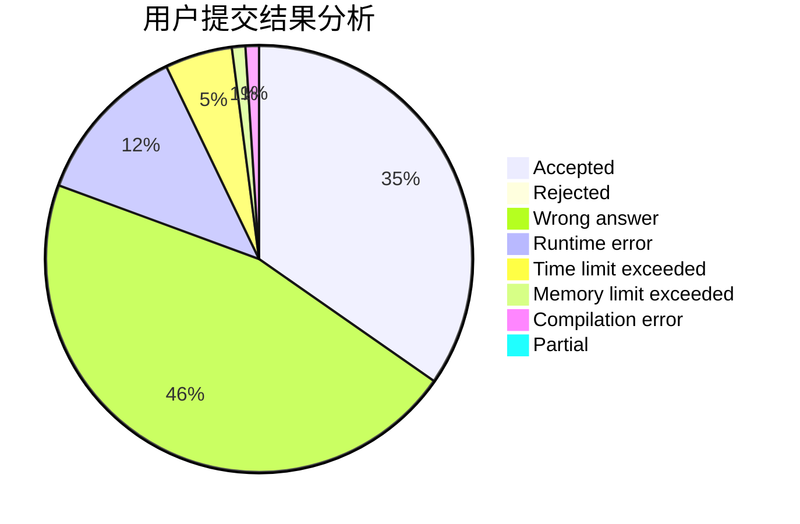
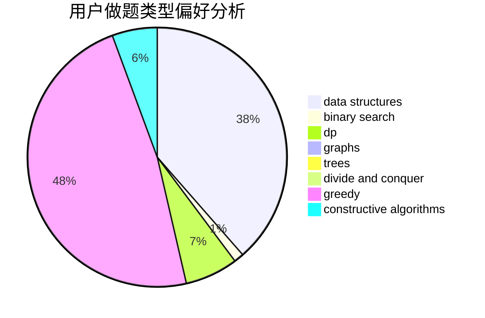
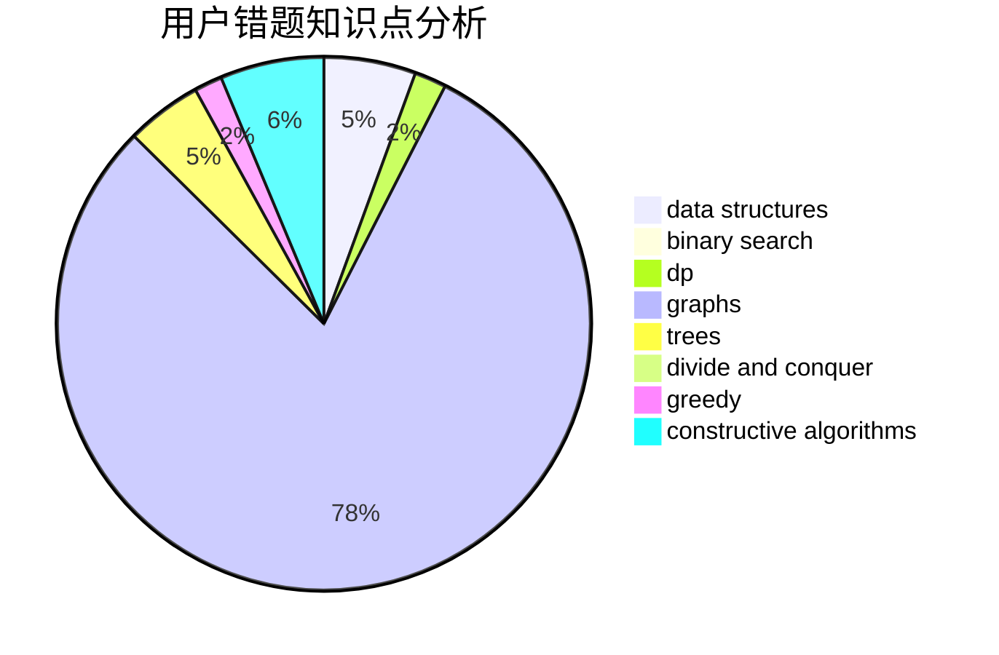

# RiverHamster

<!-- tabs:start -->

#### **用户提交结果分析**

#### **用户做题类型偏好分析**

#### **用户错题知识点分析**

<!-- tabs:end -->
# 推荐题目
[279A](https://codeforces.com/contest/279/problem/A)		brute force,
                        geometry,
                        implementation		  
[799D](https://codeforces.com/contest/799/problem/D)		brute force,
                        dp,
                        meet-in-the-middle		  
[1178C](https://codeforces.com/contest/1178/problem/C)		combinatorics,
                        greedy,
                        math		  
[3C](https://codeforces.com/contest/3/problem/C)		brute force,
                        games,
                        implementation		  
[1071D](https://codeforces.com/contest/1071/problem/D)		dsu,graphs,sortings,trees		  
[641E](https://codeforces.com/contest/641/problem/E)		data structures		  
[745C](https://codeforces.com/contest/745/problem/C)		dsu,graphs,sortings,trees		  
[1244G](https://codeforces.com/contest/1244/problem/G)		constructive algorithms,
                        greedy,
                        math		  
[960A](https://codeforces.com/contest/960/problem/A)		implementation		  
[977F](https://codeforces.com/contest/977/problem/F)		dp		  
