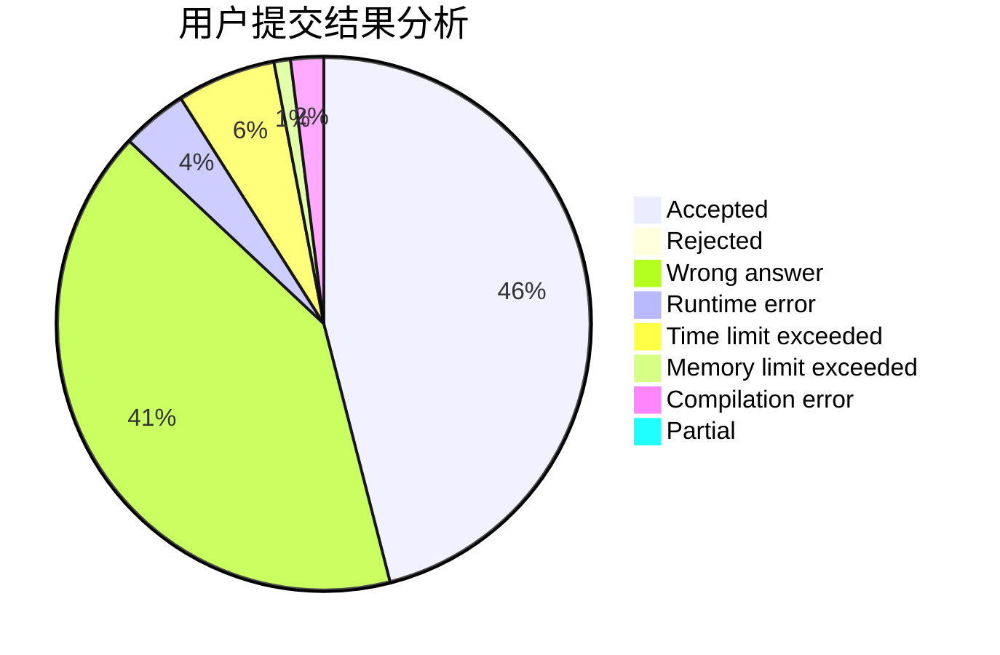
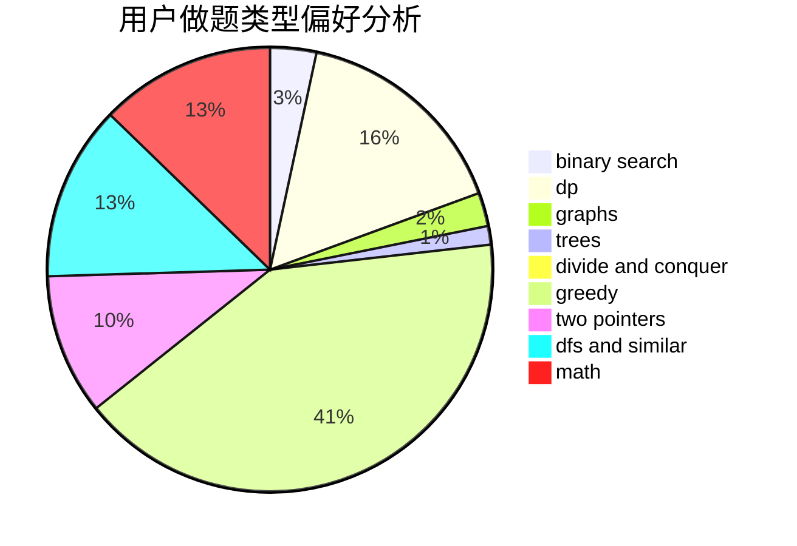

# RmZeta2718

<!-- tabs:start -->

#### **用户提交结果分析**

#### **用户做题类型偏好分析**

<!-- tabs:end -->
# 推荐题目
[45G](https://codeforces.com/contest/45/problem/G)
[741E](https://codeforces.com/contest/741/problem/E)
[212E](https://codeforces.com/contest/212/problem/E)
[1401E](https://codeforces.com/contest/1401/problem/E)
[1191E](https://codeforces.com/contest/1191/problem/E)
[1422E](https://codeforces.com/contest/1422/problem/E)
[1079C](https://codeforces.com/contest/1079/problem/C)
[803F](https://codeforces.com/contest/803/problem/F)
[985D](https://codeforces.com/contest/985/problem/D)
[577E](https://codeforces.com/contest/577/problem/E)
