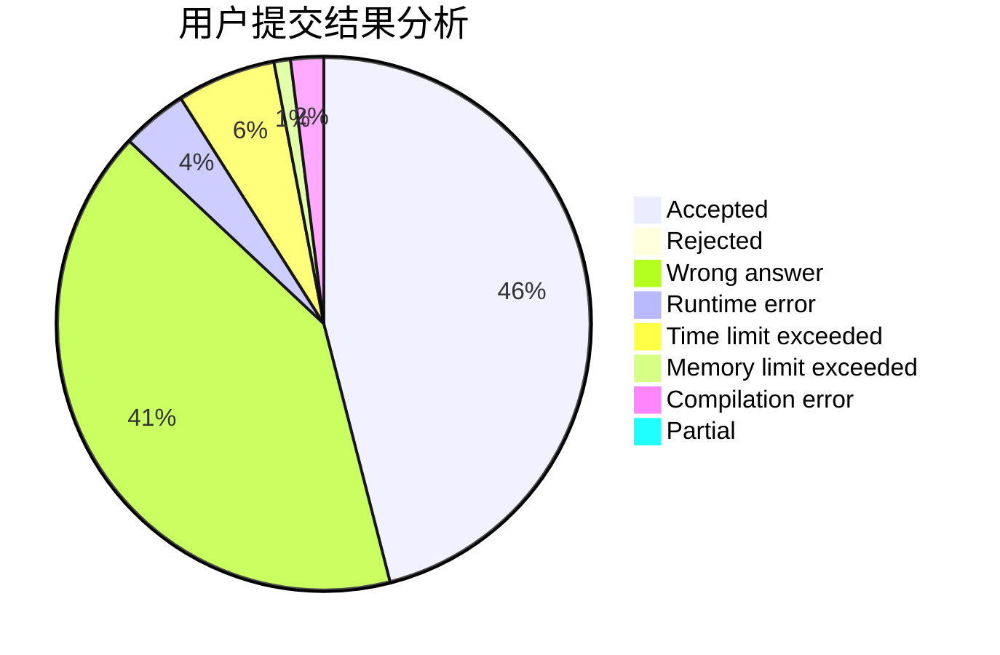
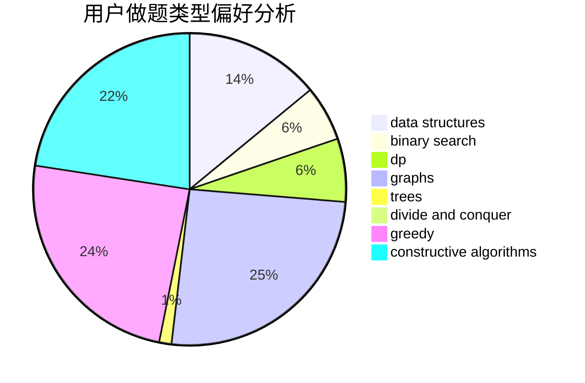
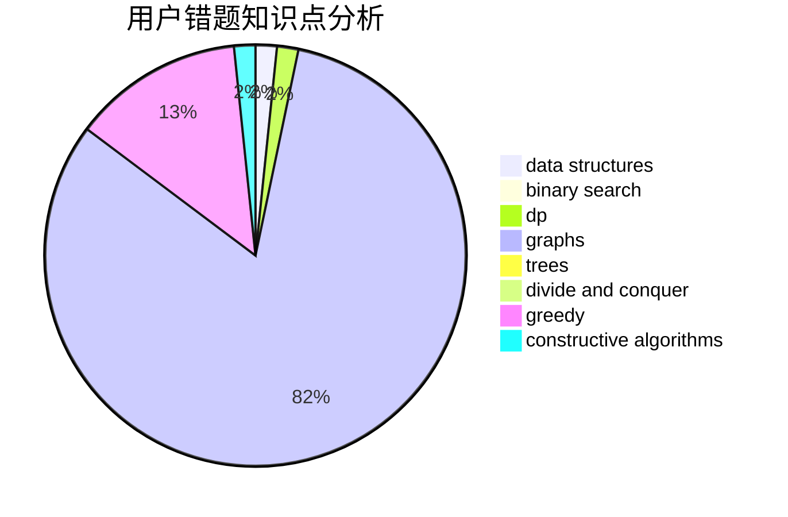

# RmZeta2718
<!-- tabs:start -->
#### **用户提交结果分析**

#### **用户做题类型偏好分析**

#### **用户错题知识点分析**

<!-- tabs:end -->
# 推荐题目
[Fedya the Potter Strikes Back](http://codeforces.com/problemset/problem/1286/E)		data structures,
                        strings		  
[Power Sequence](http://codeforces.com/problemset/problem/1397/B)		brute force,
                        math,
                        number theory,
                        sortings		  
[The Child and Zoo](https://codeforces.com/contest/438/problem/B)		dsu,
                        sortings		  
[0-1-Tree](http://codeforces.com/problemset/problem/1156/D)		dfs and similar,
                        divide and conquer,
                        dp,
                        dsu,
                        trees		  
[Cut Ribbon](http://codeforces.com/problemset/problem/189/A)		brute force,
                        dp		  
[Twilight and Ancient Scroll (harder version)](http://codeforces.com/problemset/problem/1393/E2)		dp,
                        hashing,
                        implementation,
                        string suffix structures,
                        strings,
                        two pointers		  
[Perform Easily](http://codeforces.com/problemset/problem/1413/C)		binary search,
                        brute force,
                        dp,
                        implementation,
                        sortings,
                        two pointers		  
[Vanya and Scales](http://codeforces.com/problemset/problem/552/C)		brute force,
                        dp,
                        greedy,
                        math,
                        meet-in-the-middle,
                        number theory		  
[Knights](http://codeforces.com/problemset/problem/33/D)		geometry,
                        graphs,
                        shortest paths,
                        sortings		  
[Divide Candies](http://codeforces.com/problemset/problem/1056/B)		math,
                        number theory		  
<!-- tabs:start -->
#### **data structures**
[Fedya the Potter Strikes Back](http://codeforces.com/problemset/problem/1286/E)		data structures,
                        strings		  
[Power Sequence](http://codeforces.com/problemset/problem/629/D)		data structures,
                        dp		  
[The Child and Zoo](http://codeforces.com/problemset/problem/213/E)		data structures,
                        hashing,
                        strings		  
[0-1-Tree](http://codeforces.com/problemset/problem/1469/F)		binary search,
                        data structures,
                        greedy		  
[Cut Ribbon](http://codeforces.com/problemset/problem/1492/C)		binary search,
                        data structures,
                        dp,
                        greedy,
                        two pointers		  
[Twilight and Ancient Scroll (harder version)](http://codeforces.com/problemset/problem/1490/G)		binary search,
                        data structures,
                        math		  
[Perform Easily](http://codeforces.com/problemset/problem/1479/D)		binary search,
                        bitmasks,
                        brute force,
                        data structures,
                        probabilities,
                        trees		  
[Vanya and Scales](http://codeforces.com/problemset/problem/1497/A)		brute force,
                        data structures,
                        greedy,
                        sortings		  
[Knights](http://codeforces.com/problemset/problem/1491/C)		brute force,
                        data structures,
                        dp,
                        greedy,
                        implementation		  
[Divide Candies](http://codeforces.com/problemset/problem/1492/B)		data structures,
                        greedy,
                        math		  
#### **binary search**
[Fedya the Potter Strikes Back](http://codeforces.com/problemset/problem/1413/C)		binary search,
                        brute force,
                        dp,
                        implementation,
                        sortings,
                        two pointers		  
[Power Sequence](http://codeforces.com/problemset/problem/216/D)		binary search,
                        sortings,
                        two pointers		  
[The Child and Zoo](http://codeforces.com/problemset/problem/1469/F)		binary search,
                        data structures,
                        greedy		  
[0-1-Tree](http://codeforces.com/problemset/problem/1492/C)		binary search,
                        data structures,
                        dp,
                        greedy,
                        two pointers		  
[Cut Ribbon](http://codeforces.com/problemset/problem/1463/D)		binary search,
                        constructive algorithms,
                        greedy,
                        two pointers		  
[Twilight and Ancient Scroll (harder version)](http://codeforces.com/problemset/problem/1490/G)		binary search,
                        data structures,
                        math		  
[Perform Easily](http://codeforces.com/problemset/problem/1479/D)		binary search,
                        bitmasks,
                        brute force,
                        data structures,
                        probabilities,
                        trees		  
[Vanya and Scales](http://codeforces.com/problemset/problem/1436/E)		binary search,
                        data structures,
                        two pointers		  
[Knights](http://codeforces.com/problemset/problem/1461/D)		binary search,
                        brute force,
                        data structures,
                        divide and conquer,
                        implementation,
                        sortings		  
[Divide Candies](http://codeforces.com/problemset/problem/1493/C)		binary search,
                        brute force,
                        constructive algorithms,
                        greedy,
                        strings		  
#### **dp**
[Fedya the Potter Strikes Back](http://codeforces.com/problemset/problem/1156/D)		dfs and similar,
                        divide and conquer,
                        dp,
                        dsu,
                        trees		  
[Power Sequence](http://codeforces.com/problemset/problem/189/A)		brute force,
                        dp		  
[The Child and Zoo](http://codeforces.com/problemset/problem/1393/E2)		dp,
                        hashing,
                        implementation,
                        string suffix structures,
                        strings,
                        two pointers		  
[0-1-Tree](http://codeforces.com/problemset/problem/1413/C)		binary search,
                        brute force,
                        dp,
                        implementation,
                        sortings,
                        two pointers		  
[Cut Ribbon](http://codeforces.com/problemset/problem/552/C)		brute force,
                        dp,
                        greedy,
                        math,
                        meet-in-the-middle,
                        number theory		  
[Twilight and Ancient Scroll (harder version)](http://codeforces.com/problemset/problem/219/C)		brute force,
                        dp,
                        greedy		  
[Perform Easily](http://codeforces.com/problemset/problem/629/D)		data structures,
                        dp		  
[Vanya and Scales](http://codeforces.com/problemset/problem/724/E)		dp,
                        flows,
                        greedy		  
[Knights](http://codeforces.com/problemset/problem/1109/A)		dp,
                        implementation		  
[Divide Candies](http://codeforces.com/problemset/problem/1326/F1)		bitmasks,
                        brute force,
                        dp,
                        meet-in-the-middle		  
#### **graph**
[Fedya the Potter Strikes Back](http://codeforces.com/problemset/problem/33/D)		geometry,
                        graphs,
                        shortest paths,
                        sortings		  
[Power Sequence](http://codeforces.com/problemset/problem/962/F)		dfs and similar,
                        graphs,
                        trees		  
[The Child and Zoo](http://codeforces.com/problemset/problem/788/B)		combinatorics,
                        constructive algorithms,
                        dfs and similar,
                        dsu,
                        graphs		  
[0-1-Tree](http://codeforces.com/problemset/problem/1468/J)		dsu,
                        graphs,
                        greedy		  
[Cut Ribbon](http://codeforces.com/problemset/problem/1498/D)		dfs and similar,
                        dp,
                        graphs,
                        implementation		  
[Twilight and Ancient Scroll (harder version)](http://codeforces.com/problemset/problem/1487/C)		brute force,
                        constructive algorithms,
                        dfs and similar,
                        graphs,
                        greedy,
                        implementation,
                        math		  
[Perform Easily](http://codeforces.com/problemset/problem/1437/C)		dp,
                        flows,
                        graph matchings,
                        greedy,
                        math,
                        sortings		  
[Vanya and Scales](http://codeforces.com/problemset/problem/1470/D)		constructive algorithms,
                        dfs and similar,
                        graph matchings,
                        graphs,
                        greedy		  
[Knights](http://codeforces.com/problemset/problem/1476/C)		dp,
                        graphs,
                        greedy		  
[Divide Candies](http://codeforces.com/problemset/problem/1304/D)		constructive algorithms,
                        graphs,
                        greedy,
                        two pointers		  
#### **trees**
[Fedya the Potter Strikes Back](http://codeforces.com/problemset/problem/1156/D)		dfs and similar,
                        divide and conquer,
                        dp,
                        dsu,
                        trees		  
[Power Sequence](http://codeforces.com/problemset/problem/962/F)		dfs and similar,
                        graphs,
                        trees		  
[The Child and Zoo](http://codeforces.com/problemset/problem/1188/A1)		trees		  
[0-1-Tree](http://codeforces.com/problemset/problem/1479/D)		binary search,
                        bitmasks,
                        brute force,
                        data structures,
                        probabilities,
                        trees		  
[Cut Ribbon](http://codeforces.com/problemset/problem/1511/C)		brute force,
                        data structures,
                        implementation,
                        trees		  
[Twilight and Ancient Scroll (harder version)](http://codeforces.com/problemset/problem/1499/F)		combinatorics,
                        dfs and similar,
                        dp,
                        trees		  
[Perform Easily](http://codeforces.com/problemset/problem/1491/E)		brute force,
                        dfs and similar,
                        divide and conquer,
                        number theory,
                        trees		  
[Vanya and Scales](http://codeforces.com/problemset/problem/1466/D)		data structures,
                        greedy,
                        sortings,
                        trees		  
[Knights](http://codeforces.com/problemset/problem/1495/D)		combinatorics,
                        dfs and similar,
                        graphs,
                        math,
                        shortest paths,
                        trees		  
[Divide Candies](http://codeforces.com/problemset/problem/1303/G)		data structures,
                        divide and conquer,
                        geometry,
                        trees		  
#### **divide and conquer**
[Fedya the Potter Strikes Back](http://codeforces.com/problemset/problem/1156/D)		dfs and similar,
                        divide and conquer,
                        dp,
                        dsu,
                        trees		  
[Power Sequence](http://codeforces.com/problemset/problem/1461/D)		binary search,
                        brute force,
                        data structures,
                        divide and conquer,
                        implementation,
                        sortings		  
[The Child and Zoo](http://codeforces.com/problemset/problem/1466/G)		combinatorics,
                        divide and conquer,
                        hashing,
                        math,
                        string suffix structures,
                        strings		  
[0-1-Tree](http://codeforces.com/problemset/problem/1490/D)		dfs and similar,
                        divide and conquer,
                        implementation		  
[Cut Ribbon](https://codeforces.com/contest/1483/problem/C)		data structures,
                        divide and conquer,
                        dp		  
[Twilight and Ancient Scroll (harder version)](http://codeforces.com/problemset/problem/1491/E)		brute force,
                        dfs and similar,
                        divide and conquer,
                        number theory,
                        trees		  
[Perform Easily](http://codeforces.com/problemset/problem/1303/G)		data structures,
                        divide and conquer,
                        geometry,
                        trees		  
[Vanya and Scales](http://codeforces.com/problemset/problem/1494/D)		constructive algorithms,
                        data structures,
                        dfs and similar,
                        divide and conquer,
                        dsu,
                        greedy,
                        sortings,
                        trees		  
[Knights](http://codeforces.com/problemset/problem/1482/E)		data structures,
                        divide and conquer,
                        dp		  
[Divide Candies](http://codeforces.com/problemset/problem/566/C)		dfs and similar,
                        divide and conquer,
                        trees		  
#### **greedy**
[Fedya the Potter Strikes Back](http://codeforces.com/problemset/problem/552/C)		brute force,
                        dp,
                        greedy,
                        math,
                        meet-in-the-middle,
                        number theory		  
[Power Sequence](http://codeforces.com/problemset/problem/492/C)		greedy,
                        sortings		  
[The Child and Zoo](http://codeforces.com/problemset/problem/219/C)		brute force,
                        dp,
                        greedy		  
[0-1-Tree](http://codeforces.com/problemset/problem/724/E)		dp,
                        flows,
                        greedy		  
[Cut Ribbon](http://codeforces.com/problemset/problem/1469/F)		binary search,
                        data structures,
                        greedy		  
[Twilight and Ancient Scroll (harder version)](http://codeforces.com/problemset/problem/888/B)		greedy		  
[Perform Easily](http://codeforces.com/problemset/problem/833/C)		brute force,
                        combinatorics,
                        greedy,
                        math		  
[Vanya and Scales](http://codeforces.com/problemset/problem/1468/J)		dsu,
                        graphs,
                        greedy		  
[Knights](http://codeforces.com/problemset/problem/1492/C)		binary search,
                        data structures,
                        dp,
                        greedy,
                        two pointers		  
[Divide Candies](https://codeforces.com/contest/1496/problem/C)		geometry,
                        greedy,
                        math,
                        sortings		  
#### **constructive algorithms**
[Fedya the Potter Strikes Back](http://codeforces.com/problemset/problem/1078/E)		constructive algorithms		  
[Power Sequence](http://codeforces.com/problemset/problem/710/C)		constructive algorithms,
                        math		  
[The Child and Zoo](http://codeforces.com/problemset/problem/1054/C)		constructive algorithms,
                        implementation		  
[0-1-Tree](http://codeforces.com/problemset/problem/788/B)		combinatorics,
                        constructive algorithms,
                        dfs and similar,
                        dsu,
                        graphs		  
[Cut Ribbon](http://codeforces.com/problemset/problem/1493/A)		constructive algorithms,
                        greedy		  
[Twilight and Ancient Scroll (harder version)](http://codeforces.com/problemset/problem/1463/D)		binary search,
                        constructive algorithms,
                        greedy,
                        two pointers		  
[Perform Easily](https://codeforces.com/contest/1456/problem/B)		bitmasks,
                        brute force,
                        constructive algorithms		  
[Vanya and Scales](http://codeforces.com/problemset/problem/1492/D)		bitmasks,
                        constructive algorithms,
                        greedy,
                        math		  
[Knights](https://codeforces.com/contest/1504/problem/D)		constructive algorithms,
                        games,
                        interactive		  
[Divide Candies](https://codeforces.com/contest/1483/problem/A)		brute force,
                        constructive algorithms,
                        greedy,
                        implementation		  
#### **sortings**
[Fedya the Potter Strikes Back](http://codeforces.com/problemset/problem/1397/B)		brute force,
                        math,
                        number theory,
                        sortings		  
[Power Sequence](https://codeforces.com/contest/438/problem/B)		dsu,
                        sortings		  
[The Child and Zoo](http://codeforces.com/problemset/problem/1413/C)		binary search,
                        brute force,
                        dp,
                        implementation,
                        sortings,
                        two pointers		  
[0-1-Tree](http://codeforces.com/problemset/problem/33/D)		geometry,
                        graphs,
                        shortest paths,
                        sortings		  
[Cut Ribbon](http://codeforces.com/problemset/problem/492/C)		greedy,
                        sortings		  
[Twilight and Ancient Scroll (harder version)](http://codeforces.com/problemset/problem/216/D)		binary search,
                        sortings,
                        two pointers		  
[Perform Easily](https://codeforces.com/contest/1496/problem/C)		geometry,
                        greedy,
                        math,
                        sortings		  
[Vanya and Scales](http://codeforces.com/problemset/problem/1495/A)		geometry,
                        greedy,
                        math,
                        sortings		  
[Knights](http://codeforces.com/problemset/problem/1497/A)		brute force,
                        data structures,
                        greedy,
                        sortings		  
[Divide Candies](http://codeforces.com/problemset/problem/1427/A)		math,
                        sortings		  
<!-- tabs:end -->
