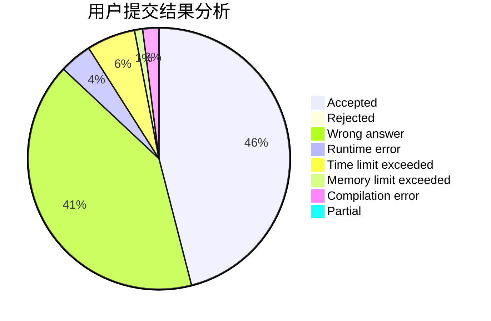
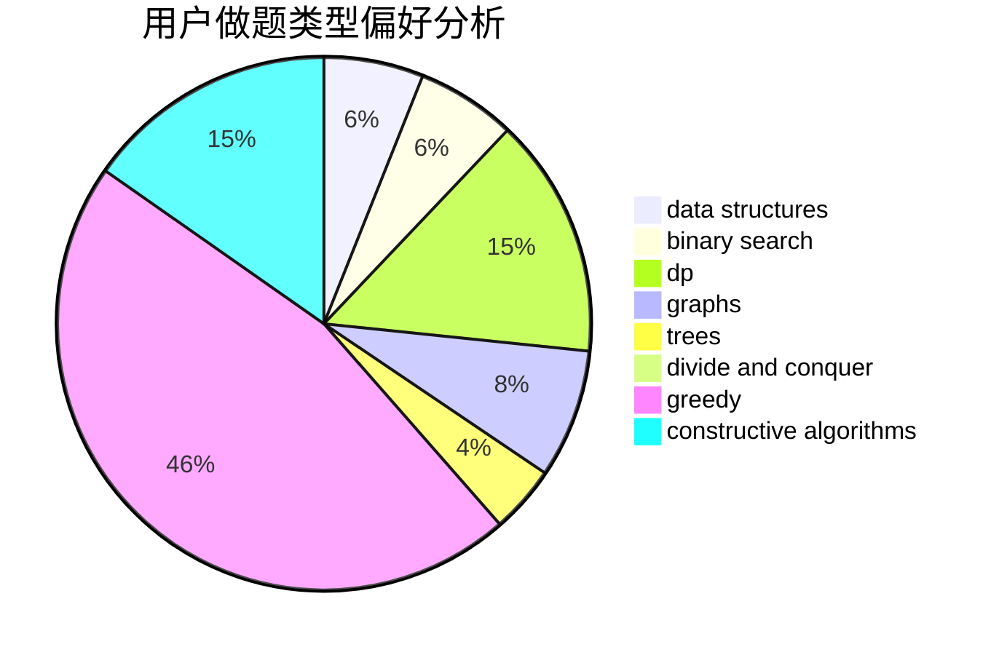
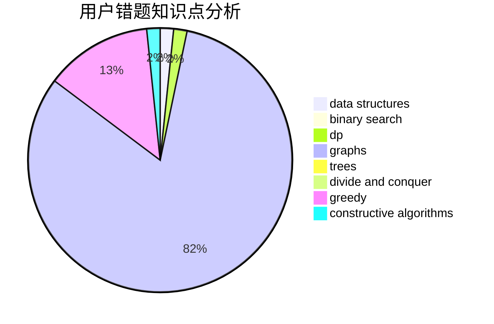

# RmZeta2718

<!-- tabs:start -->

#### **用户提交结果分析**

#### **用户做题类型偏好分析**

#### **用户错题知识点分析**

<!-- tabs:end -->
# 推荐题目
[45G](https://codeforces.com/contest/45/problem/G)		number theory		  
[741E](https://codeforces.com/contest/741/problem/E)		data structures,
                        string suffix structures		  
[212E](https://codeforces.com/contest/212/problem/E)		dfs and similar,
                        dp,
                        trees		  
[1401E](https://codeforces.com/contest/1401/problem/E)		data structures,
                        geometry,
                        implementation,
                        sortings		  
[1191E](https://codeforces.com/contest/1191/problem/E)		dsu,graphs,sortings,trees		  
[1422E](https://codeforces.com/contest/1422/problem/E)		dp,
                        greedy,
                        implementation,
                        strings		  
[1079C](https://codeforces.com/contest/1079/problem/C)		dsu,graphs,sortings,trees		  
[803F](https://codeforces.com/contest/803/problem/F)		bitmasks,
                        combinatorics,
                        number theory		  
[985D](https://codeforces.com/contest/985/problem/D)		binary search,
                        constructive algorithms,
                        math		  
[577E](https://codeforces.com/contest/577/problem/E)		dsu,graphs,sortings,trees		  
