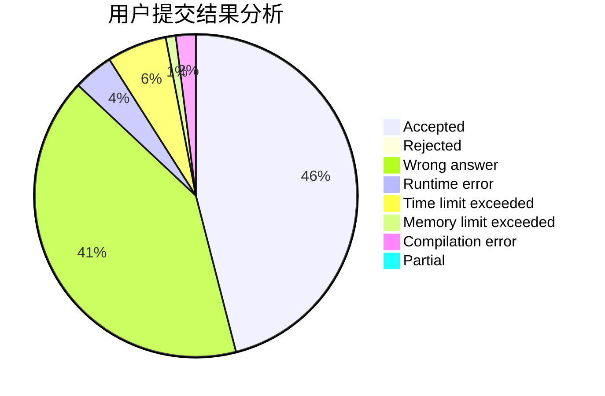
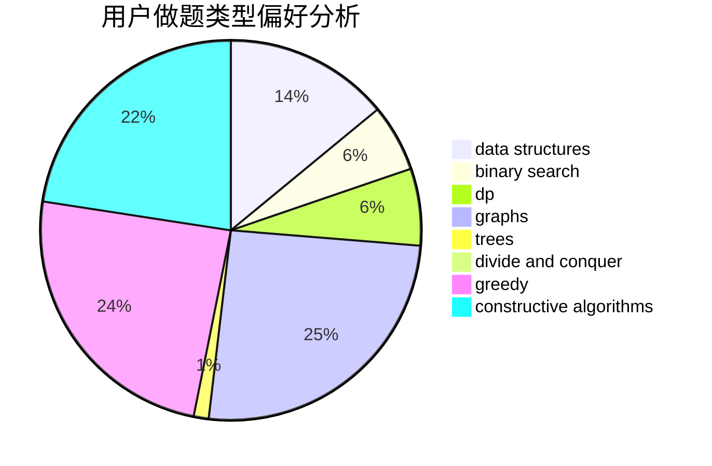
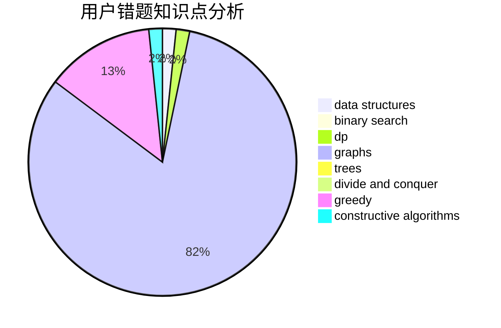

# RmZeta2718

<!-- tabs:start -->

#### **用户提交结果分析**

#### **用户做题类型偏好分析**

#### **用户错题知识点分析**

<!-- tabs:end -->
# 推荐题目
[438B](https://codeforces.com/contest/438/problem/B)		dsu,graphs,sortings,trees		  
[724E](https://codeforces.com/contest/724/problem/E)		dp,
                        flows,
                        greedy		  
[189A](https://codeforces.com/contest/189/problem/A)		brute force,
                        dp		  
[1393E2](https://codeforces.com/contest/1393E/problem/2)		dp,
                        hashing,
                        implementation,
                        string suffix structures,
                        strings,
                        two pointers		  
[1188A1](https://codeforces.com/contest/1188A/problem/1)		trees		  
[1413C](https://codeforces.com/contest/1413/problem/C)		binary search,
                        brute force,
                        dp,
                        implementation,
                        sortings,
                        two pointers		  
[1078E](https://codeforces.com/contest/1078/problem/E)		constructive algorithms		  
[788B](https://codeforces.com/contest/788/problem/B)		combinatorics,
                        constructive algorithms,
                        dfs and similar,
                        dsu,
                        graphs		  
[962F](https://codeforces.com/contest/962/problem/F)		dfs and similar,
                        graphs,
                        trees		  
[552C](https://codeforces.com/contest/552/problem/C)		brute force,
                        dp,
                        greedy,
                        math,
                        meet-in-the-middle,
                        number theory		  
