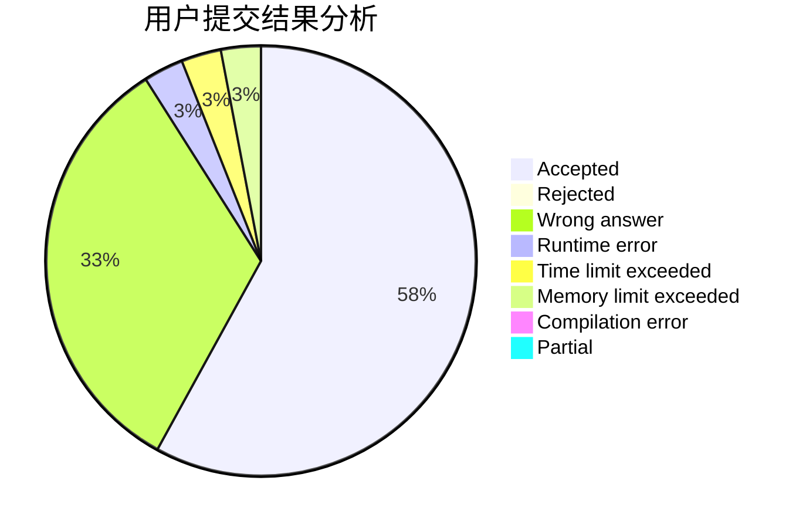
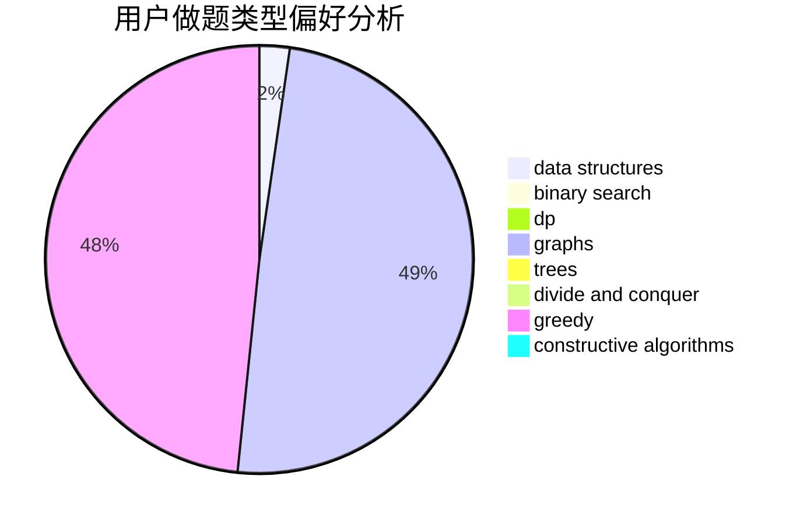
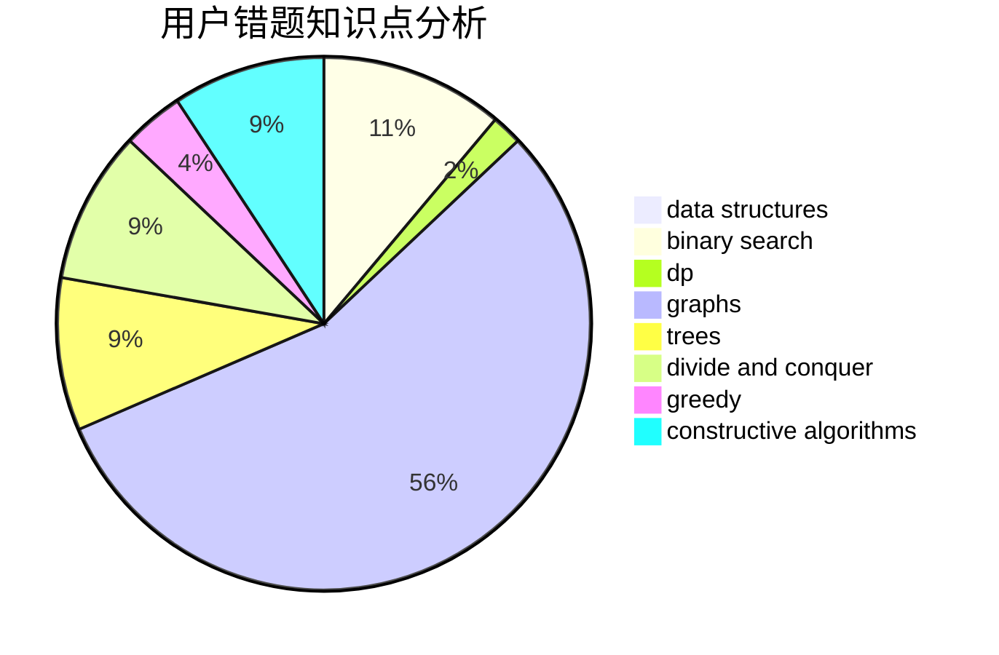

# RobeZH

<!-- tabs:start -->

#### **用户提交结果分析**

#### **用户做题类型偏好分析**

#### **用户错题知识点分析**

<!-- tabs:end -->
# 推荐题目
[216B](https://codeforces.com/contest/216/problem/B)		dfs and similar,
                        implementation		  
[498D](https://codeforces.com/contest/498/problem/D)		data structures,
                        dp,
                        number theory		  
[898F](https://codeforces.com/contest/898/problem/F)		brute force,
                        hashing,
                        math		  
[383C](https://codeforces.com/contest/383/problem/C)		data structures,
                        dfs and similar,
                        trees		  
[1190C](https://codeforces.com/contest/1190/problem/C)		brute force,
                        games,
                        greedy		  
[802O](https://codeforces.com/contest/802/problem/O)		binary search,
                        data structures,
                        flows		  
[1490C](https://codeforces.com/contest/1490/problem/C)		binary search,
                        brute force,
                        brute force,
                        math		  
[1497B](https://codeforces.com/contest/1497/problem/B)		constructive algorithms,
                        greedy,
                        math		  
[1491C](https://codeforces.com/contest/1491/problem/C)		brute force,
                        data structures,
                        dp,
                        greedy,
                        implementation		  
[1484C](https://codeforces.com/contest/1484/problem/C)		dsu,graphs,sortings,trees		  
