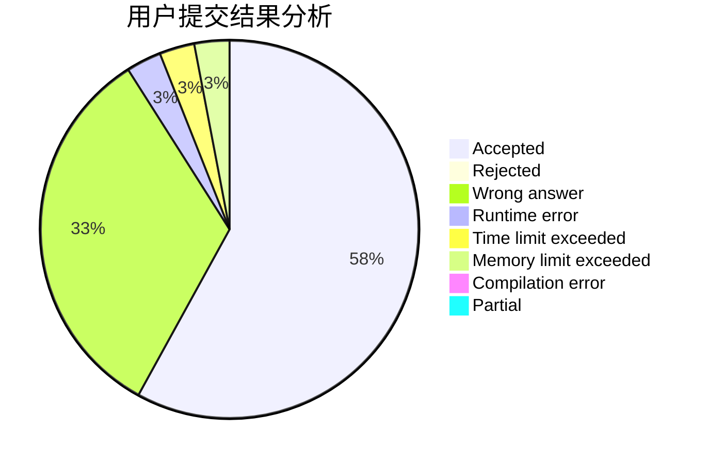
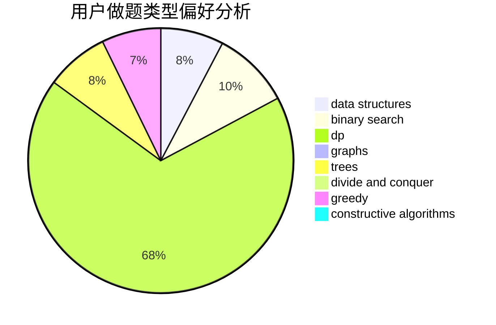
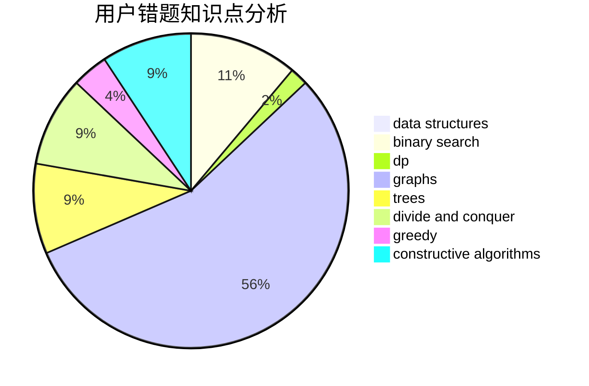

# RobeZH

<!-- tabs:start -->

#### **用户提交结果分析**

#### **用户做题类型偏好分析**

#### **用户错题知识点分析**

<!-- tabs:end -->
# 推荐题目
[193A](https://codeforces.com/contest/193/problem/A)		constructive algorithms,
                        graphs,
                        trees		  
[478D](https://codeforces.com/contest/478/problem/D)		dp		  
[878A](https://codeforces.com/contest/878/problem/A)		bitmasks,
                        constructive algorithms		  
[357B](https://codeforces.com/contest/357/problem/B)		constructive algorithms,
                        implementation		  
[1187A](https://codeforces.com/contest/1187/problem/A)		math		  
[786D](https://codeforces.com/contest/786/problem/D)		data structures,
                        dfs and similar,
                        hashing,
                        strings,
                        trees		  
[1482E](https://codeforces.com/contest/1482/problem/E)		data structures,
                        divide and conquer,
                        dp		  
[1489D](https://codeforces.com/contest/1489/problem/D)		dsu,graphs,sortings,trees		  
[1483E](https://codeforces.com/contest/1483/problem/E)		dsu,graphs,sortings,trees		  
[1475F](https://codeforces.com/contest/1475/problem/F)		2-sat,
                        brute force,
                        constructive algorithms		  
