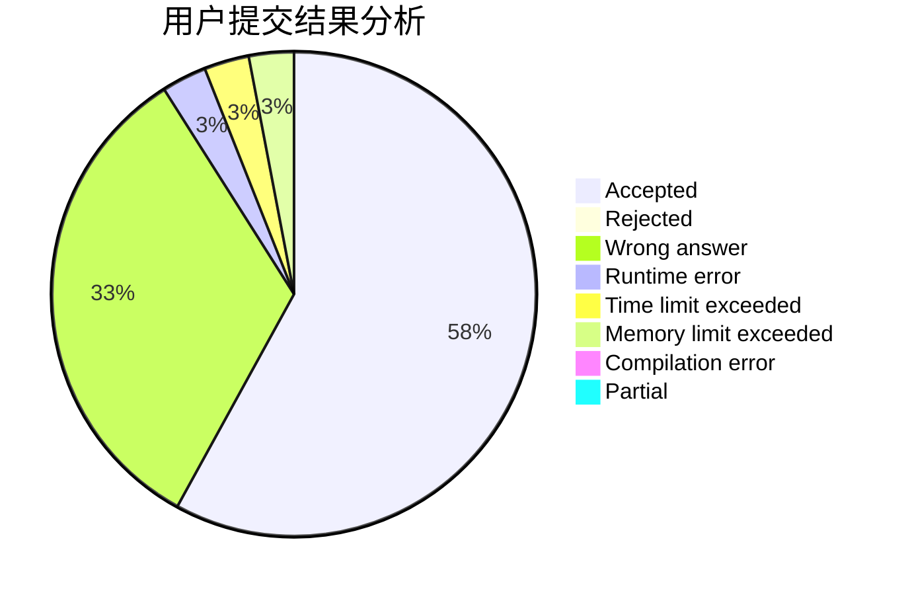
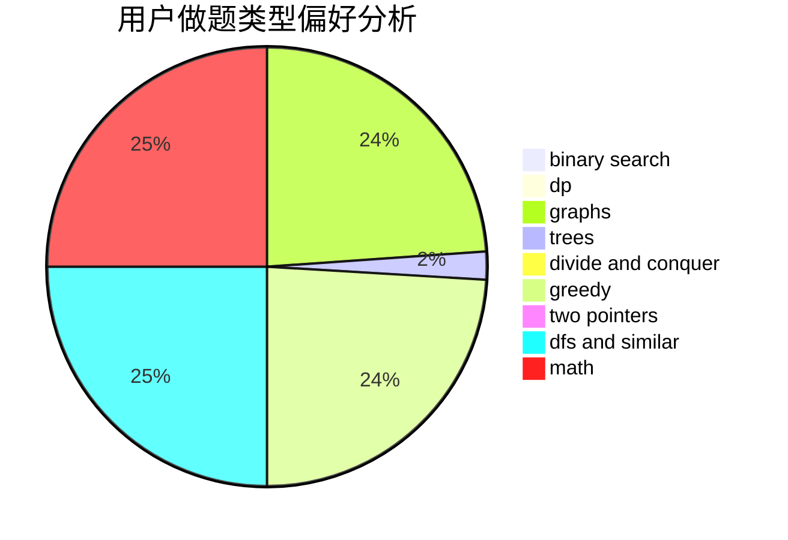

# RobeZH

<!-- tabs:start -->

#### **用户提交结果分析**

#### **用户做题类型偏好分析**

<!-- tabs:end -->
# 推荐题目
[216B](https://codeforces.com/contest/216/problem/B)
[498D](https://codeforces.com/contest/498/problem/D)
[898F](https://codeforces.com/contest/898/problem/F)
[383C](https://codeforces.com/contest/383/problem/C)
[1190C](https://codeforces.com/contest/1190/problem/C)
[802O](https://codeforces.com/contest/802/problem/O)
[1490C](https://codeforces.com/contest/1490/problem/C)
[1497B](https://codeforces.com/contest/1497/problem/B)
[1491C](https://codeforces.com/contest/1491/problem/C)
[1484C](https://codeforces.com/contest/1484/problem/C)
