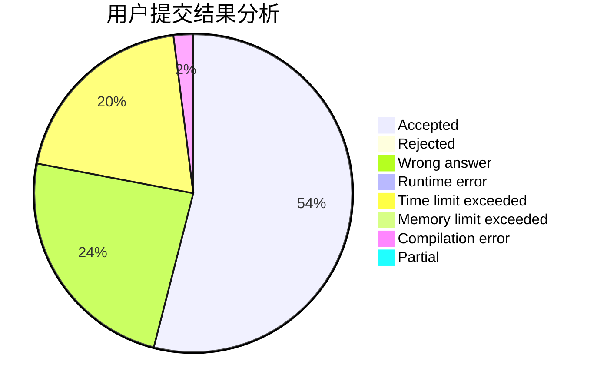
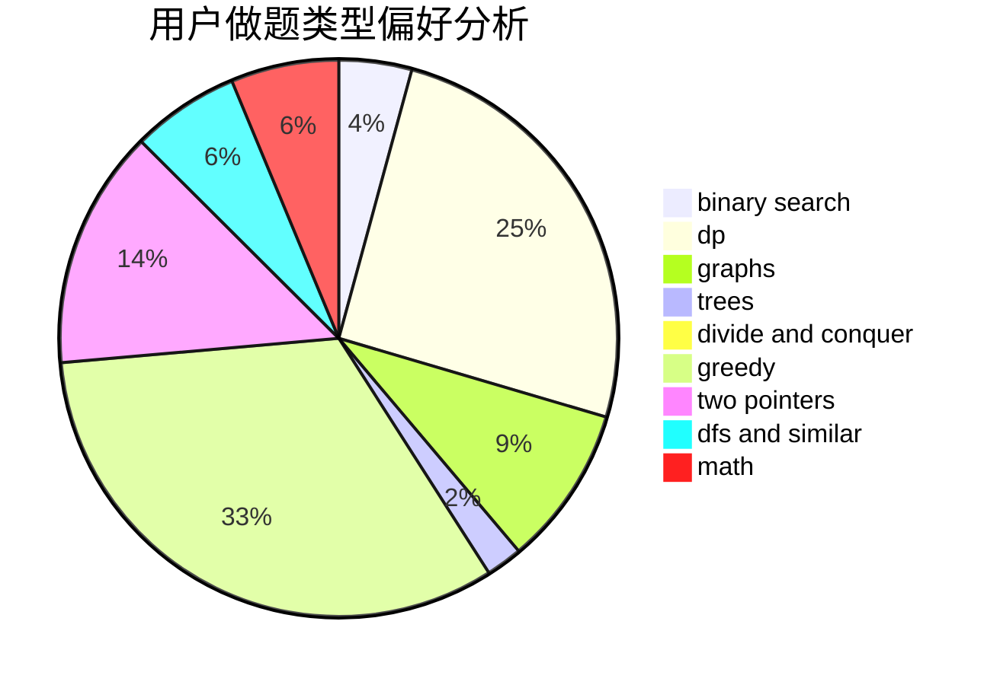

# Robert_JYH

<!-- tabs:start -->

#### **用户提交结果分析**

#### **用户做题类型偏好分析**

<!-- tabs:end -->
# 推荐题目
[961E](https://codeforces.com/contest/961/problem/E)
[1423C](https://codeforces.com/contest/1423/problem/C)
[991C](https://codeforces.com/contest/991/problem/C)
[293A](https://codeforces.com/contest/293/problem/A)
[854B](https://codeforces.com/contest/854/problem/B)
[672C](https://codeforces.com/contest/672/problem/C)
[376A](https://codeforces.com/contest/376/problem/A)
[1132C](https://codeforces.com/contest/1132/problem/C)
[1227A](https://codeforces.com/contest/1227/problem/A)
[662D](https://codeforces.com/contest/662/problem/D)
