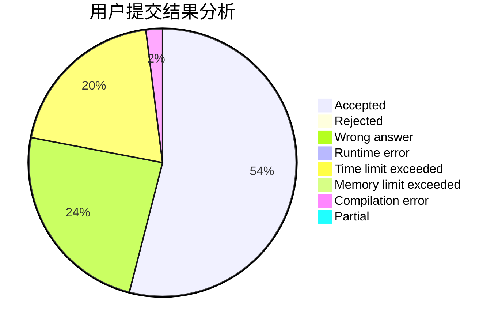
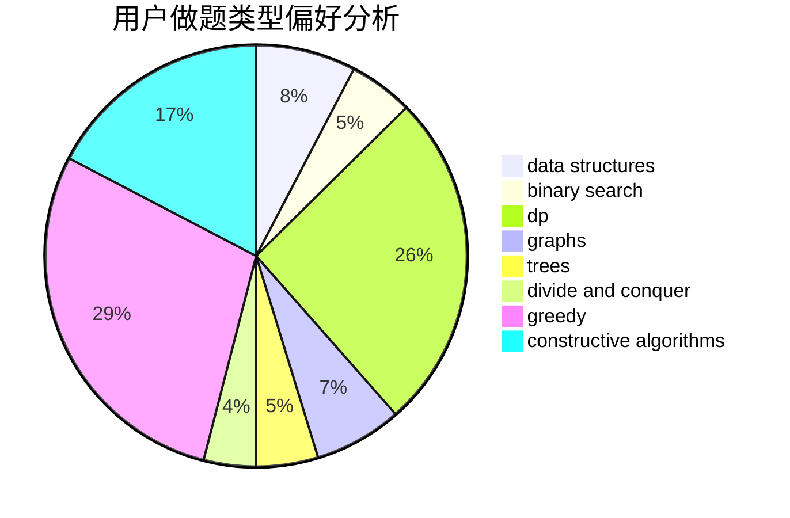
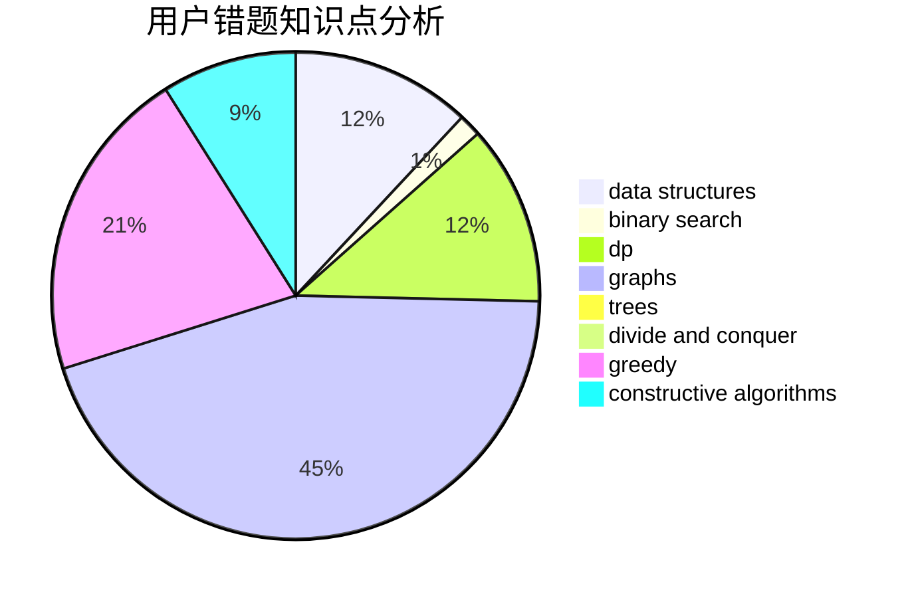

# Robert_JYH

<!-- tabs:start -->

#### **用户提交结果分析**

#### **用户做题类型偏好分析**

#### **用户错题知识点分析**

<!-- tabs:end -->
# 推荐题目
[940A](https://codeforces.com/contest/940/problem/A)		brute force,
                        greedy,
                        sortings		  
[1413F](https://codeforces.com/contest/1413/problem/F)		data structures,
                        trees		  
[977E](https://codeforces.com/contest/977/problem/E)		dfs and similar,
                        dsu,
                        graphs		  
[277E](https://codeforces.com/contest/277/problem/E)		flows,
                        trees		  
[837B](https://codeforces.com/contest/837/problem/B)		brute force,
                        implementation		  
[645G](https://codeforces.com/contest/645/problem/G)		binary search,
                        geometry		  
[349B](https://codeforces.com/contest/349/problem/B)		data structures,
                        dp,
                        greedy,
                        implementation		  
[1130C](https://codeforces.com/contest/1130/problem/C)		brute force,
                        dfs and similar,
                        dsu		  
[121C](https://codeforces.com/contest/121/problem/C)		brute force,
                        combinatorics,
                        number theory		  
[631E](https://codeforces.com/contest/631/problem/E)		data structures,
                        dp,
                        geometry		  
