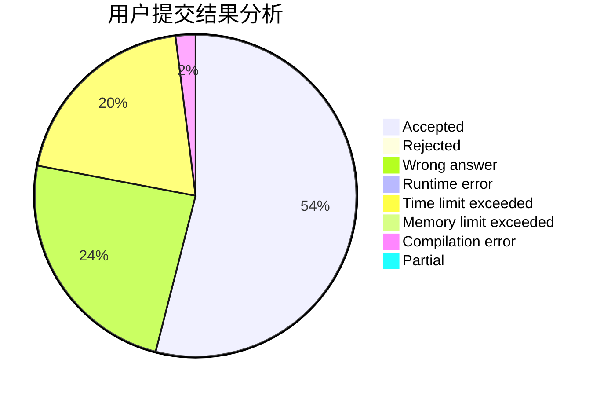
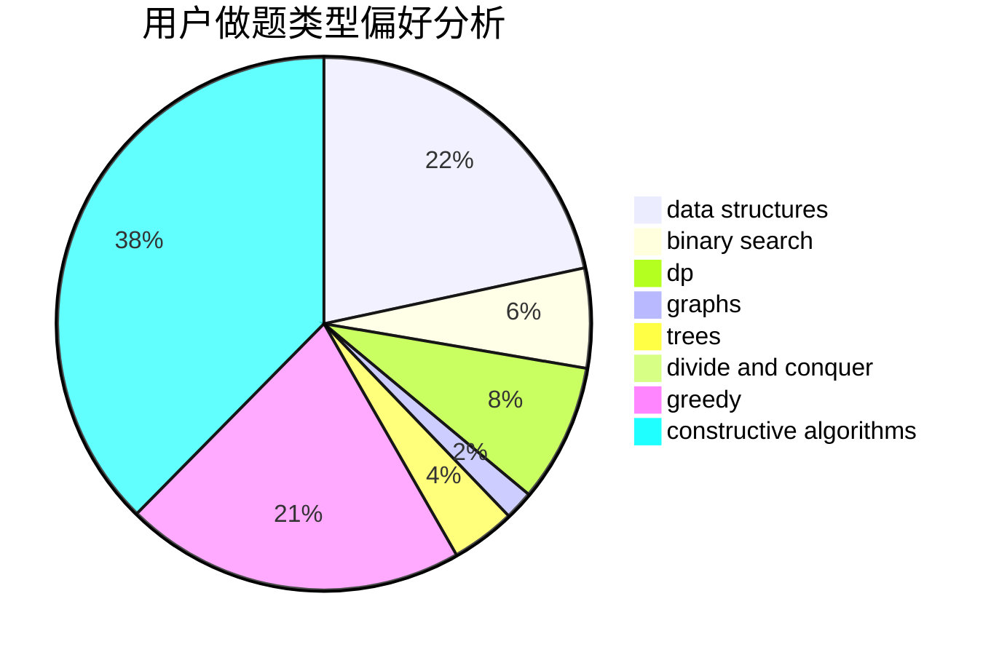
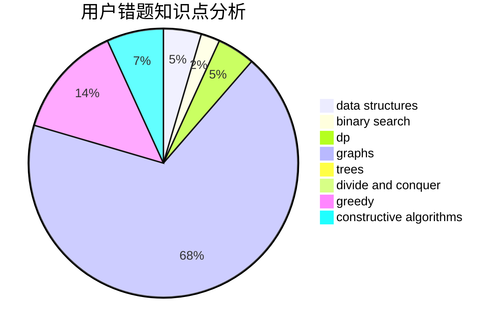

# Robert_JYH

<!-- tabs:start -->

#### **用户提交结果分析**

#### **用户做题类型偏好分析**

#### **用户错题知识点分析**

<!-- tabs:end -->
# 推荐题目
[961E](https://codeforces.com/contest/961/problem/E)		data structures		  
[1423C](https://codeforces.com/contest/1423/problem/C)		divide and conquer,
                        graphs,
                        trees		  
[991C](https://codeforces.com/contest/991/problem/C)		binary search,
                        implementation		  
[293A](https://codeforces.com/contest/293/problem/A)		games,
                        greedy		  
[854B](https://codeforces.com/contest/854/problem/B)		constructive algorithms,
                        math		  
[672C](https://codeforces.com/contest/672/problem/C)		dsu,graphs,sortings,trees		  
[376A](https://codeforces.com/contest/376/problem/A)		implementation,
                        math		  
[1132C](https://codeforces.com/contest/1132/problem/C)		brute force		  
[1227A](https://codeforces.com/contest/1227/problem/A)		math		  
[662D](https://codeforces.com/contest/662/problem/D)		constructive algorithms,
                        greedy,
                        implementation,
                        math		  
