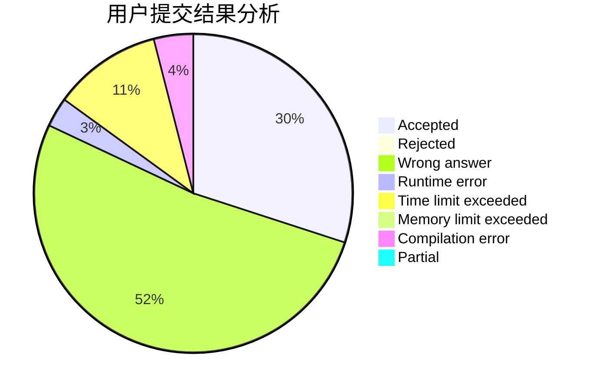
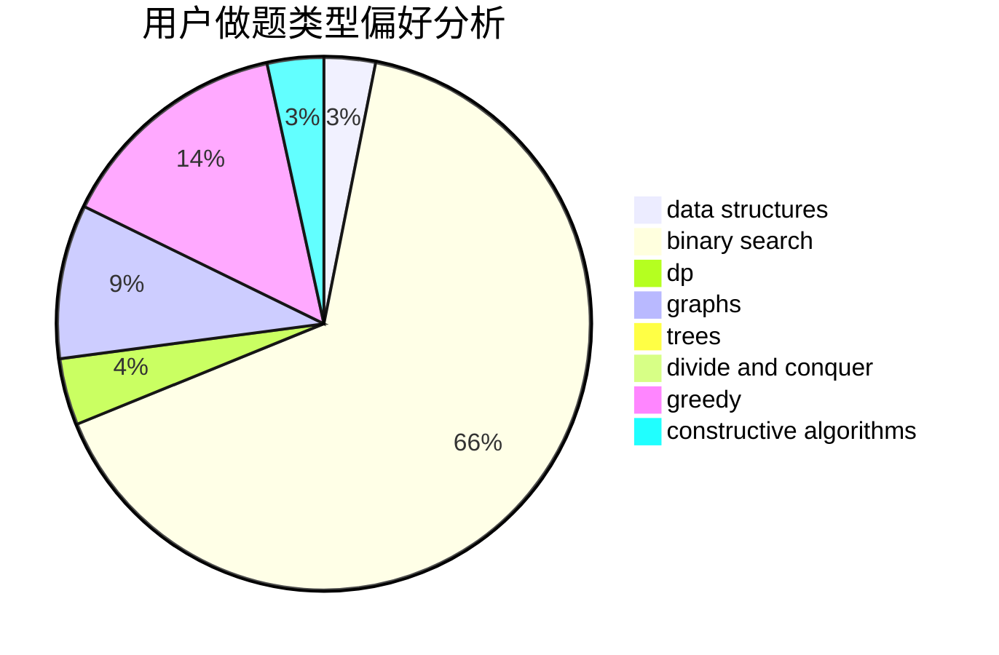

# RobinWen

<!-- tabs:start -->

#### **用户提交结果分析**

#### **用户做题类型偏好分析**

#### **用户错题知识点分析**

<!-- tabs:end -->
# 推荐题目
[1207B](https://codeforces.com/contest/1207/problem/B)		constructive algorithms,
                        greedy,
                        implementation		  
[1131D](https://codeforces.com/contest/1131/problem/D)		dfs and similar,
                        dp,
                        dsu,
                        graphs,
                        greedy		  
[575A](https://codeforces.com/contest/575/problem/A)		data structures,
                        math,
                        matrices		  
[585B](https://codeforces.com/contest/585/problem/B)		dfs and similar,
                        graphs,
                        shortest paths		  
[630F](https://codeforces.com/contest/630/problem/F)		combinatorics,
                        math		  
[453D](https://codeforces.com/contest/453/problem/D)		dp,
                        matrices		  
[535E](https://codeforces.com/contest/535/problem/E)		geometry,
                        math		  
[723A](https://codeforces.com/contest/723/problem/A)		implementation,
                        math,
                        sortings		  
[894A](https://codeforces.com/contest/894/problem/A)		brute force,
                        dp		  
[960F](https://codeforces.com/contest/960/problem/F)		data structures,
                        dp,
                        graphs		  
