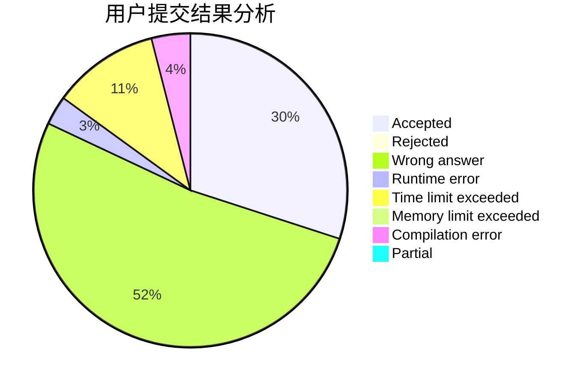
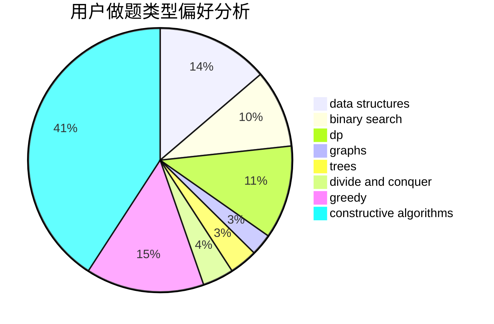

# RobinWen

<!-- tabs:start -->

#### **用户提交结果分析**

#### **用户做题类型偏好分析**

#### **用户错题知识点分析**

<!-- tabs:end -->
# 推荐题目
[1202D](https://codeforces.com/contest/1202/problem/D)		combinatorics,
                        constructive algorithms,
                        math,
                        strings		  
[1129D](https://codeforces.com/contest/1129/problem/D)		data structures,
                        dp		  
[54A](https://codeforces.com/contest/54/problem/A)		implementation		  
[566C](https://codeforces.com/contest/566/problem/C)		dfs and similar,
                        divide and conquer,
                        trees		  
[611C](https://codeforces.com/contest/611/problem/C)		dp,
                        implementation		  
[432D](https://codeforces.com/contest/432/problem/D)		dp,
                        string suffix structures,
                        strings,
                        two pointers		  
[512E](https://codeforces.com/contest/512/problem/E)		constructive algorithms,
                        divide and conquer		  
[703E](https://codeforces.com/contest/703/problem/E)		dp,
                        number theory		  
[873B](https://codeforces.com/contest/873/problem/B)		dp,
                        implementation		  
[939C](https://codeforces.com/contest/939/problem/C)		binary search,
                        two pointers		  
