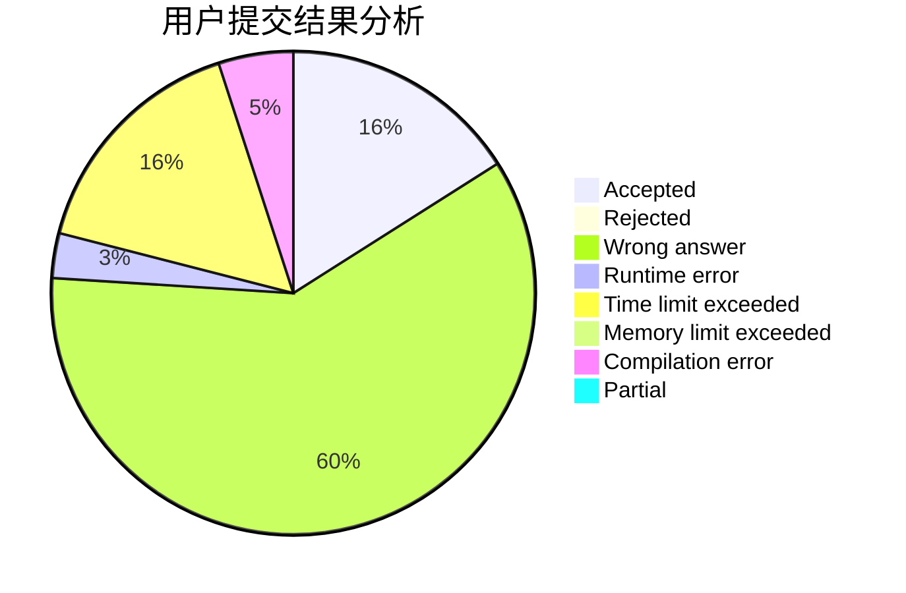
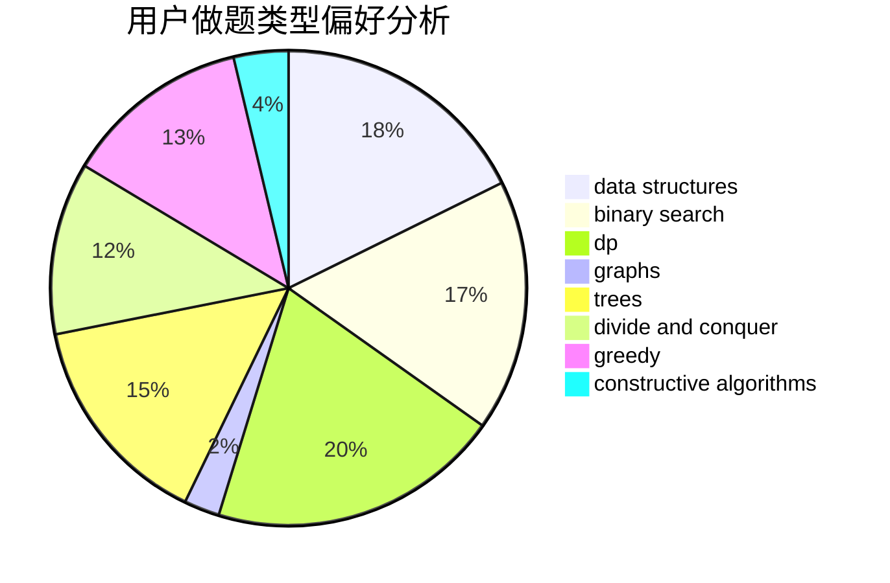
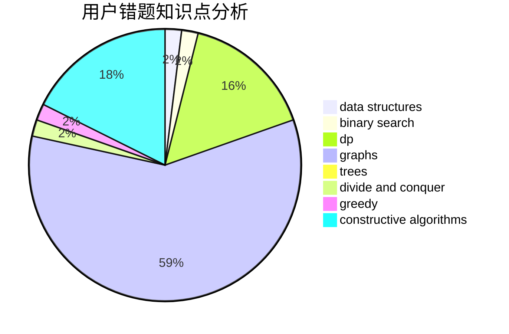

# AIUSR_TMP

<!-- tabs:start -->

#### **用户提交结果分析**

#### **用户做题类型偏好分析**

#### **用户错题知识点分析**

<!-- tabs:end -->
# 推荐题目
[1500E](https://codeforces.com/contest/1500/problem/E)		binary search,
                        data structures		  
[1499F](https://codeforces.com/contest/1499/problem/F)		combinatorics,
                        dfs and similar,
                        dp,
                        trees		  
[1290D](https://codeforces.com/contest/1290/problem/D)		constructive algorithms,
                        graphs,
                        interactive		  
[1431B](https://codeforces.com/contest/1431/problem/B)		*special problem,
                        implementation,
                        two pointers		  
[1017B](https://codeforces.com/contest/1017/problem/B)		implementation,
                        math		  
[14C](https://codeforces.com/contest/14/problem/C)		brute force,
                        constructive algorithms,
                        geometry,
                        implementation,
                        math		  
[102A](https://codeforces.com/contest/102/problem/A)		brute force		  
[14D](https://codeforces.com/contest/14/problem/D)		dfs and similar,
                        dp,
                        graphs,
                        shortest paths,
                        trees,
                        two pointers		  
[1500F](https://codeforces.com/contest/1500/problem/F)		dp		  
[1033C](https://codeforces.com/contest/1033/problem/C)		brute force,
                        dp,
                        games		  
