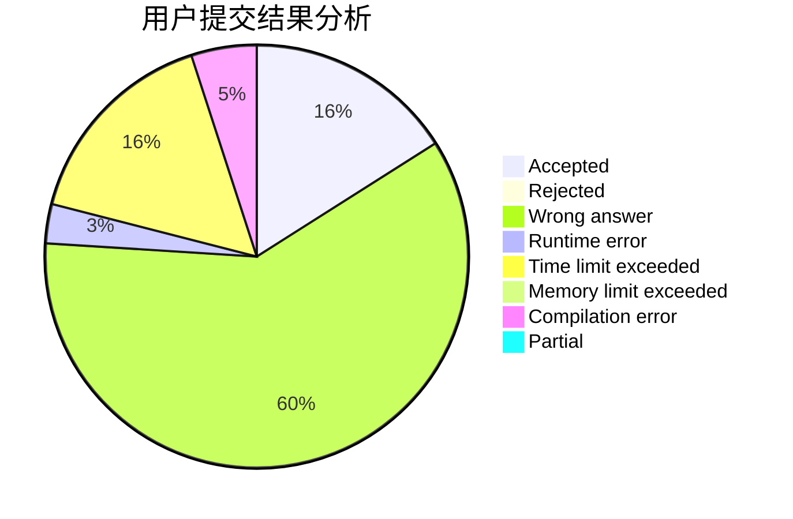
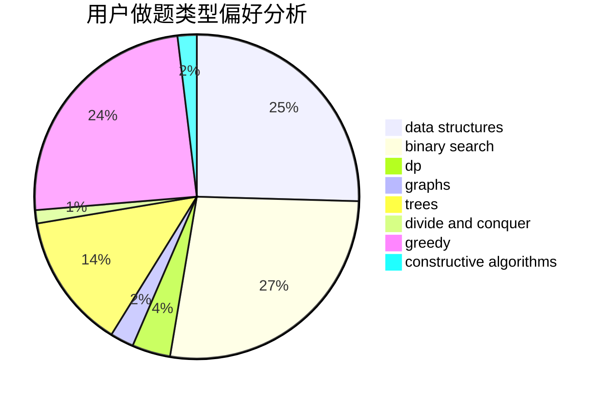
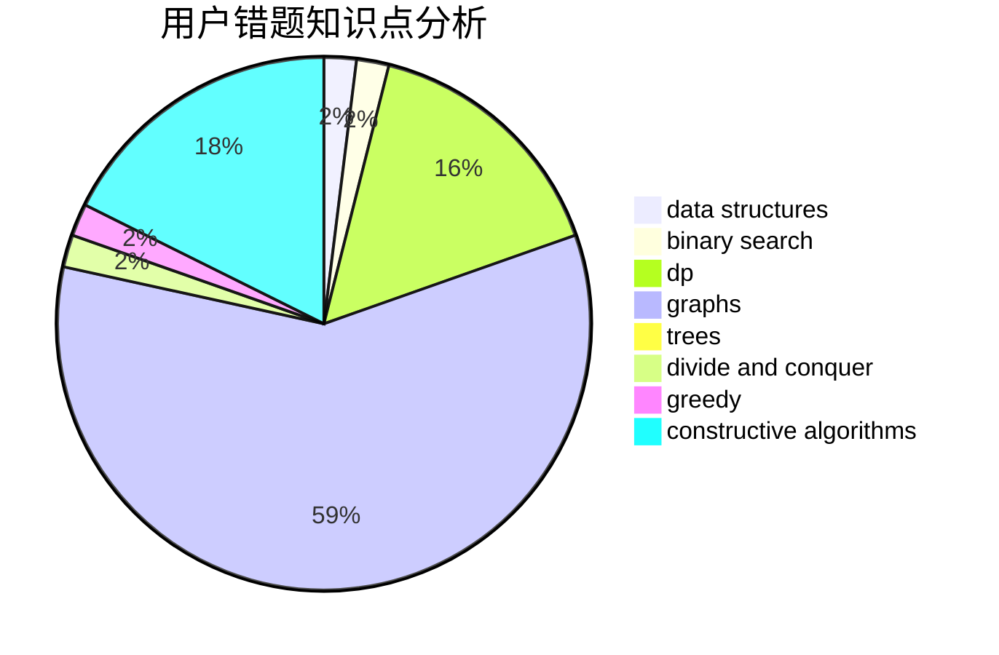

# AIUSR_TMP

<!-- tabs:start -->

#### **用户提交结果分析**

#### **用户做题类型偏好分析**

#### **用户错题知识点分析**

<!-- tabs:end -->
# 推荐题目
[1492D](https://codeforces.com/contest/1492/problem/D)		bitmasks,
                        constructive algorithms,
                        greedy,
                        math		  
[1490G](https://codeforces.com/contest/1490/problem/G)		binary search,
                        data structures,
                        math		  
[1283D](https://codeforces.com/contest/1283/problem/D)		graphs,
                        greedy,
                        shortest paths		  
[1423G](https://codeforces.com/contest/1423/problem/G)		data structures		  
[1016F](https://codeforces.com/contest/1016/problem/F)		dfs and similar,
                        dp,
                        trees		  
[1491F](https://codeforces.com/contest/1491/problem/F)		binary search,
                        constructive algorithms,
                        interactive		  
[1029D](https://codeforces.com/contest/1029/problem/D)		implementation,
                        math		  
[1491G](https://codeforces.com/contest/1491/problem/G)		constructive algorithms,
                        graphs,
                        math		  
[1492E](https://codeforces.com/contest/1492/problem/E)		brute force,
                        constructive algorithms,
                        dfs and similar,
                        greedy,
                        implementation		  
[1032F](https://codeforces.com/contest/1032/problem/F)		dp,
                        trees		  
