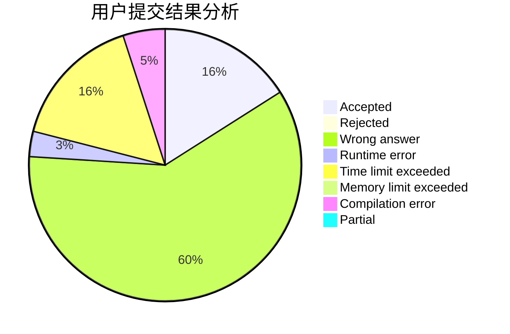
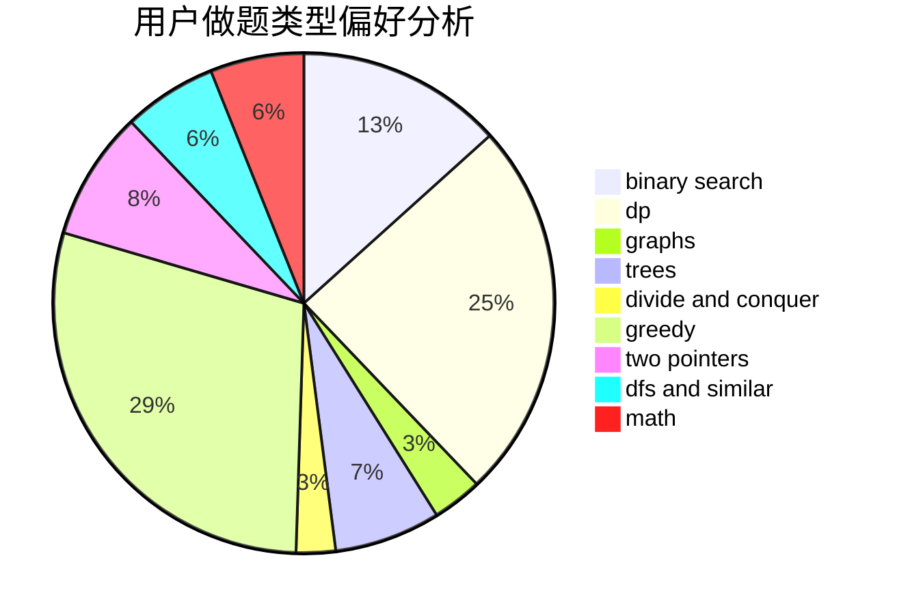

# AIUSR_TMP

<!-- tabs:start -->

#### **用户提交结果分析**

#### **用户做题类型偏好分析**

<!-- tabs:end -->
# 推荐题目
[1500E](https://codeforces.com/contest/1500/problem/E)
[1499F](https://codeforces.com/contest/1499/problem/F)
[1290D](https://codeforces.com/contest/1290/problem/D)
[1431B](https://codeforces.com/contest/1431/problem/B)
[1017B](https://codeforces.com/contest/1017/problem/B)
[14C](https://codeforces.com/contest/14/problem/C)
[102A](https://codeforces.com/contest/102/problem/A)
[14D](https://codeforces.com/contest/14/problem/D)
[1500F](https://codeforces.com/contest/1500/problem/F)
[1033C](https://codeforces.com/contest/1033/problem/C)
