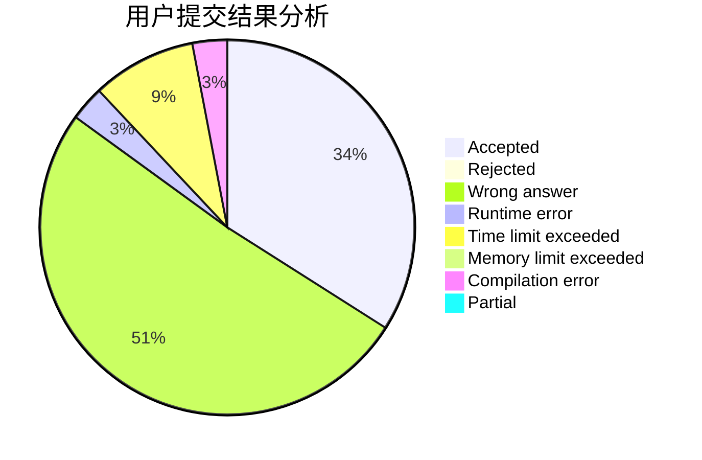
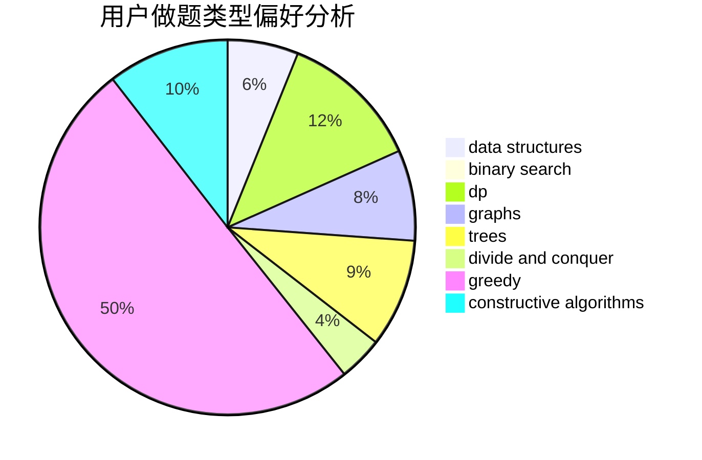

# RobsonChen
<!-- tabs:start -->
#### **用户提交结果分析**

#### **用户做题类型偏好分析**

#### **用户错题知识点分析**

<!-- tabs:end -->
# 推荐题目
[Vabank](https://codeforces.com/contest/1483/problem/E)		binary search,
                        interactive		  
[Margarite and the best present](http://codeforces.com/problemset/problem/1080/B)		math		  
[Playing Piano](https://codeforces.com/contest/1079/problem/C)		constructive algorithms,
                        dp		  
[Electrification](http://codeforces.com/problemset/problem/1175/C)		binary search,
                        brute force,
                        greedy		  
[Evil](http://codeforces.com/problemset/problem/329/E)		math		  
[Minimum Ternary String](http://codeforces.com/problemset/problem/1009/B)		greedy,
                        implementation		  
[No Game No Life](https://codeforces.com/contest/1464/problem/E)		bitmasks,
                        games,
                        math,
                        matrices		  
[Quest](http://codeforces.com/problemset/problem/542/F)		dp,
                        greedy		  
[Linear Kingdom Races](http://codeforces.com/problemset/problem/115/E)		data structures,
                        dp		  
[Year of University Entrance](http://codeforces.com/problemset/problem/769/A)		*special problem,
                        implementation,
                        sortings		  
<!-- tabs:start -->
#### **data structures**
[Vabank](http://codeforces.com/problemset/problem/115/E)		data structures,
                        dp		  
[Margarite and the best present](http://codeforces.com/problemset/problem/838/B)		data structures,
                        dfs and similar,
                        trees		  
[Playing Piano](http://codeforces.com/problemset/problem/703/D)		data structures		  
[Electrification](http://codeforces.com/problemset/problem/940/F)		brute force,
                        data structures		  
[Evil](http://codeforces.com/problemset/problem/1257/E)		data structures,
                        dp,
                        greedy		  
[Minimum Ternary String](http://codeforces.com/problemset/problem/1076/E)		data structures,
                        trees		  
[No Game No Life](https://codeforces.com/contest/1382/problem/C2)		constructive algorithms,
                        data structures,
                        implementation,
                        strings,
                        two pointers		  
[Quest](http://codeforces.com/problemset/problem/1109/E)		data structures,
                        number theory		  
[Linear Kingdom Races](http://codeforces.com/problemset/problem/1492/C)		binary search,
                        data structures,
                        dp,
                        greedy,
                        two pointers		  
[Year of University Entrance](http://codeforces.com/problemset/problem/1490/G)		binary search,
                        data structures,
                        math		  
#### **binary search**
[Vabank](https://codeforces.com/contest/1483/problem/E)		binary search,
                        interactive		  
[Margarite and the best present](http://codeforces.com/problemset/problem/1175/C)		binary search,
                        brute force,
                        greedy		  
[Playing Piano](http://codeforces.com/problemset/problem/325/B)		binary search,
                        math		  
[Electrification](http://codeforces.com/problemset/problem/732/C)		binary search,
                        constructive algorithms,
                        greedy,
                        implementation,
                        math		  
[Evil](http://codeforces.com/problemset/problem/255/D)		binary search,
                        implementation,
                        math		  
[Minimum Ternary String](http://codeforces.com/problemset/problem/1492/C)		binary search,
                        data structures,
                        dp,
                        greedy,
                        two pointers		  
[No Game No Life](http://codeforces.com/problemset/problem/1463/D)		binary search,
                        constructive algorithms,
                        greedy,
                        two pointers		  
[Quest](http://codeforces.com/problemset/problem/1490/G)		binary search,
                        data structures,
                        math		  
[Linear Kingdom Races](http://codeforces.com/problemset/problem/1479/D)		binary search,
                        bitmasks,
                        brute force,
                        data structures,
                        probabilities,
                        trees		  
[Year of University Entrance](http://codeforces.com/problemset/problem/1436/E)		binary search,
                        data structures,
                        two pointers		  
#### **dp**
[Vabank](https://codeforces.com/contest/1079/problem/C)		constructive algorithms,
                        dp		  
[Margarite and the best present](http://codeforces.com/problemset/problem/542/F)		dp,
                        greedy		  
[Playing Piano](http://codeforces.com/problemset/problem/115/E)		data structures,
                        dp		  
[Electrification](http://codeforces.com/problemset/problem/533/B)		dfs and similar,
                        dp,
                        graphs,
                        strings,
                        trees		  
[Evil](http://codeforces.com/problemset/problem/1070/G)		brute force,
                        dp,
                        greedy,
                        implementation		  
[Minimum Ternary String](http://codeforces.com/problemset/problem/1257/E)		data structures,
                        dp,
                        greedy		  
[No Game No Life](http://codeforces.com/problemset/problem/724/F)		combinatorics,
                        dp,
                        trees		  
[Quest](http://codeforces.com/problemset/problem/115/D)		dp,
                        expression parsing		  
[Linear Kingdom Races](http://codeforces.com/problemset/problem/653/B)		brute force,
                        dfs and similar,
                        dp,
                        strings		  
[Year of University Entrance](http://codeforces.com/problemset/problem/1245/E)		dp,
                        probabilities,
                        shortest paths		  
#### **graph**
[Vabank](http://codeforces.com/problemset/problem/533/B)		dfs and similar,
                        dp,
                        graphs,
                        strings,
                        trees		  
[Margarite and the best present](http://codeforces.com/problemset/problem/1239/F)		graphs,
                        implementation		  
[Playing Piano](http://codeforces.com/problemset/problem/1487/C)		brute force,
                        constructive algorithms,
                        dfs and similar,
                        graphs,
                        greedy,
                        implementation,
                        math		  
[Electrification](http://codeforces.com/problemset/problem/1437/C)		dp,
                        flows,
                        graph matchings,
                        greedy,
                        math,
                        sortings		  
[Evil](http://codeforces.com/problemset/problem/1470/D)		constructive algorithms,
                        dfs and similar,
                        graph matchings,
                        graphs,
                        greedy		  
[Minimum Ternary String](http://codeforces.com/problemset/problem/1476/C)		dp,
                        graphs,
                        greedy		  
[No Game No Life](http://codeforces.com/problemset/problem/1304/D)		constructive algorithms,
                        graphs,
                        greedy,
                        two pointers		  
[Quest](http://codeforces.com/problemset/problem/1475/C)		combinatorics,
                        graphs,
                        math		  
[Linear Kingdom Races](http://codeforces.com/problemset/problem/553/E)		dp,
                        fft,
                        graphs,
                        math,
                        probabilities		  
[Year of University Entrance](http://codeforces.com/problemset/problem/1495/C)		constructive algorithms,
                        graphs		  
#### **trees**
[Vabank](http://codeforces.com/problemset/problem/838/B)		data structures,
                        dfs and similar,
                        trees		  
[Margarite and the best present](http://codeforces.com/problemset/problem/533/B)		dfs and similar,
                        dp,
                        graphs,
                        strings,
                        trees		  
[Playing Piano](http://codeforces.com/problemset/problem/1205/D)		constructive algorithms,
                        trees		  
[Electrification](http://codeforces.com/problemset/problem/1076/E)		data structures,
                        trees		  
[Evil](http://codeforces.com/problemset/problem/724/F)		combinatorics,
                        dp,
                        trees		  
[Minimum Ternary String](http://codeforces.com/problemset/problem/1479/D)		binary search,
                        bitmasks,
                        brute force,
                        data structures,
                        probabilities,
                        trees		  
[No Game No Life](http://codeforces.com/problemset/problem/1511/C)		brute force,
                        data structures,
                        implementation,
                        trees		  
[Quest](http://codeforces.com/problemset/problem/1499/F)		combinatorics,
                        dfs and similar,
                        dp,
                        trees		  
[Linear Kingdom Races](http://codeforces.com/problemset/problem/1491/E)		brute force,
                        dfs and similar,
                        divide and conquer,
                        number theory,
                        trees		  
[Year of University Entrance](http://codeforces.com/problemset/problem/1466/D)		data structures,
                        greedy,
                        sortings,
                        trees		  
#### **divide and conquer**
[Vabank](http://codeforces.com/problemset/problem/1461/D)		binary search,
                        brute force,
                        data structures,
                        divide and conquer,
                        implementation,
                        sortings		  
[Margarite and the best present](http://codeforces.com/problemset/problem/1466/G)		combinatorics,
                        divide and conquer,
                        hashing,
                        math,
                        string suffix structures,
                        strings		  
[Playing Piano](http://codeforces.com/problemset/problem/1490/D)		dfs and similar,
                        divide and conquer,
                        implementation		  
[Electrification](https://codeforces.com/contest/1483/problem/C)		data structures,
                        divide and conquer,
                        dp		  
[Evil](http://codeforces.com/problemset/problem/1491/E)		brute force,
                        dfs and similar,
                        divide and conquer,
                        number theory,
                        trees		  
[Minimum Ternary String](http://codeforces.com/problemset/problem/1303/G)		data structures,
                        divide and conquer,
                        geometry,
                        trees		  
[No Game No Life](http://codeforces.com/problemset/problem/1494/D)		constructive algorithms,
                        data structures,
                        dfs and similar,
                        divide and conquer,
                        dsu,
                        greedy,
                        sortings,
                        trees		  
[Quest](http://codeforces.com/problemset/problem/1482/E)		data structures,
                        divide and conquer,
                        dp		  
[Linear Kingdom Races](http://codeforces.com/problemset/problem/566/C)		dfs and similar,
                        divide and conquer,
                        trees		  
[Year of University Entrance](http://codeforces.com/problemset/problem/1428/F)		binary search,
                        data structures,
                        divide and conquer,
                        dp,
                        two pointers		  
#### **greedy**
[Vabank](http://codeforces.com/problemset/problem/1175/C)		binary search,
                        brute force,
                        greedy		  
[Margarite and the best present](http://codeforces.com/problemset/problem/1009/B)		greedy,
                        implementation		  
[Playing Piano](http://codeforces.com/problemset/problem/542/F)		dp,
                        greedy		  
[Electrification](http://codeforces.com/problemset/problem/1157/C1)		greedy		  
[Evil](http://codeforces.com/problemset/problem/402/A)		greedy,
                        math		  
[Minimum Ternary String](http://codeforces.com/problemset/problem/732/C)		binary search,
                        constructive algorithms,
                        greedy,
                        implementation,
                        math		  
[No Game No Life](http://codeforces.com/problemset/problem/1407/B)		brute force,
                        greedy,
                        math,
                        number theory		  
[Quest](http://codeforces.com/problemset/problem/1070/G)		brute force,
                        dp,
                        greedy,
                        implementation		  
[Linear Kingdom Races](http://codeforces.com/problemset/problem/1189/B)		greedy,
                        math,
                        sortings		  
[Year of University Entrance](http://codeforces.com/problemset/problem/1181/B)		greedy,
                        implementation,
                        strings		  
#### **constructive algorithms**
[Vabank](https://codeforces.com/contest/1079/problem/C)		constructive algorithms,
                        dp		  
[Margarite and the best present](http://codeforces.com/problemset/problem/732/C)		binary search,
                        constructive algorithms,
                        greedy,
                        implementation,
                        math		  
[Playing Piano](http://codeforces.com/problemset/problem/734/F)		bitmasks,
                        constructive algorithms,
                        implementation,
                        math		  
[Electrification](http://codeforces.com/problemset/problem/1205/D)		constructive algorithms,
                        trees		  
[Evil](http://codeforces.com/problemset/problem/1321/C)		brute force,
                        constructive algorithms,
                        greedy,
                        strings		  
[Minimum Ternary String](https://codeforces.com/contest/1382/problem/C2)		constructive algorithms,
                        data structures,
                        implementation,
                        strings,
                        two pointers		  
[No Game No Life](http://codeforces.com/problemset/problem/1433/D)		constructive algorithms,
                        dfs and similar		  
[Quest](http://codeforces.com/problemset/problem/1497/C2)		constructive algorithms,
                        math		  
[Linear Kingdom Races](http://codeforces.com/problemset/problem/1513/E)		combinatorics,
                        constructive algorithms,
                        math,
                        sortings		  
[Year of University Entrance](http://codeforces.com/problemset/problem/1332/D)		bitmasks,
                        constructive algorithms,
                        math		  
#### **sortings**
[Vabank](http://codeforces.com/problemset/problem/769/A)		*special problem,
                        implementation,
                        sortings		  
[Margarite and the best present](http://codeforces.com/problemset/problem/1189/B)		greedy,
                        math,
                        sortings		  
[Playing Piano](http://codeforces.com/problemset/problem/1513/E)		combinatorics,
                        constructive algorithms,
                        math,
                        sortings		  
[Electrification](https://codeforces.com/contest/1496/problem/C)		geometry,
                        greedy,
                        math,
                        sortings		  
[Evil](http://codeforces.com/problemset/problem/1495/A)		geometry,
                        greedy,
                        math,
                        sortings		  
[Minimum Ternary String](http://codeforces.com/problemset/problem/1497/A)		brute force,
                        data structures,
                        greedy,
                        sortings		  
[No Game No Life](http://codeforces.com/problemset/problem/1427/A)		math,
                        sortings		  
[Quest](http://codeforces.com/problemset/problem/1461/D)		binary search,
                        brute force,
                        data structures,
                        divide and conquer,
                        implementation,
                        sortings		  
[Linear Kingdom Races](http://codeforces.com/problemset/problem/1437/C)		dp,
                        flows,
                        graph matchings,
                        greedy,
                        math,
                        sortings		  
[Year of University Entrance](http://codeforces.com/problemset/problem/1473/A)		greedy,
                        implementation,
                        math,
                        sortings		  
<!-- tabs:end -->
