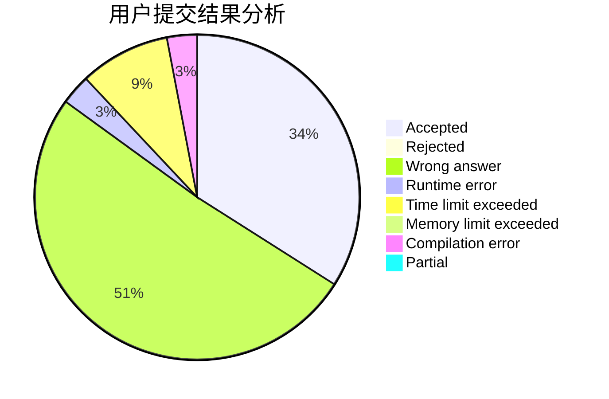
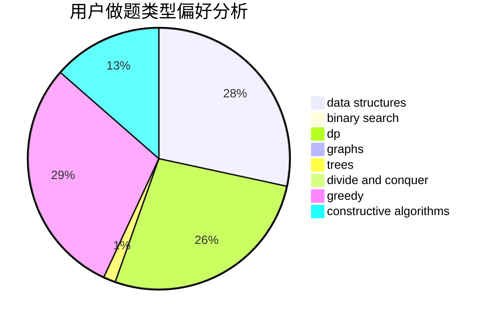

# RobsonChen

<!-- tabs:start -->

#### **用户提交结果分析**

#### **用户做题类型偏好分析**

#### **用户错题知识点分析**

<!-- tabs:end -->
# 推荐题目
[1491C](https://codeforces.com/contest/1491/problem/C)		brute force,
                        data structures,
                        dp,
                        greedy,
                        implementation		  
[1178C](https://codeforces.com/contest/1178/problem/C)		combinatorics,
                        greedy,
                        math		  
[567B](https://codeforces.com/contest/567/problem/B)		implementation		  
[107B](https://codeforces.com/contest/107/problem/B)		combinatorics,
                        dp,
                        math,
                        probabilities		  
[1080E](https://codeforces.com/contest/1080/problem/E)		strings		  
[274A](https://codeforces.com/contest/274/problem/A)		binary search,
                        greedy,
                        sortings		  
[1009E](https://codeforces.com/contest/1009/problem/E)		combinatorics,
                        math,
                        probabilities		  
[817B](https://codeforces.com/contest/817/problem/B)		combinatorics,
                        implementation,
                        math,
                        sortings		  
[357B](https://codeforces.com/contest/357/problem/B)		constructive algorithms,
                        implementation		  
[722F](https://codeforces.com/contest/722/problem/F)		chinese remainder theorem,
                        data structures,
                        implementation,
                        number theory,
                        two pointers		  
