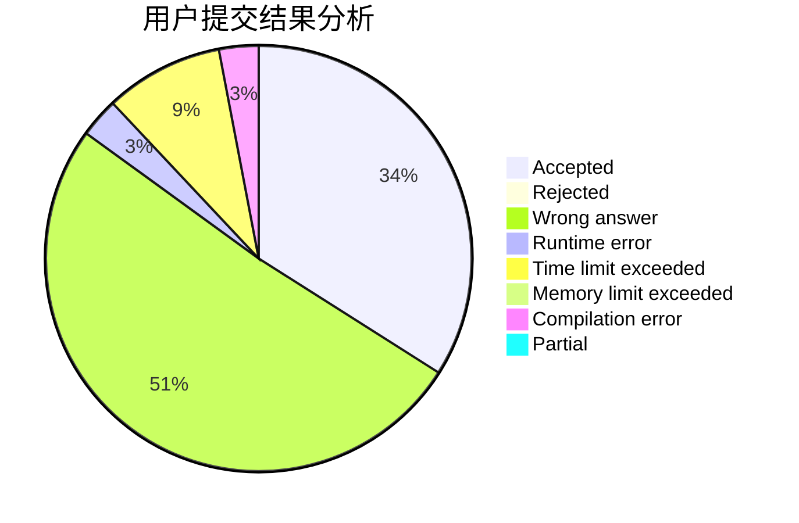
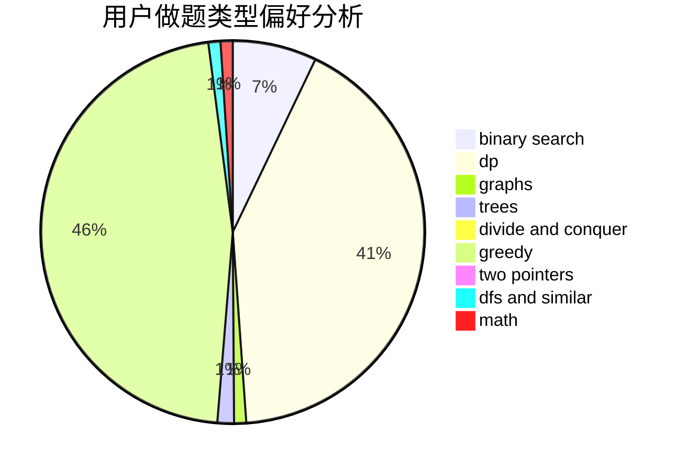

# RobsonChen

<!-- tabs:start -->

#### **用户提交结果分析**

#### **用户做题类型偏好分析**

<!-- tabs:end -->
# 推荐题目
[1491C](https://codeforces.com/contest/1491/problem/C)
[1178C](https://codeforces.com/contest/1178/problem/C)
[567B](https://codeforces.com/contest/567/problem/B)
[107B](https://codeforces.com/contest/107/problem/B)
[1080E](https://codeforces.com/contest/1080/problem/E)
[274A](https://codeforces.com/contest/274/problem/A)
[1009E](https://codeforces.com/contest/1009/problem/E)
[817B](https://codeforces.com/contest/817/problem/B)
[357B](https://codeforces.com/contest/357/problem/B)
[722F](https://codeforces.com/contest/722/problem/F)
