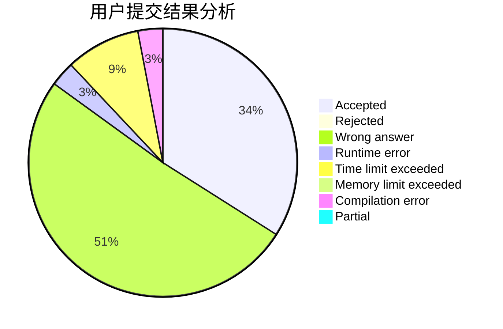
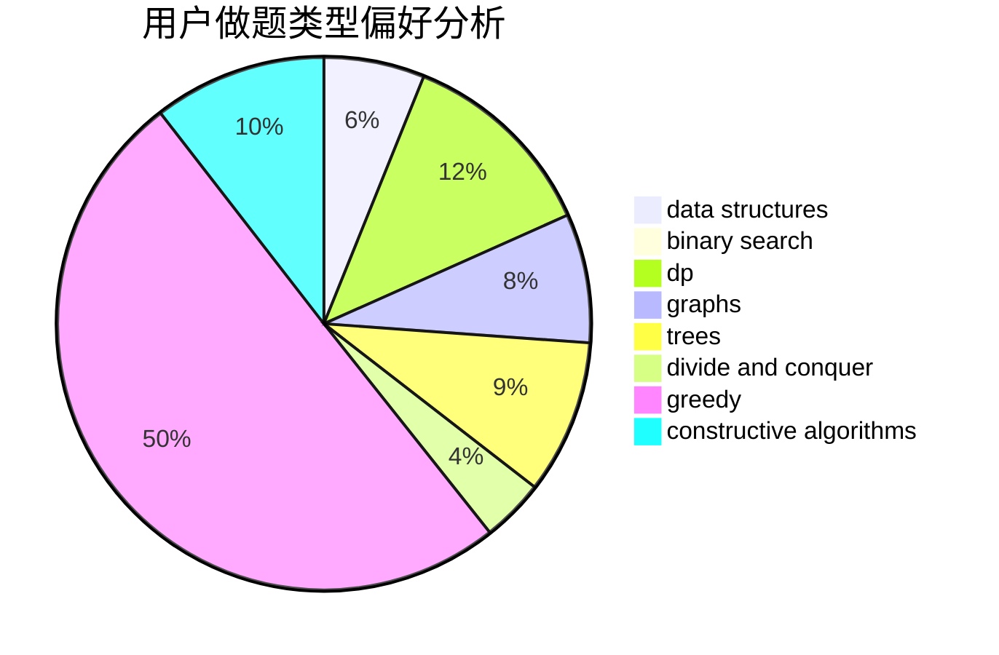

# RobsonChen

<!-- tabs:start -->

#### **用户提交结果分析**

#### **用户做题类型偏好分析**

#### **用户错题知识点分析**

<!-- tabs:end -->
# 推荐题目
[1483E](https://codeforces.com/contest/1483/problem/E)		dsu,graphs,sortings,trees		  
[1175C](https://codeforces.com/contest/1175/problem/C)		binary search,
                        brute force,
                        greedy		  
[542F](https://codeforces.com/contest/542/problem/F)		dp,
                        greedy		  
[1079C](https://codeforces.com/contest/1079/problem/C)		dsu,graphs,sortings,trees		  
[1080B](https://codeforces.com/contest/1080/problem/B)		math		  
[255D](https://codeforces.com/contest/255/problem/D)		binary search,
                        implementation,
                        math		  
[1009B](https://codeforces.com/contest/1009/problem/B)		greedy,
                        implementation		  
[802C](https://codeforces.com/contest/802/problem/C)		flows		  
[329E](https://codeforces.com/contest/329/problem/E)		math		  
[703D](https://codeforces.com/contest/703/problem/D)		data structures		  
