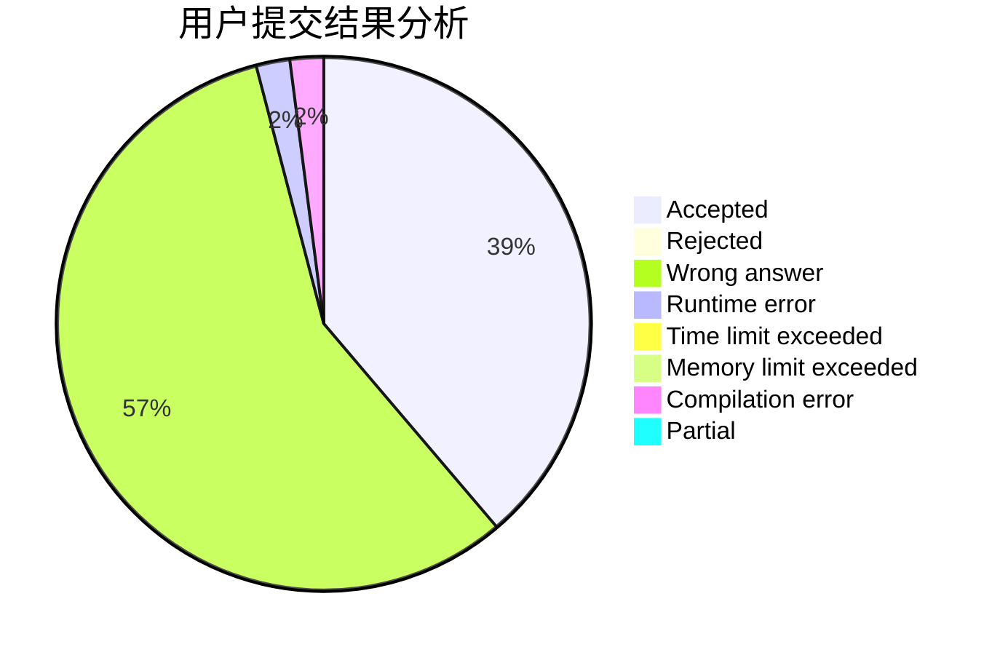
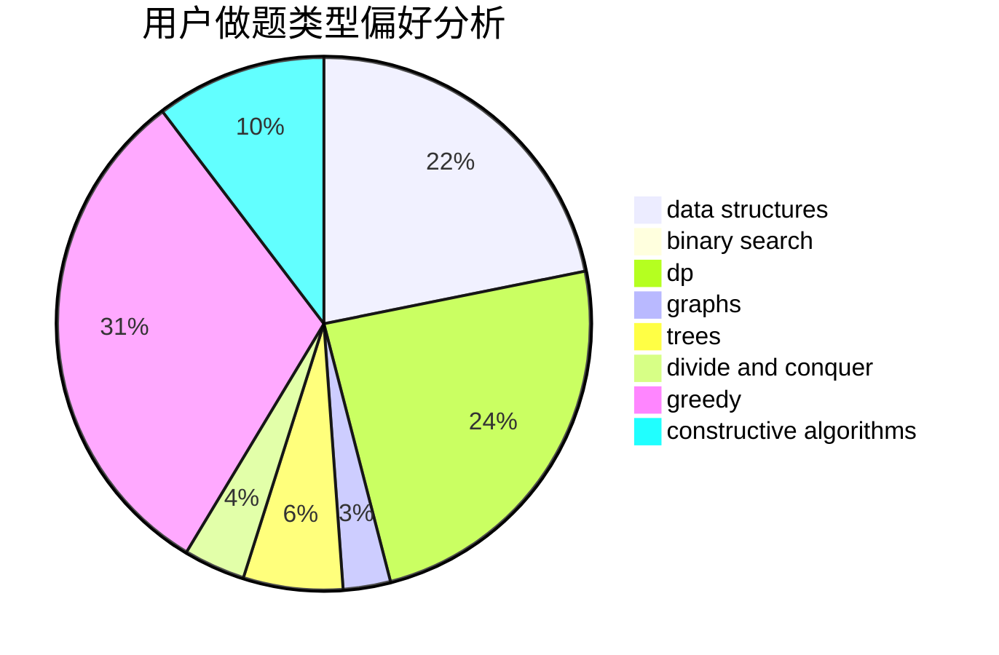

# RoccoShi

<!-- tabs:start -->

#### **用户提交结果分析**

#### **用户做题类型偏好分析**

#### **用户错题知识点分析**

<!-- tabs:end -->
# 推荐题目
[7A](https://codeforces.com/contest/7/problem/A)		brute force,
                        constructive algorithms		  
[370A](https://codeforces.com/contest/370/problem/A)		graphs,
                        math,
                        shortest paths		  
[1142D](https://codeforces.com/contest/1142/problem/D)		dp		  
[540C](https://codeforces.com/contest/540/problem/C)		dfs and similar		  
[338D](https://codeforces.com/contest/338/problem/D)		chinese remainder theorem,
                        math,
                        number theory		  
[683A](https://codeforces.com/contest/683/problem/A)		*special problem,
                        geometry		  
[1071A](https://codeforces.com/contest/1071/problem/A)		dsu,graphs,sortings,trees		  
[547C](https://codeforces.com/contest/547/problem/C)		bitmasks,
                        combinatorics,
                        dp,
                        math,
                        number theory		  
[778C](https://codeforces.com/contest/778/problem/C)		brute force,
                        dfs and similar,
                        dsu,
                        hashing,
                        strings,
                        trees		  
[1240C](https://codeforces.com/contest/1240/problem/C)		dsu,graphs,sortings,trees		  
