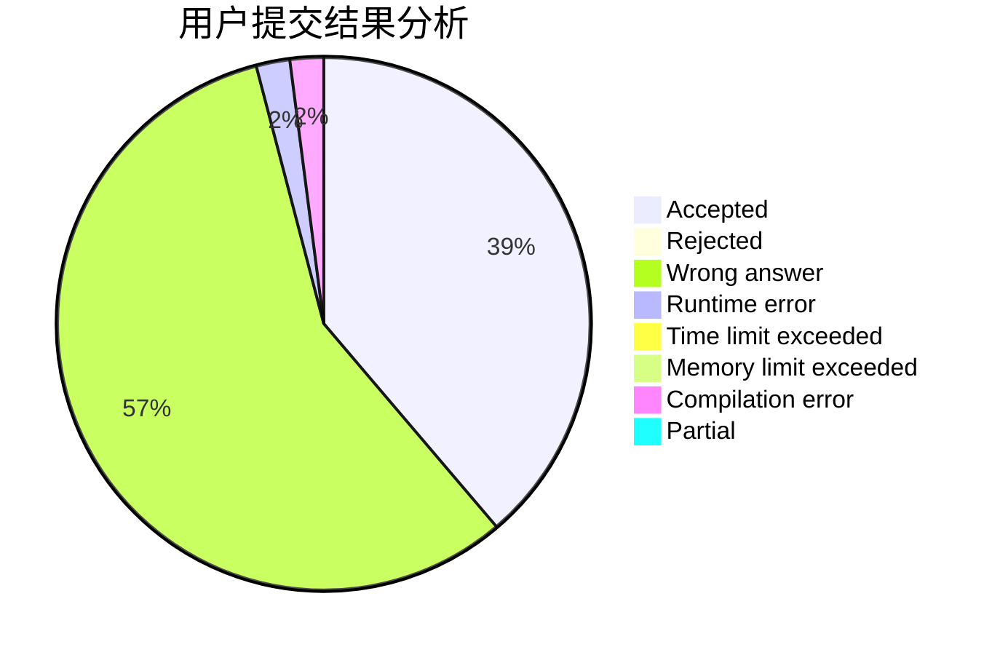
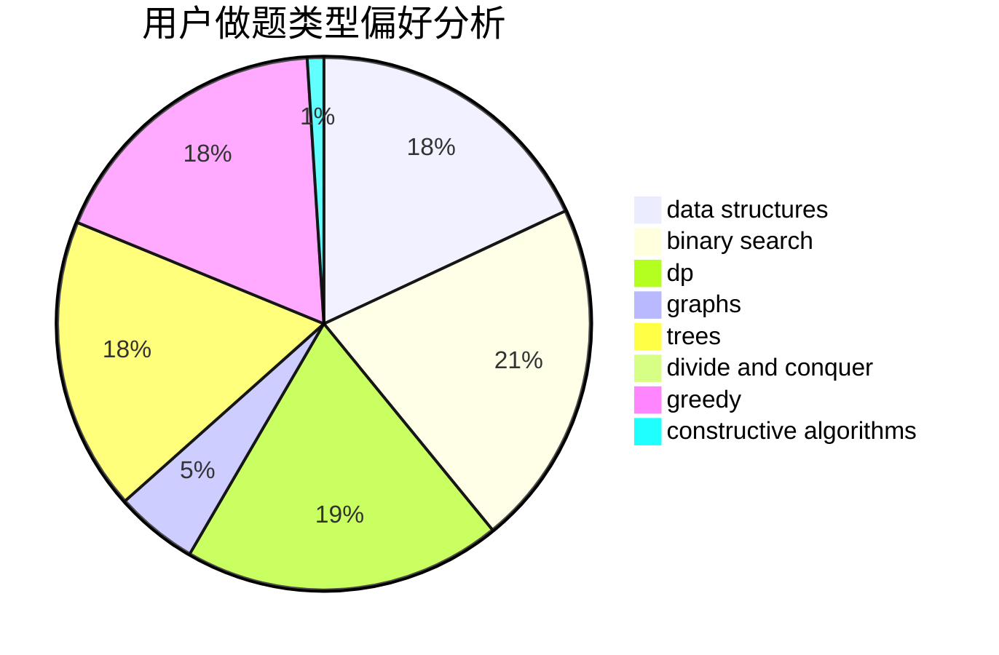

# RoccoShi

<!-- tabs:start -->

#### **用户提交结果分析**

#### **用户做题类型偏好分析**

#### **用户错题知识点分析**

<!-- tabs:end -->
# 推荐题目
[781C](https://codeforces.com/contest/781/problem/C)		dsu,graphs,sortings,trees		  
[343E](https://codeforces.com/contest/343/problem/E)		brute force,
                        dfs and similar,
                        divide and conquer,
                        flows,
                        graphs,
                        greedy,
                        trees		  
[1140F](https://codeforces.com/contest/1140/problem/F)		data structures,
                        divide and conquer,
                        dsu		  
[514E](https://codeforces.com/contest/514/problem/E)		dp,
                        matrices		  
[313E](https://codeforces.com/contest/313/problem/E)		constructive algorithms,
                        data structures,
                        dsu,
                        greedy		  
[663E](https://codeforces.com/contest/663/problem/E)		dsu,graphs,sortings,trees		  
[1070K](https://codeforces.com/contest/1070/problem/K)		implementation		  
[521D](https://codeforces.com/contest/521/problem/D)		greedy		  
[759A](https://codeforces.com/contest/759/problem/A)		dsu,graphs,sortings,trees		  
[1234F](https://codeforces.com/contest/1234/problem/F)		bitmasks,
                        dp		  
