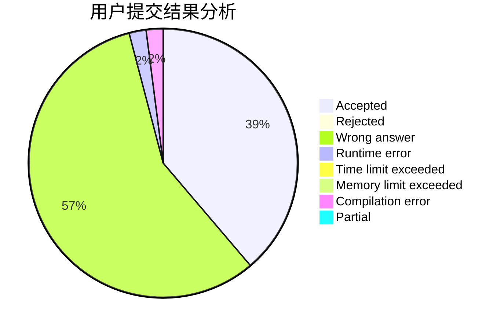
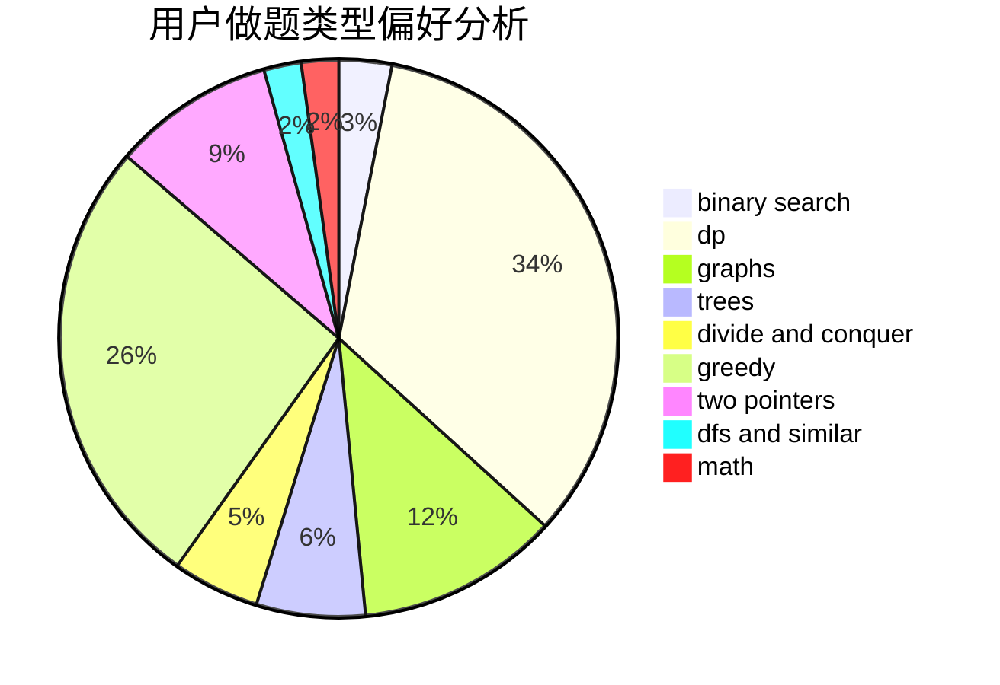

# RoccoShi

<!-- tabs:start -->

#### **用户提交结果分析**

#### **用户做题类型偏好分析**

<!-- tabs:end -->
# 推荐题目
[7A](https://codeforces.com/contest/7/problem/A)
[370A](https://codeforces.com/contest/370/problem/A)
[1142D](https://codeforces.com/contest/1142/problem/D)
[540C](https://codeforces.com/contest/540/problem/C)
[338D](https://codeforces.com/contest/338/problem/D)
[683A](https://codeforces.com/contest/683/problem/A)
[1071A](https://codeforces.com/contest/1071/problem/A)
[547C](https://codeforces.com/contest/547/problem/C)
[778C](https://codeforces.com/contest/778/problem/C)
[1240C](https://codeforces.com/contest/1240/problem/C)
