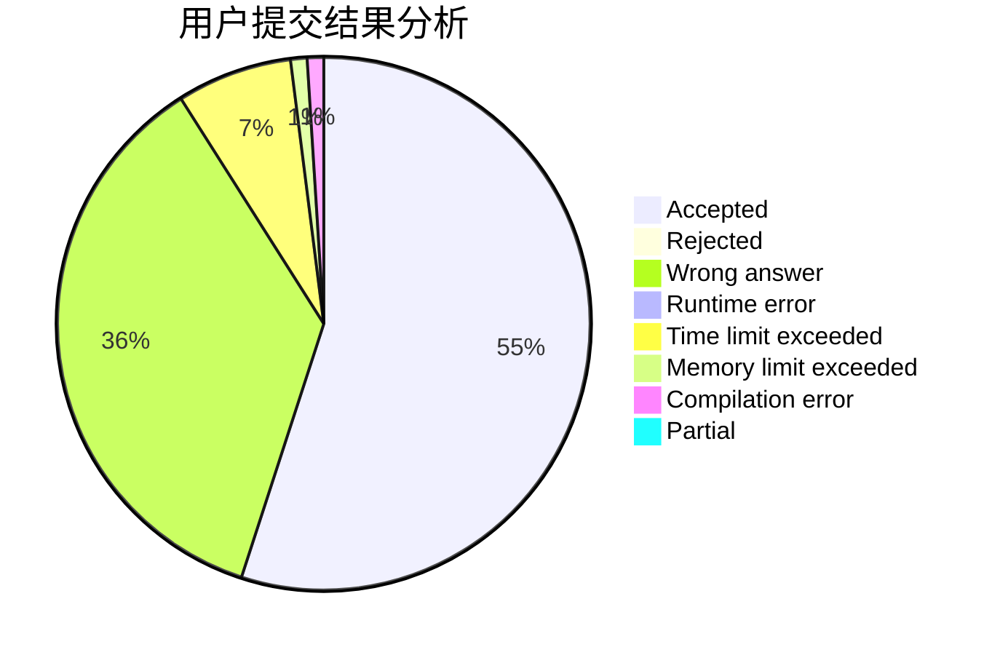
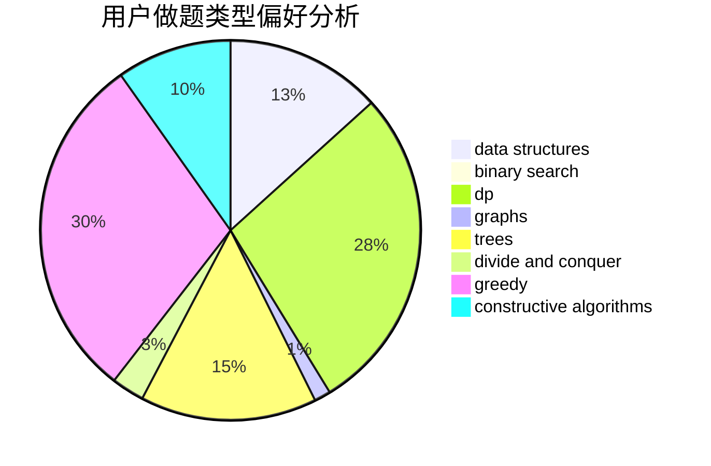
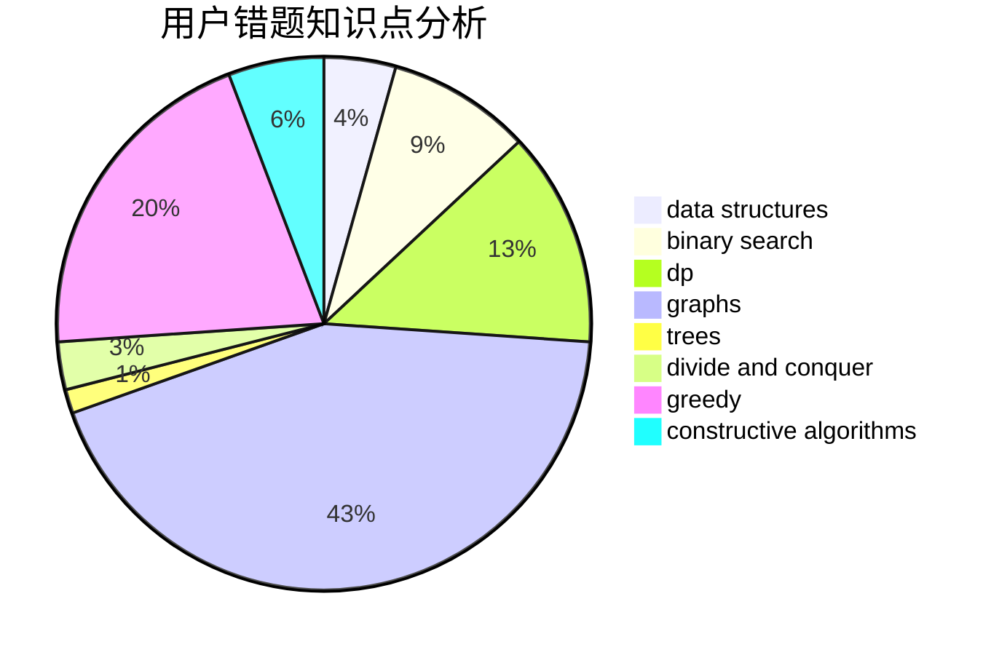

# RogerDTZ

<!-- tabs:start -->

#### **用户提交结果分析**

#### **用户做题类型偏好分析**

#### **用户错题知识点分析**

<!-- tabs:end -->
# 推荐题目
[3A](https://codeforces.com/contest/3/problem/A)		greedy,
                        shortest paths		  
[274D](https://codeforces.com/contest/274/problem/D)		dfs and similar,
                        graphs,
                        greedy,
                        sortings		  
[1459F](https://codeforces.com/contest/1459/problem/F)		dsu,graphs,sortings,trees		  
[870C](https://codeforces.com/contest/870/problem/C)		dp,
                        greedy,
                        math,
                        number theory		  
[1067B](https://codeforces.com/contest/1067/problem/B)		dfs and similar,
                        graphs,
                        shortest paths		  
[1310A](https://codeforces.com/contest/1310/problem/A)		data structures,
                        greedy,
                        sortings		  
[1415A](https://codeforces.com/contest/1415/problem/A)		brute force,
                        math		  
[633C](https://codeforces.com/contest/633/problem/C)		data structures,
                        dp,
                        hashing,
                        implementation,
                        sortings,
                        string suffix structures,
                        strings		  
[478C](https://codeforces.com/contest/478/problem/C)		greedy		  
[1064F](https://codeforces.com/contest/1064/problem/F)		dsu,graphs,sortings,trees		  
