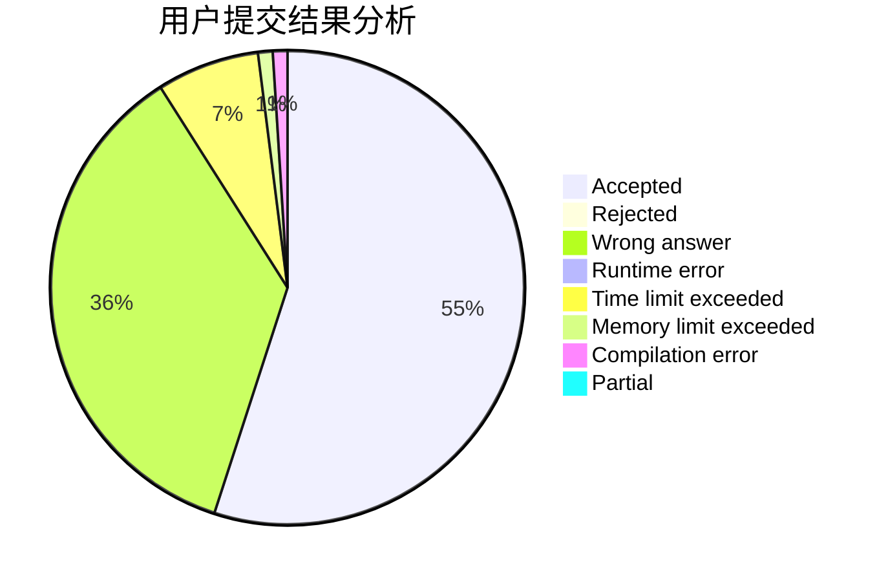
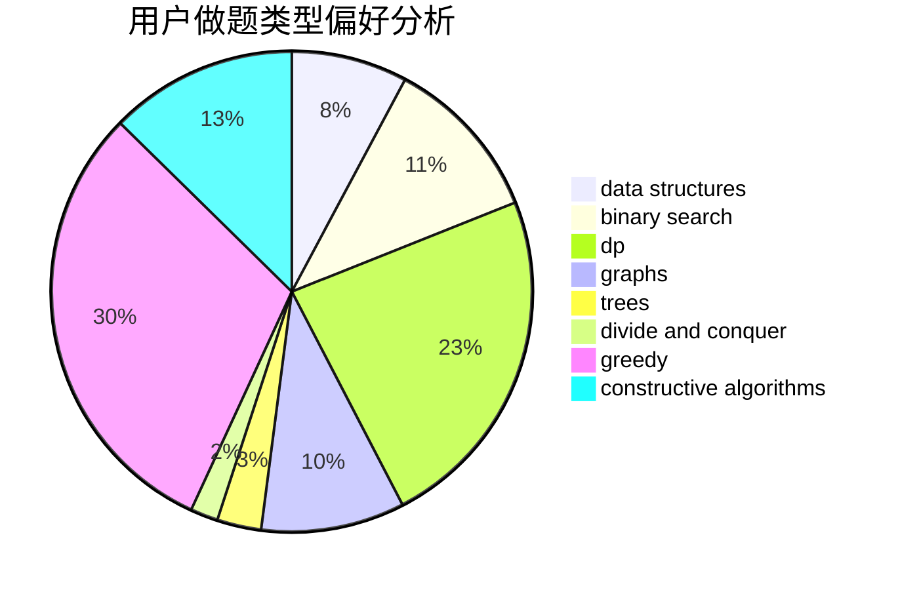
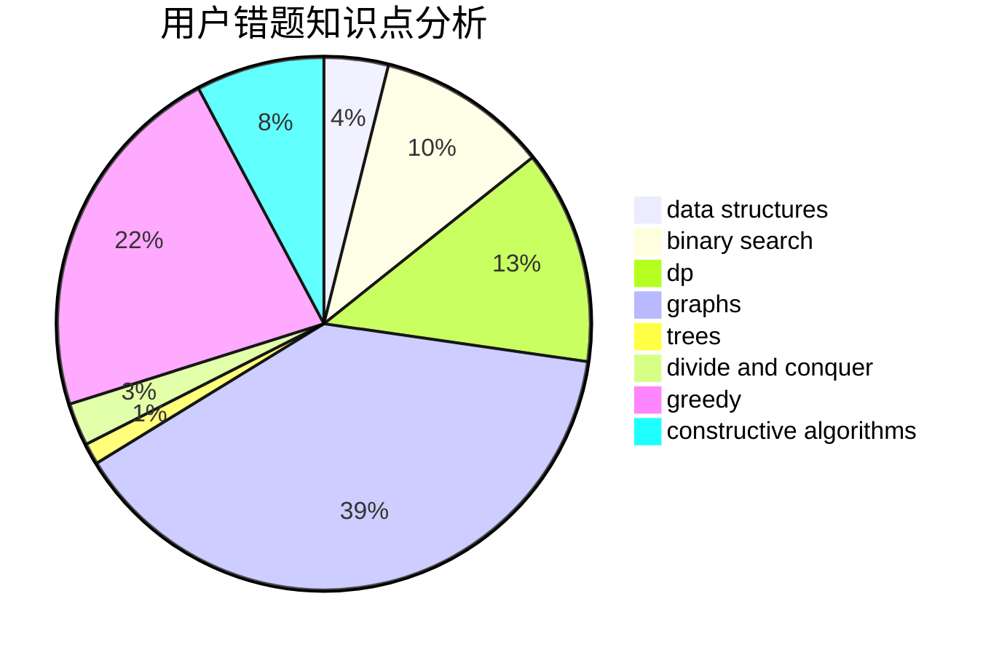

# RogerDTZ

<!-- tabs:start -->

#### **用户提交结果分析**

#### **用户做题类型偏好分析**

#### **用户错题知识点分析**

<!-- tabs:end -->
# 推荐题目
[36D](https://codeforces.com/contest/36/problem/D)		games		  
[257D](https://codeforces.com/contest/257/problem/D)		greedy,
                        math		  
[1450H2](https://codeforces.com/contest/1450H/problem/2)		combinatorics,
                        implementation,
                        math		  
[852D](https://codeforces.com/contest/852/problem/D)		binary search,
                        flows,
                        graph matchings,
                        shortest paths		  
[1066E](https://codeforces.com/contest/1066/problem/E)		data structures,
                        implementation,
                        math		  
[1300C](https://codeforces.com/contest/1300/problem/C)		dsu,graphs,sortings,trees		  
[1403B](https://codeforces.com/contest/1403/problem/B)		*special problem,
                        data structures,
                        dfs and similar,
                        graphs,
                        trees		  
[614D](https://codeforces.com/contest/614/problem/D)		dsu,graphs,sortings,trees		  
[459D](https://codeforces.com/contest/459/problem/D)		data structures,
                        divide and conquer,
                        sortings		  
[1064C](https://codeforces.com/contest/1064/problem/C)		dsu,graphs,sortings,trees		  
