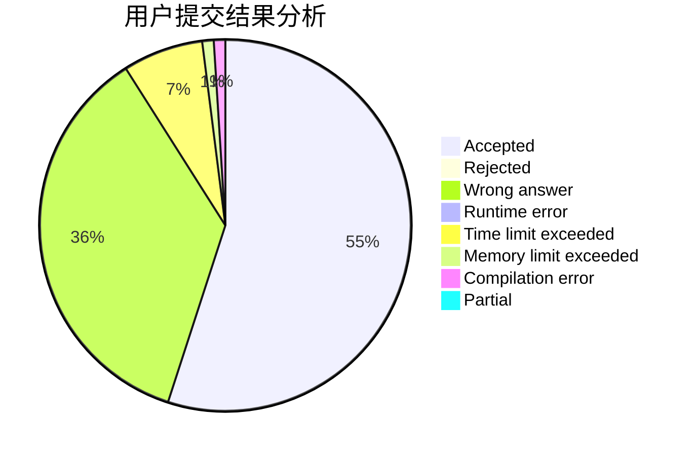
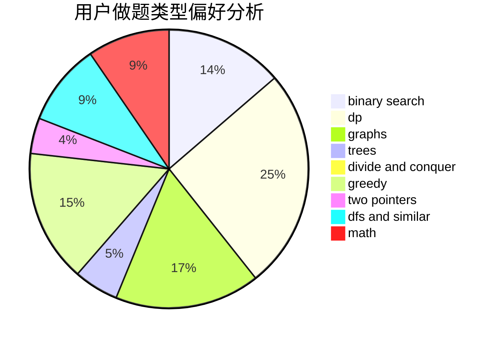

# RogerDTZ

<!-- tabs:start -->

#### **用户提交结果分析**

#### **用户做题类型偏好分析**

<!-- tabs:end -->
# 推荐题目
[3A](https://codeforces.com/contest/3/problem/A)
[274D](https://codeforces.com/contest/274/problem/D)
[1459F](https://codeforces.com/contest/1459/problem/F)
[870C](https://codeforces.com/contest/870/problem/C)
[1067B](https://codeforces.com/contest/1067/problem/B)
[1310A](https://codeforces.com/contest/1310/problem/A)
[1415A](https://codeforces.com/contest/1415/problem/A)
[633C](https://codeforces.com/contest/633/problem/C)
[478C](https://codeforces.com/contest/478/problem/C)
[1064F](https://codeforces.com/contest/1064/problem/F)
