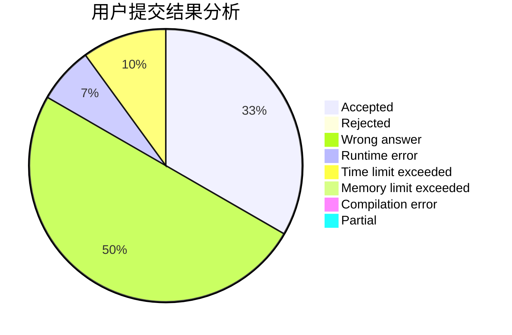
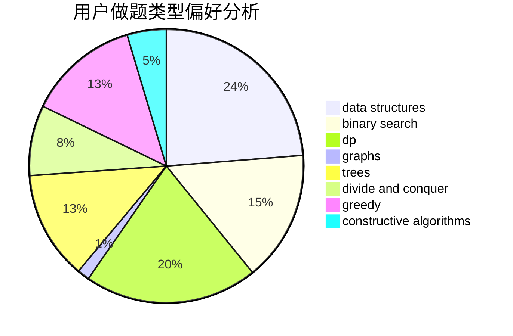

# Rogggger

<!-- tabs:start -->

#### **用户提交结果分析**

#### **用户做题类型偏好分析**

#### **用户错题知识点分析**

<!-- tabs:end -->
# 推荐题目
[1484C](https://codeforces.com/contest/1484/problem/C)		dsu,graphs,sortings,trees		  
[385E](https://codeforces.com/contest/385/problem/E)		math,
                        matrices		  
[464E](https://codeforces.com/contest/464/problem/E)		data structures,
                        graphs,
                        shortest paths		  
[520A](https://codeforces.com/contest/520/problem/A)		implementation,
                        strings		  
[776D](https://codeforces.com/contest/776/problem/D)		2-sat,
                        dfs and similar,
                        dsu,
                        graphs		  
[981G](https://codeforces.com/contest/981/problem/G)		data structures		  
[915G](https://codeforces.com/contest/915/problem/G)		math,
                        number theory		  
[1213F](https://codeforces.com/contest/1213/problem/F)		data structures,
                        dfs and similar,
                        dsu,
                        graphs,
                        greedy,
                        implementation,
                        strings		  
[8D](https://codeforces.com/contest/8/problem/D)		binary search,
                        geometry		  
[251D](https://codeforces.com/contest/251/problem/D)		bitmasks,
                        math		  
