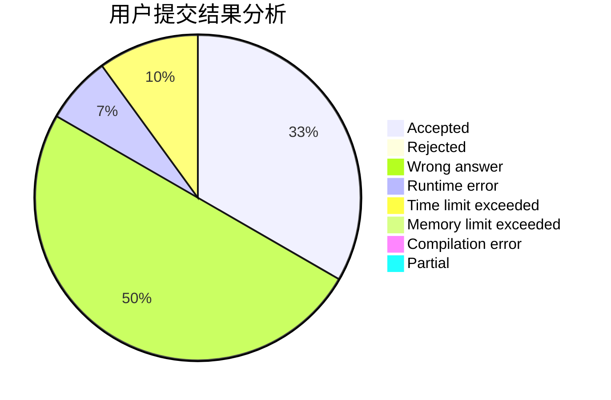
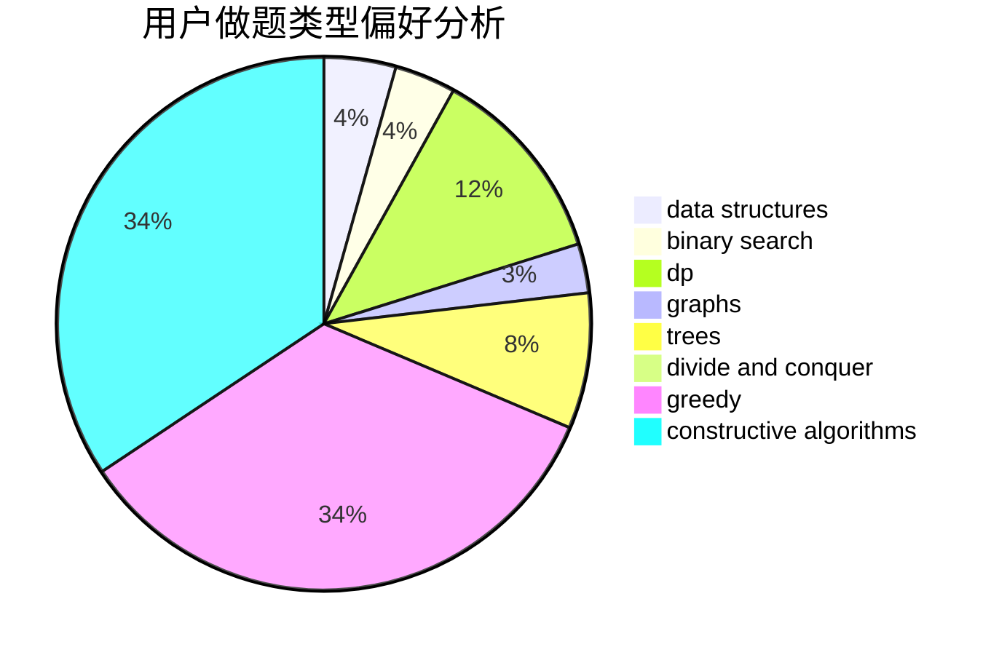

# Rogggger
<!-- tabs:start -->
#### **用户提交结果分析**

#### **用户做题类型偏好分析**

#### **用户错题知识点分析**

<!-- tabs:end -->
# 推荐题目
[Unusual Matrix](http://codeforces.com/problemset/problem/1475/F)		2-sat,
                        brute force,
                        constructive algorithms		  
[Permutation](http://codeforces.com/problemset/problem/359/B)		constructive algorithms,
                        dp,
                        math		  
[DZY Loves Chessboard](http://codeforces.com/problemset/problem/445/A)		dfs and similar,
                        implementation		  
[Uniqueness](http://codeforces.com/problemset/problem/1208/B)		binary search,
                        brute force,
                        implementation,
                        two pointers		  
[Ostap and Tree](https://codeforces.com/contest/736/problem/C)		dp,
                        trees		  
[Obsession with Robots](http://codeforces.com/problemset/problem/8/B)		constructive algorithms,
                        graphs,
                        implementation		  
[Counting Rhombi](http://codeforces.com/problemset/problem/189/B)		brute force,
                        math		  
[Watermelon](http://codeforces.com/problemset/problem/4/A)		brute force,
                        math		  
[Interesting Game](http://codeforces.com/problemset/problem/87/C)		dp,
                        games,
                        math		  
[Palindromes](http://codeforces.com/problemset/problem/137/D)		dp,
                        strings		  
<!-- tabs:start -->
#### **data structures**
[Unusual Matrix](http://codeforces.com/problemset/problem/833/D)		data structures,
                        divide and conquer,
                        implementation,
                        trees		  
[Permutation](http://codeforces.com/problemset/problem/527/C)		binary search,
                        data structures,
                        implementation		  
[DZY Loves Chessboard](http://codeforces.com/problemset/problem/438/D)		data structures,
                        math		  
[Uniqueness](http://codeforces.com/problemset/problem/1458/E)		data structures,
                        games		  
[Ostap and Tree](http://codeforces.com/problemset/problem/1492/C)		binary search,
                        data structures,
                        dp,
                        greedy,
                        two pointers		  
[Obsession with Robots](http://codeforces.com/problemset/problem/1490/G)		binary search,
                        data structures,
                        math		  
[Counting Rhombi](http://codeforces.com/problemset/problem/1479/D)		binary search,
                        bitmasks,
                        brute force,
                        data structures,
                        probabilities,
                        trees		  
[Watermelon](http://codeforces.com/problemset/problem/1497/A)		brute force,
                        data structures,
                        greedy,
                        sortings		  
[Interesting Game](http://codeforces.com/problemset/problem/1491/C)		brute force,
                        data structures,
                        dp,
                        greedy,
                        implementation		  
[Palindromes](http://codeforces.com/problemset/problem/1492/B)		data structures,
                        greedy,
                        math		  
#### **binary search**
[Unusual Matrix](http://codeforces.com/problemset/problem/1208/B)		binary search,
                        brute force,
                        implementation,
                        two pointers		  
[Permutation](https://codeforces.com/contest/737/problem/A)		binary search,
                        greedy,
                        sortings		  
[DZY Loves Chessboard](http://codeforces.com/problemset/problem/527/C)		binary search,
                        data structures,
                        implementation		  
[Uniqueness](http://codeforces.com/problemset/problem/1486/C2)		binary search,
                        interactive		  
[Ostap and Tree](http://codeforces.com/problemset/problem/1492/C)		binary search,
                        data structures,
                        dp,
                        greedy,
                        two pointers		  
[Obsession with Robots](http://codeforces.com/problemset/problem/1463/D)		binary search,
                        constructive algorithms,
                        greedy,
                        two pointers		  
[Counting Rhombi](http://codeforces.com/problemset/problem/1490/G)		binary search,
                        data structures,
                        math		  
[Watermelon](http://codeforces.com/problemset/problem/1479/D)		binary search,
                        bitmasks,
                        brute force,
                        data structures,
                        probabilities,
                        trees		  
[Interesting Game](http://codeforces.com/problemset/problem/1436/E)		binary search,
                        data structures,
                        two pointers		  
[Palindromes](http://codeforces.com/problemset/problem/1461/D)		binary search,
                        brute force,
                        data structures,
                        divide and conquer,
                        implementation,
                        sortings		  
#### **dp**
[Unusual Matrix](http://codeforces.com/problemset/problem/359/B)		constructive algorithms,
                        dp,
                        math		  
[Permutation](https://codeforces.com/contest/736/problem/C)		dp,
                        trees		  
[DZY Loves Chessboard](http://codeforces.com/problemset/problem/87/C)		dp,
                        games,
                        math		  
[Uniqueness](http://codeforces.com/problemset/problem/137/D)		dp,
                        strings		  
[Ostap and Tree](http://codeforces.com/problemset/problem/70/E)		dp,
                        implementation,
                        trees		  
[Obsession with Robots](http://codeforces.com/problemset/problem/757/E)		brute force,
                        combinatorics,
                        dp,
                        number theory		  
[Counting Rhombi](http://codeforces.com/problemset/problem/372/B)		brute force,
                        divide and conquer,
                        dp		  
[Watermelon](http://codeforces.com/problemset/problem/1382/B)		dp,
                        games		  
[Interesting Game](http://codeforces.com/problemset/problem/95/E)		dp,
                        dsu,
                        graphs		  
[Palindromes](http://codeforces.com/problemset/problem/1182/A)		dp,
                        math		  
#### **graph**
[Unusual Matrix](http://codeforces.com/problemset/problem/8/B)		constructive algorithms,
                        graphs,
                        implementation		  
[Permutation](http://codeforces.com/problemset/problem/1146/C)		bitmasks,
                        graphs,
                        interactive		  
[DZY Loves Chessboard](http://codeforces.com/problemset/problem/95/E)		dp,
                        dsu,
                        graphs		  
[Uniqueness](http://codeforces.com/problemset/problem/521/E)		dfs and similar,
                        graphs		  
[Ostap and Tree](http://codeforces.com/problemset/problem/1139/C)		dfs and similar,
                        dsu,
                        graphs,
                        math,
                        trees		  
[Obsession with Robots](http://codeforces.com/problemset/problem/1012/B)		constructive algorithms,
                        dfs and similar,
                        dsu,
                        graphs,
                        matrices		  
[Counting Rhombi](http://codeforces.com/problemset/problem/1383/F)		flows,
                        graphs		  
[Watermelon](http://codeforces.com/problemset/problem/1487/C)		brute force,
                        constructive algorithms,
                        dfs and similar,
                        graphs,
                        greedy,
                        implementation,
                        math		  
[Interesting Game](http://codeforces.com/problemset/problem/1437/C)		dp,
                        flows,
                        graph matchings,
                        greedy,
                        math,
                        sortings		  
[Palindromes](http://codeforces.com/problemset/problem/1470/D)		constructive algorithms,
                        dfs and similar,
                        graph matchings,
                        graphs,
                        greedy		  
#### **trees**
[Unusual Matrix](https://codeforces.com/contest/736/problem/C)		dp,
                        trees		  
[Permutation](http://codeforces.com/problemset/problem/70/E)		dp,
                        implementation,
                        trees		  
[DZY Loves Chessboard](http://codeforces.com/problemset/problem/833/D)		data structures,
                        divide and conquer,
                        implementation,
                        trees		  
[Uniqueness](https://codeforces.com/contest/430/problem/C)		dfs and similar,
                        trees		  
[Ostap and Tree](http://codeforces.com/problemset/problem/1139/C)		dfs and similar,
                        dsu,
                        graphs,
                        math,
                        trees		  
[Obsession with Robots](http://codeforces.com/problemset/problem/1363/E)		dfs and similar,
                        dp,
                        greedy,
                        trees		  
[Counting Rhombi](http://codeforces.com/problemset/problem/1479/D)		binary search,
                        bitmasks,
                        brute force,
                        data structures,
                        probabilities,
                        trees		  
[Watermelon](http://codeforces.com/problemset/problem/1511/C)		brute force,
                        data structures,
                        implementation,
                        trees		  
[Interesting Game](http://codeforces.com/problemset/problem/1499/F)		combinatorics,
                        dfs and similar,
                        dp,
                        trees		  
[Palindromes](http://codeforces.com/problemset/problem/1491/E)		brute force,
                        dfs and similar,
                        divide and conquer,
                        number theory,
                        trees		  
#### **divide and conquer**
[Unusual Matrix](http://codeforces.com/problemset/problem/833/D)		data structures,
                        divide and conquer,
                        implementation,
                        trees		  
[Permutation](http://codeforces.com/problemset/problem/372/B)		brute force,
                        divide and conquer,
                        dp		  
[DZY Loves Chessboard](http://codeforces.com/problemset/problem/1461/D)		binary search,
                        brute force,
                        data structures,
                        divide and conquer,
                        implementation,
                        sortings		  
[Uniqueness](http://codeforces.com/problemset/problem/1466/G)		combinatorics,
                        divide and conquer,
                        hashing,
                        math,
                        string suffix structures,
                        strings		  
[Ostap and Tree](http://codeforces.com/problemset/problem/1490/D)		dfs and similar,
                        divide and conquer,
                        implementation		  
[Obsession with Robots](https://codeforces.com/contest/1483/problem/C)		data structures,
                        divide and conquer,
                        dp		  
[Counting Rhombi](http://codeforces.com/problemset/problem/1491/E)		brute force,
                        dfs and similar,
                        divide and conquer,
                        number theory,
                        trees		  
[Watermelon](http://codeforces.com/problemset/problem/1303/G)		data structures,
                        divide and conquer,
                        geometry,
                        trees		  
[Interesting Game](http://codeforces.com/problemset/problem/1494/D)		constructive algorithms,
                        data structures,
                        dfs and similar,
                        divide and conquer,
                        dsu,
                        greedy,
                        sortings,
                        trees		  
[Palindromes](http://codeforces.com/problemset/problem/1482/E)		data structures,
                        divide and conquer,
                        dp		  
#### **greedy**
[Unusual Matrix](https://codeforces.com/contest/737/problem/A)		binary search,
                        greedy,
                        sortings		  
[Permutation](http://codeforces.com/problemset/problem/231/A)		brute force,
                        greedy		  
[DZY Loves Chessboard](http://codeforces.com/problemset/problem/508/B)		greedy,
                        math,
                        strings		  
[Uniqueness](https://codeforces.com/contest/146/problem/C)		greedy,
                        implementation		  
[Ostap and Tree](http://codeforces.com/problemset/problem/1375/E)		constructive algorithms,
                        greedy,
                        sortings		  
[Obsession with Robots](http://codeforces.com/problemset/problem/1363/E)		dfs and similar,
                        dp,
                        greedy,
                        trees		  
[Counting Rhombi](http://codeforces.com/problemset/problem/1492/C)		binary search,
                        data structures,
                        dp,
                        greedy,
                        two pointers		  
[Watermelon](https://codeforces.com/contest/1496/problem/C)		geometry,
                        greedy,
                        math,
                        sortings		  
[Interesting Game](http://codeforces.com/problemset/problem/1493/A)		constructive algorithms,
                        greedy		  
[Palindromes](http://codeforces.com/problemset/problem/1463/D)		binary search,
                        constructive algorithms,
                        greedy,
                        two pointers		  
#### **constructive algorithms**
[Unusual Matrix](http://codeforces.com/problemset/problem/1475/F)		2-sat,
                        brute force,
                        constructive algorithms		  
[Permutation](http://codeforces.com/problemset/problem/359/B)		constructive algorithms,
                        dp,
                        math		  
[DZY Loves Chessboard](http://codeforces.com/problemset/problem/8/B)		constructive algorithms,
                        graphs,
                        implementation		  
[Uniqueness](http://codeforces.com/problemset/problem/732/A)		brute force,
                        constructive algorithms,
                        implementation,
                        math		  
[Ostap and Tree](https://codeforces.com/contest/1130/problem/E)		constructive algorithms		  
[Obsession with Robots](http://codeforces.com/problemset/problem/675/B)		brute force,
                        constructive algorithms,
                        math		  
[Counting Rhombi](http://codeforces.com/problemset/problem/1012/B)		constructive algorithms,
                        dfs and similar,
                        dsu,
                        graphs,
                        matrices		  
[Watermelon](http://codeforces.com/problemset/problem/1242/A)		constructive algorithms,
                        math,
                        number theory		  
[Interesting Game](http://codeforces.com/problemset/problem/1375/E)		constructive algorithms,
                        greedy,
                        sortings		  
[Palindromes](http://codeforces.com/problemset/problem/1493/A)		constructive algorithms,
                        greedy		  
#### **sortings**
[Unusual Matrix](https://codeforces.com/contest/737/problem/A)		binary search,
                        greedy,
                        sortings		  
[Permutation](http://codeforces.com/problemset/problem/27/A)		implementation,
                        sortings		  
[DZY Loves Chessboard](http://codeforces.com/problemset/problem/632/C)		sortings,
                        strings		  
[Uniqueness](http://codeforces.com/problemset/problem/1375/E)		constructive algorithms,
                        greedy,
                        sortings		  
[Ostap and Tree](https://codeforces.com/contest/1496/problem/C)		geometry,
                        greedy,
                        math,
                        sortings		  
[Obsession with Robots](http://codeforces.com/problemset/problem/1495/A)		geometry,
                        greedy,
                        math,
                        sortings		  
[Counting Rhombi](http://codeforces.com/problemset/problem/1497/A)		brute force,
                        data structures,
                        greedy,
                        sortings		  
[Watermelon](http://codeforces.com/problemset/problem/1427/A)		math,
                        sortings		  
[Interesting Game](http://codeforces.com/problemset/problem/1461/D)		binary search,
                        brute force,
                        data structures,
                        divide and conquer,
                        implementation,
                        sortings		  
[Palindromes](http://codeforces.com/problemset/problem/1437/C)		dp,
                        flows,
                        graph matchings,
                        greedy,
                        math,
                        sortings		  
<!-- tabs:end -->
