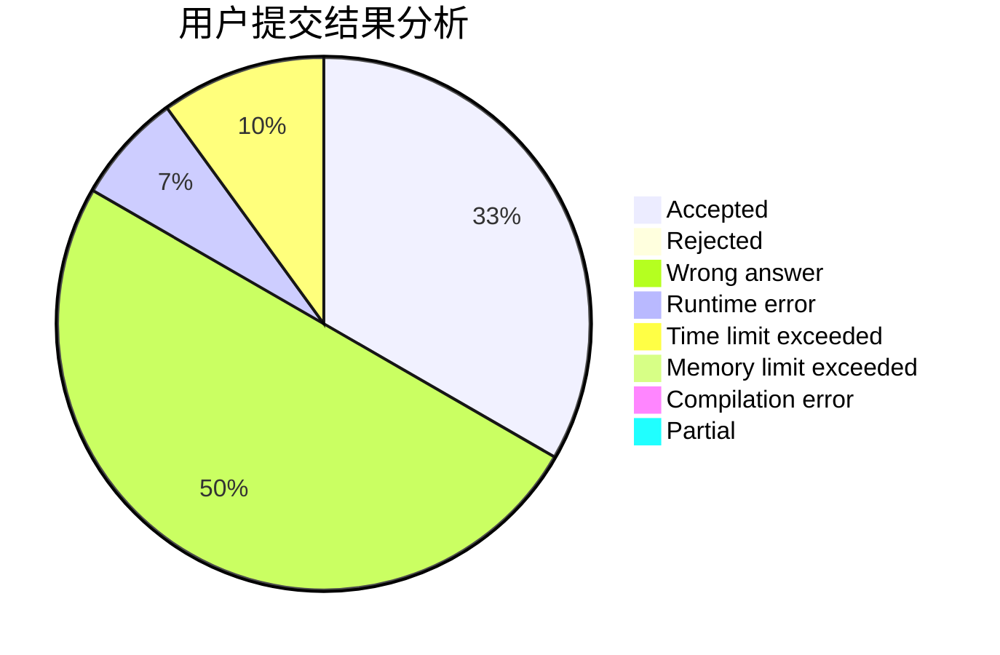
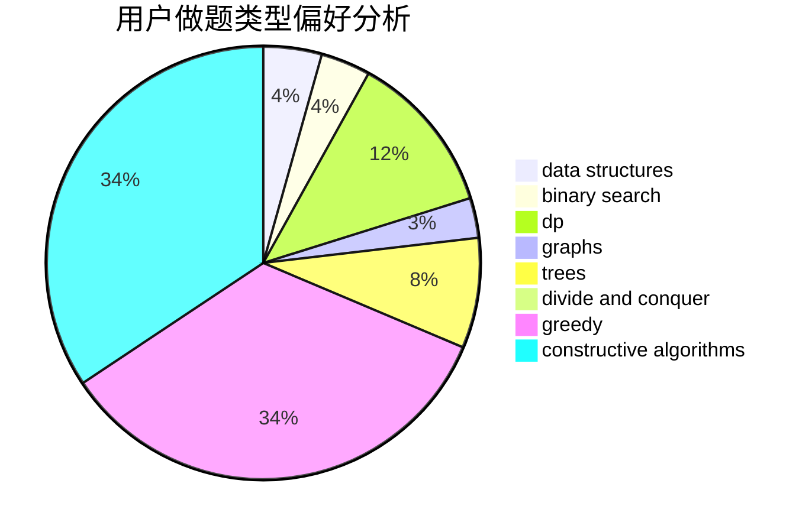

# Rogggger

<!-- tabs:start -->

#### **用户提交结果分析**

#### **用户做题类型偏好分析**

#### **用户错题知识点分析**

<!-- tabs:end -->
# 推荐题目
[1475F](https://codeforces.com/contest/1475/problem/F)		2-sat,
                        brute force,
                        constructive algorithms		  
[359B](https://codeforces.com/contest/359/problem/B)		constructive algorithms,
                        dp,
                        math		  
[445A](https://codeforces.com/contest/445/problem/A)		dfs and similar,
                        implementation		  
[4A](https://codeforces.com/contest/4/problem/A)		brute force,
                        math		  
[757E](https://codeforces.com/contest/757/problem/E)		brute force,
                        combinatorics,
                        dp,
                        number theory		  
[95E](https://codeforces.com/contest/95/problem/E)		dp,
                        dsu,
                        graphs		  
[8B](https://codeforces.com/contest/8/problem/B)		constructive algorithms,
                        graphs,
                        implementation		  
[1208B](https://codeforces.com/contest/1208/problem/B)		binary search,
                        brute force,
                        implementation,
                        two pointers		  
[87C](https://codeforces.com/contest/87/problem/C)		dp,
                        games,
                        math		  
[231A](https://codeforces.com/contest/231/problem/A)		brute force,
                        greedy		  
