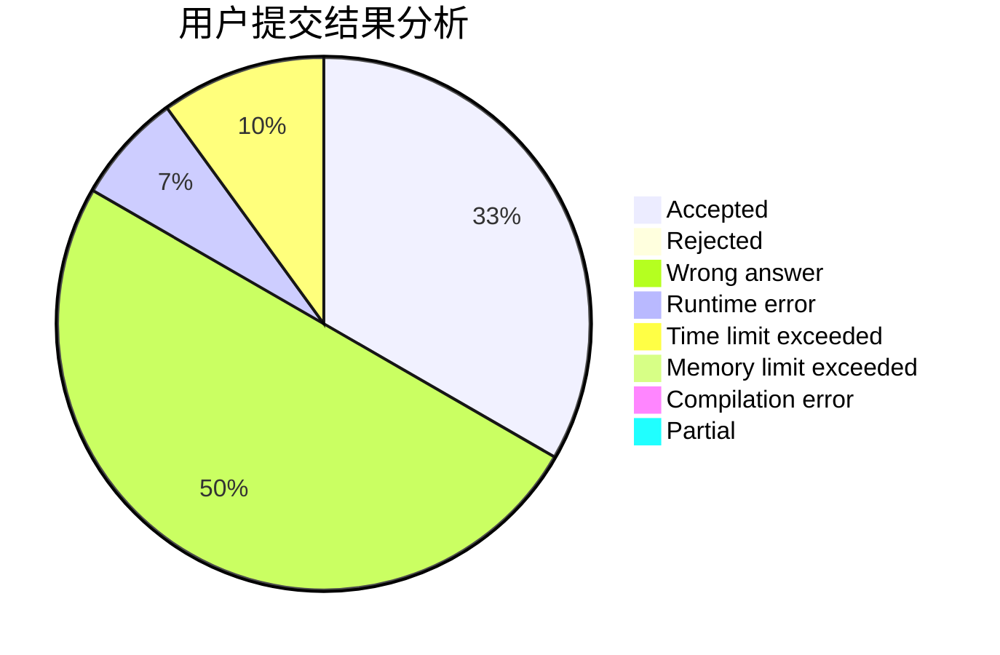
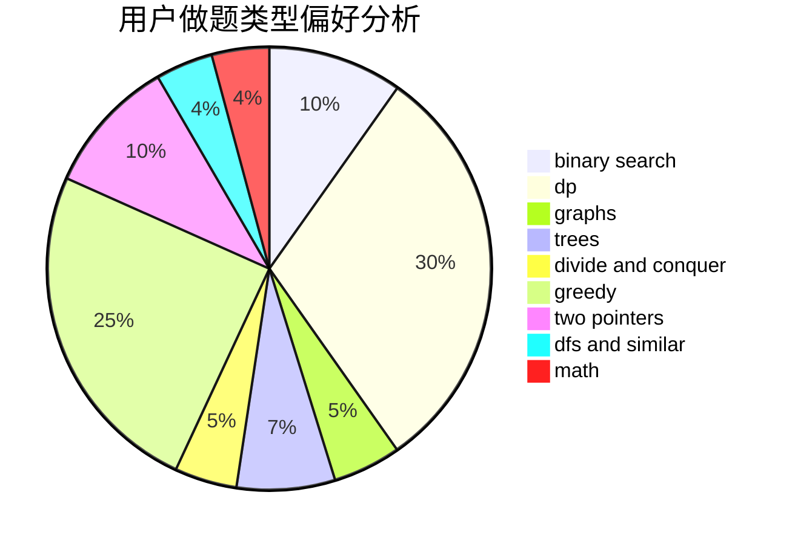

# Rogggger

<!-- tabs:start -->

#### **用户提交结果分析**

#### **用户做题类型偏好分析**

<!-- tabs:end -->
# 推荐题目
[1484C](https://codeforces.com/contest/1484/problem/C)
[385E](https://codeforces.com/contest/385/problem/E)
[464E](https://codeforces.com/contest/464/problem/E)
[520A](https://codeforces.com/contest/520/problem/A)
[776D](https://codeforces.com/contest/776/problem/D)
[981G](https://codeforces.com/contest/981/problem/G)
[915G](https://codeforces.com/contest/915/problem/G)
[1213F](https://codeforces.com/contest/1213/problem/F)
[8D](https://codeforces.com/contest/8/problem/D)
[251D](https://codeforces.com/contest/251/problem/D)
