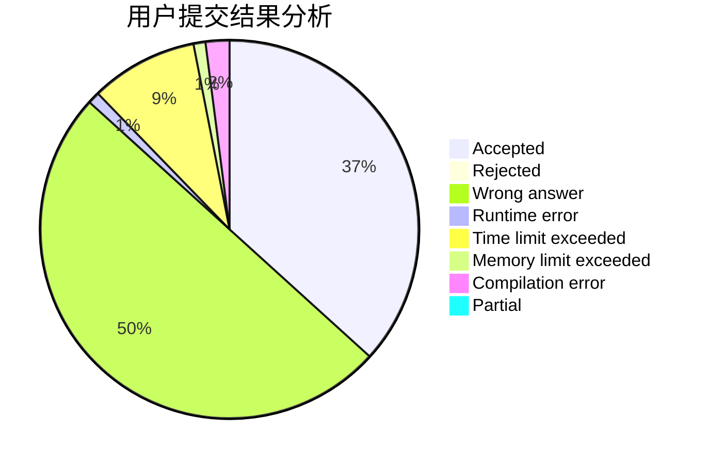
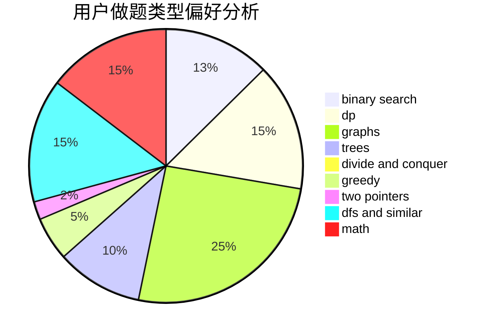

# RoundDog

<!-- tabs:start -->

#### **用户提交结果分析**

#### **用户做题类型偏好分析**

<!-- tabs:end -->
# 推荐题目
[1454E](https://codeforces.com/contest/1454/problem/E)
[1097A](https://codeforces.com/contest/1097/problem/A)
[448B](https://codeforces.com/contest/448/problem/B)
[1156D](https://codeforces.com/contest/1156/problem/D)
[910A](https://codeforces.com/contest/910/problem/A)
[388B](https://codeforces.com/contest/388/problem/B)
[650D](https://codeforces.com/contest/650/problem/D)
[733A](https://codeforces.com/contest/733/problem/A)
[70A](https://codeforces.com/contest/70/problem/A)
[1386B](https://codeforces.com/contest/1386/problem/B)
