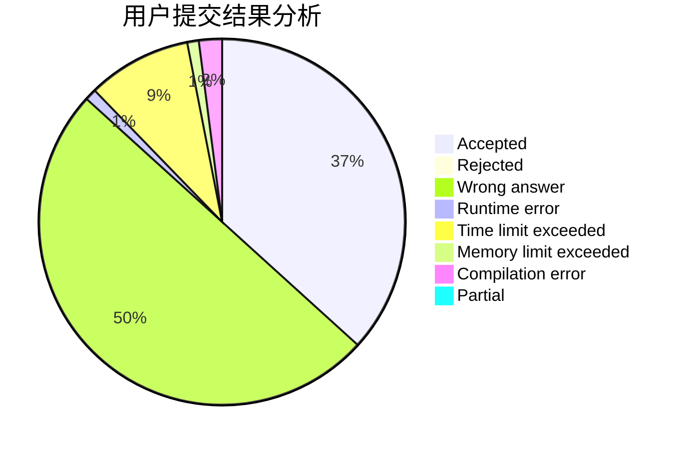
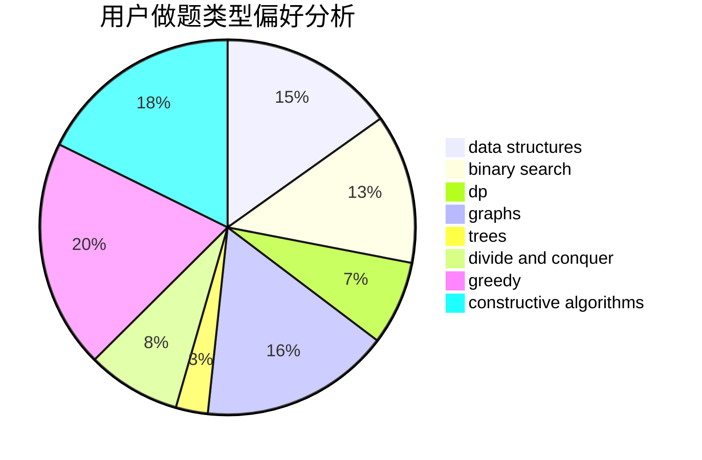

# RoundDog

<!-- tabs:start -->

#### **用户提交结果分析**

#### **用户做题类型偏好分析**

#### **用户错题知识点分析**

<!-- tabs:end -->
# 推荐题目
[1445B](https://codeforces.com/contest/1445/problem/B)		greedy,
                        math		  
[1096E](https://codeforces.com/contest/1096/problem/E)		combinatorics,
                        dp,
                        math,
                        probabilities		  
[424E](https://codeforces.com/contest/424/problem/E)		dfs and similar,
                        dp,
                        probabilities		  
[1154D](https://codeforces.com/contest/1154/problem/D)		greedy		  
[891E](https://codeforces.com/contest/891/problem/E)		combinatorics,
                        math,
                        matrices		  
[360A](https://codeforces.com/contest/360/problem/A)		greedy,
                        implementation		  
[622D](https://codeforces.com/contest/622/problem/D)		constructive algorithms		  
[714B](https://codeforces.com/contest/714/problem/B)		implementation,
                        sortings		  
[689B](https://codeforces.com/contest/689/problem/B)		dfs and similar,
                        graphs,
                        greedy,
                        shortest paths		  
[1377A1](https://codeforces.com/contest/1377A/problem/1)		dsu,graphs,sortings,trees		  
