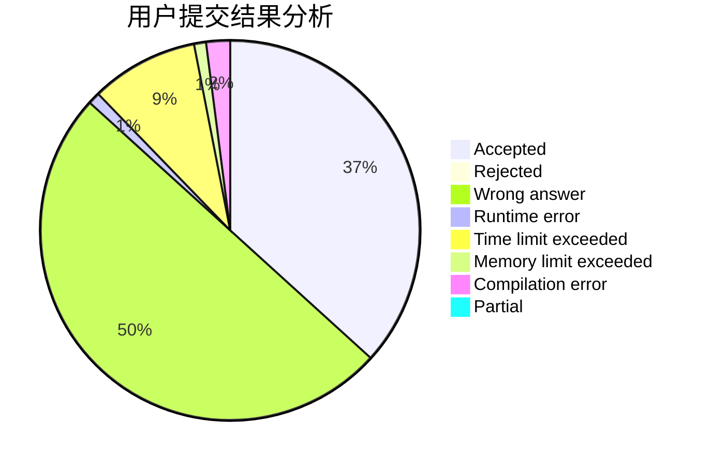
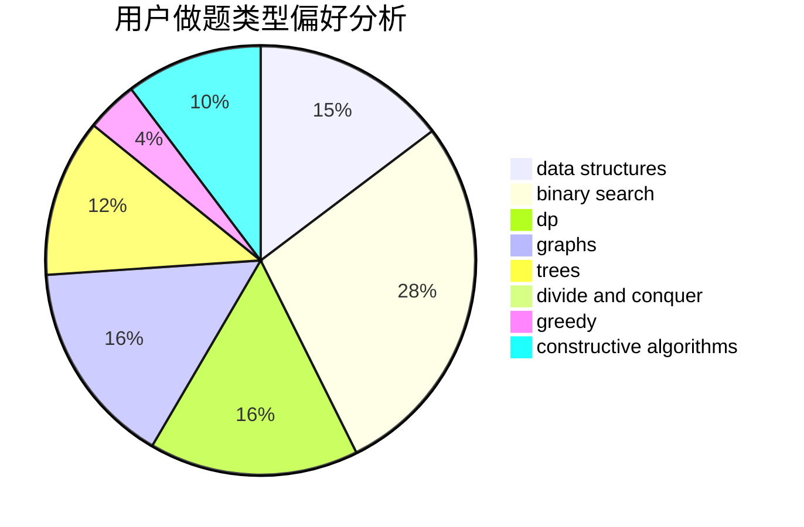
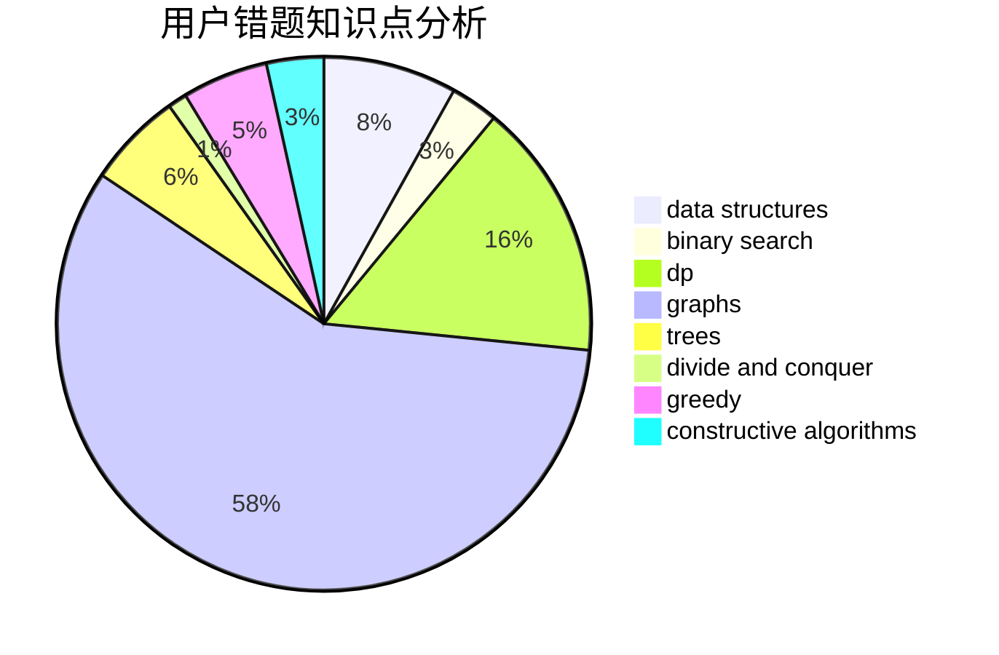

# RoundDog

<!-- tabs:start -->

#### **用户提交结果分析**

#### **用户做题类型偏好分析**

#### **用户错题知识点分析**

<!-- tabs:end -->
# 推荐题目
[1454E](https://codeforces.com/contest/1454/problem/E)		combinatorics,
                        dfs and similar,
                        graphs,
                        trees		  
[1097A](https://codeforces.com/contest/1097/problem/A)		brute force,
                        implementation		  
[448B](https://codeforces.com/contest/448/problem/B)		implementation,
                        strings		  
[1156D](https://codeforces.com/contest/1156/problem/D)		dfs and similar,
                        divide and conquer,
                        dp,
                        dsu,
                        trees		  
[910A](https://codeforces.com/contest/910/problem/A)		dfs and similar,
                        dp,
                        greedy,
                        implementation		  
[388B](https://codeforces.com/contest/388/problem/B)		bitmasks,
                        constructive algorithms,
                        graphs,
                        implementation,
                        math		  
[650D](https://codeforces.com/contest/650/problem/D)		binary search,
                        data structures,
                        dp,
                        hashing		  
[733A](https://codeforces.com/contest/733/problem/A)		implementation		  
[70A](https://codeforces.com/contest/70/problem/A)		math		  
[1386B](https://codeforces.com/contest/1386/problem/B)		*special problem,
                        data structures,
                        geometry,
                        math,
                        sortings		  
