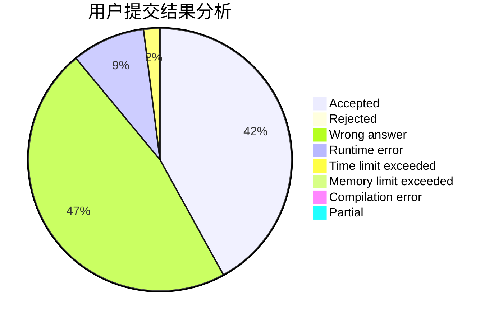
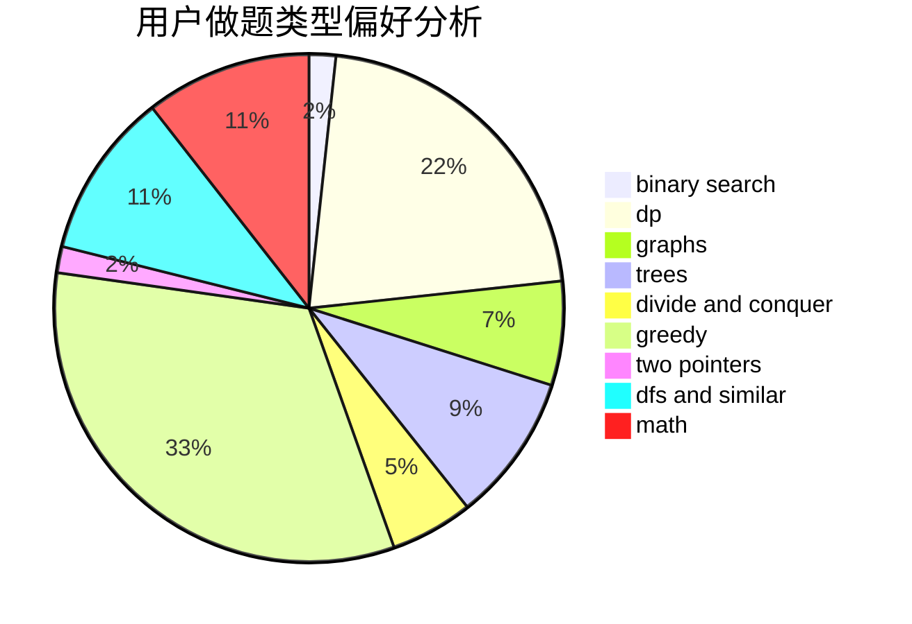

# Roundgod

<!-- tabs:start -->

#### **用户提交结果分析**

#### **用户做题类型偏好分析**

<!-- tabs:end -->
# 推荐题目
[1325E](https://codeforces.com/contest/1325/problem/E)
[600D](https://codeforces.com/contest/600/problem/D)
[28B](https://codeforces.com/contest/28/problem/B)
[1088B](https://codeforces.com/contest/1088/problem/B)
[861A](https://codeforces.com/contest/861/problem/A)
[1059E](https://codeforces.com/contest/1059/problem/E)
[715A](https://codeforces.com/contest/715/problem/A)
[1104E](https://codeforces.com/contest/1104/problem/E)
[459B](https://codeforces.com/contest/459/problem/B)
[781D](https://codeforces.com/contest/781/problem/D)
