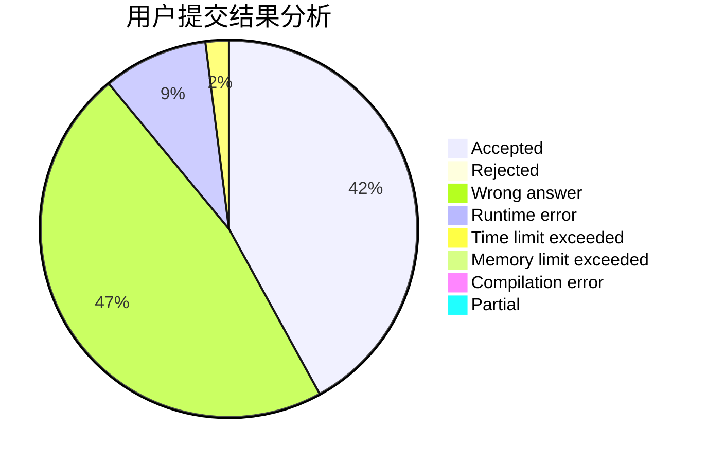
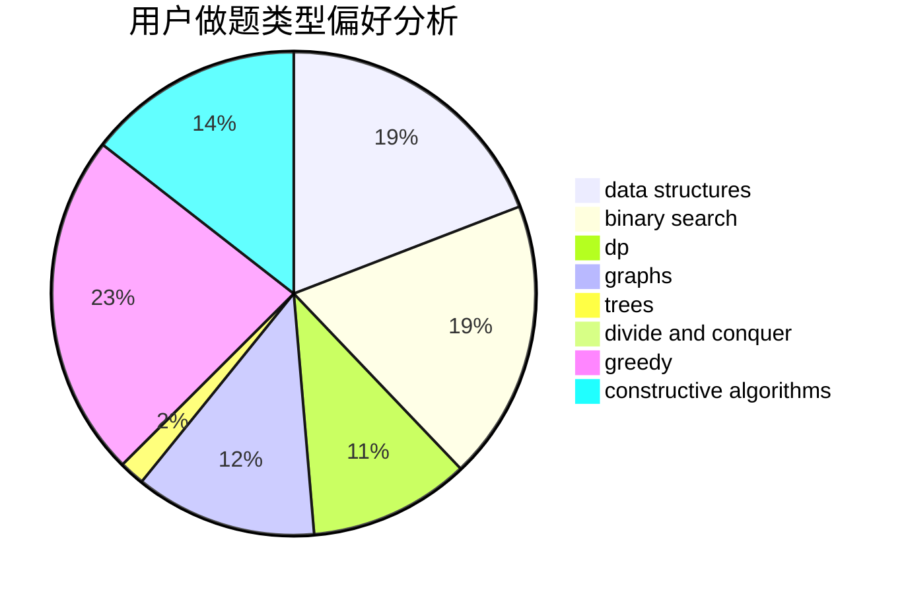
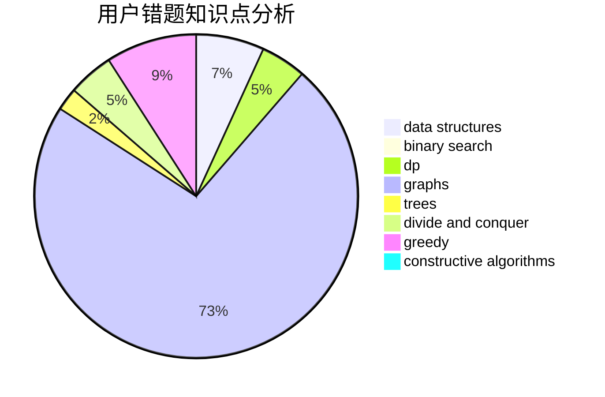

# Roundgod
<!-- tabs:start -->
#### **用户提交结果分析**

#### **用户做题类型偏好分析**

#### **用户错题知识点分析**

<!-- tabs:end -->
# 推荐题目
[Replacing Elements](http://codeforces.com/problemset/problem/1473/A)		greedy,
                        implementation,
                        math,
                        sortings		  
[Vasya and Templates](https://codeforces.com/contest/1087/problem/E)		greedy,
                        implementation,
                        strings		  
[Kefa and Company](http://codeforces.com/problemset/problem/580/B)		binary search,
                        sortings,
                        two pointers		  
[LRU](http://codeforces.com/problemset/problem/698/C)		bitmasks,
                        dp,
                        math,
                        probabilities		  
[Gleb And Pizza](http://codeforces.com/problemset/problem/842/B)		geometry		  
[The Last Hole!](http://codeforces.com/problemset/problem/274/C)		brute force,
                        geometry		  
[Views Matter](http://codeforces.com/problemset/problem/1061/B)		greedy,
                        implementation,
                        sortings		  
[Magic Powder - 1](http://codeforces.com/problemset/problem/670/D1)		binary search,
                        brute force,
                        implementation		  
[Thor](https://codeforces.com/contest/705/problem/C)		brute force,
                        data structures,
                        implementation		  
[Modest Substrings](http://codeforces.com/problemset/problem/1110/H)		dp,
                        strings		  
<!-- tabs:start -->
#### **data structures**
[Replacing Elements](https://codeforces.com/contest/705/problem/C)		brute force,
                        data structures,
                        implementation		  
[Vasya and Templates](http://codeforces.com/problemset/problem/1104/B)		data structures,
                        implementation,
                        math		  
[Kefa and Company](http://codeforces.com/problemset/problem/979/D)		binary search,
                        bitmasks,
                        brute force,
                        data structures,
                        dp,
                        dsu,
                        greedy,
                        math,
                        number theory,
                        strings,
                        trees		  
[LRU](http://codeforces.com/problemset/problem/436/F)		brute force,
                        data structures,
                        dp		  
[Gleb And Pizza](http://codeforces.com/problemset/problem/1060/G)		data structures		  
[The Last Hole!](http://codeforces.com/problemset/problem/1214/C)		data structures,
                        greedy		  
[Views Matter](http://codeforces.com/problemset/problem/677/D)		data structures,
                        dp,
                        graphs,
                        shortest paths		  
[Magic Powder - 1](http://codeforces.com/problemset/problem/1492/C)		binary search,
                        data structures,
                        dp,
                        greedy,
                        two pointers		  
[Thor](http://codeforces.com/problemset/problem/1490/G)		binary search,
                        data structures,
                        math		  
[Modest Substrings](http://codeforces.com/problemset/problem/1479/D)		binary search,
                        bitmasks,
                        brute force,
                        data structures,
                        probabilities,
                        trees		  
#### **binary search**
[Replacing Elements](http://codeforces.com/problemset/problem/580/B)		binary search,
                        sortings,
                        two pointers		  
[Vasya and Templates](http://codeforces.com/problemset/problem/670/D1)		binary search,
                        brute force,
                        implementation		  
[Kefa and Company](http://codeforces.com/problemset/problem/231/C)		binary search,
                        sortings,
                        two pointers		  
[LRU](http://codeforces.com/problemset/problem/979/D)		binary search,
                        bitmasks,
                        brute force,
                        data structures,
                        dp,
                        dsu,
                        greedy,
                        math,
                        number theory,
                        strings,
                        trees		  
[Gleb And Pizza](http://codeforces.com/problemset/problem/1190/E)		binary search,
                        greedy		  
[The Last Hole!](https://codeforces.com/contest/1395/problem/F)		binary search,
                        geometry,
                        ternary search		  
[Views Matter](http://codeforces.com/problemset/problem/1203/D2)		binary search,
                        greedy,
                        implementation,
                        two pointers		  
[Magic Powder - 1](http://codeforces.com/problemset/problem/676/C)		binary search,
                        dp,
                        strings,
                        two pointers		  
[Thor](http://codeforces.com/problemset/problem/1462/E2)		binary search,
                        combinatorics,
                        implementation,
                        math,
                        sortings,
                        two pointers		  
[Modest Substrings](http://codeforces.com/problemset/problem/1370/F1)		binary search,
                        dfs and similar,
                        graphs,
                        interactive,
                        shortest paths,
                        trees		  
#### **dp**
[Replacing Elements](http://codeforces.com/problemset/problem/698/C)		bitmasks,
                        dp,
                        math,
                        probabilities		  
[Vasya and Templates](http://codeforces.com/problemset/problem/1110/H)		dp,
                        strings		  
[Kefa and Company](http://codeforces.com/problemset/problem/838/E)		dp		  
[LRU](https://codeforces.com/contest/866/problem/E)		bitmasks,
                        brute force,
                        dp,
                        graphs		  
[Gleb And Pizza](http://codeforces.com/problemset/problem/67/A)		dp,
                        graphs,
                        greedy,
                        implementation		  
[The Last Hole!](http://codeforces.com/problemset/problem/1266/H)		dp,
                        graphs,
                        math,
                        matrices,
                        meet-in-the-middle		  
[Views Matter](http://codeforces.com/problemset/problem/979/D)		binary search,
                        bitmasks,
                        brute force,
                        data structures,
                        dp,
                        dsu,
                        greedy,
                        math,
                        number theory,
                        strings,
                        trees		  
[Magic Powder - 1](http://codeforces.com/problemset/problem/436/F)		brute force,
                        data structures,
                        dp		  
[Thor](http://codeforces.com/problemset/problem/747/D)		dp,
                        greedy,
                        sortings		  
[Modest Substrings](http://codeforces.com/problemset/problem/1093/F)		dp		  
#### **graph**
[Replacing Elements](http://codeforces.com/problemset/problem/611/H)		constructive algorithms,
                        flows,
                        graphs		  
[Vasya and Templates](https://codeforces.com/contest/866/problem/E)		bitmasks,
                        brute force,
                        dp,
                        graphs		  
[Kefa and Company](http://codeforces.com/problemset/problem/590/C)		dfs and similar,
                        graphs,
                        shortest paths		  
[LRU](http://codeforces.com/problemset/problem/67/A)		dp,
                        graphs,
                        greedy,
                        implementation		  
[Gleb And Pizza](http://codeforces.com/problemset/problem/741/C)		constructive algorithms,
                        dfs and similar,
                        graphs		  
[The Last Hole!](http://codeforces.com/problemset/problem/1266/H)		dp,
                        graphs,
                        math,
                        matrices,
                        meet-in-the-middle		  
[Views Matter](http://codeforces.com/problemset/problem/653/E)		dfs and similar,
                        dsu,
                        graphs,
                        trees		  
[Magic Powder - 1](http://codeforces.com/problemset/problem/762/F)		combinatorics,
                        graphs,
                        trees		  
[Thor](http://codeforces.com/problemset/problem/1082/D)		constructive algorithms,
                        graphs,
                        implementation		  
[Modest Substrings](http://codeforces.com/problemset/problem/1370/F1)		binary search,
                        dfs and similar,
                        graphs,
                        interactive,
                        shortest paths,
                        trees		  
#### **trees**
[Replacing Elements](http://codeforces.com/problemset/problem/979/D)		binary search,
                        bitmasks,
                        brute force,
                        data structures,
                        dp,
                        dsu,
                        greedy,
                        math,
                        number theory,
                        strings,
                        trees		  
[Vasya and Templates](http://codeforces.com/problemset/problem/653/E)		dfs and similar,
                        dsu,
                        graphs,
                        trees		  
[Kefa and Company](http://codeforces.com/problemset/problem/762/F)		combinatorics,
                        graphs,
                        trees		  
[LRU](http://codeforces.com/problemset/problem/1370/F1)		binary search,
                        dfs and similar,
                        graphs,
                        interactive,
                        shortest paths,
                        trees		  
[Gleb And Pizza](http://codeforces.com/problemset/problem/1364/D)		constructive algorithms,
                        dfs and similar,
                        graphs,
                        greedy,
                        implementation,
                        trees		  
[The Last Hole!](http://codeforces.com/problemset/problem/1479/D)		binary search,
                        bitmasks,
                        brute force,
                        data structures,
                        probabilities,
                        trees		  
[Views Matter](http://codeforces.com/problemset/problem/1511/C)		brute force,
                        data structures,
                        implementation,
                        trees		  
[Magic Powder - 1](http://codeforces.com/problemset/problem/1499/F)		combinatorics,
                        dfs and similar,
                        dp,
                        trees		  
[Thor](http://codeforces.com/problemset/problem/1491/E)		brute force,
                        dfs and similar,
                        divide and conquer,
                        number theory,
                        trees		  
[Modest Substrings](http://codeforces.com/problemset/problem/1466/D)		data structures,
                        greedy,
                        sortings,
                        trees		  
#### **divide and conquer**
[Replacing Elements](https://codeforces.com/contest/577/problem/E)		constructive algorithms,
                        divide and conquer,
                        geometry,
                        greedy,
                        sortings		  
[Vasya and Templates](http://codeforces.com/problemset/problem/1461/D)		binary search,
                        brute force,
                        data structures,
                        divide and conquer,
                        implementation,
                        sortings		  
[Kefa and Company](http://codeforces.com/problemset/problem/1466/G)		combinatorics,
                        divide and conquer,
                        hashing,
                        math,
                        string suffix structures,
                        strings		  
[LRU](http://codeforces.com/problemset/problem/1490/D)		dfs and similar,
                        divide and conquer,
                        implementation		  
[Gleb And Pizza](https://codeforces.com/contest/1483/problem/C)		data structures,
                        divide and conquer,
                        dp		  
[The Last Hole!](http://codeforces.com/problemset/problem/1491/E)		brute force,
                        dfs and similar,
                        divide and conquer,
                        number theory,
                        trees		  
[Views Matter](http://codeforces.com/problemset/problem/1303/G)		data structures,
                        divide and conquer,
                        geometry,
                        trees		  
[Magic Powder - 1](http://codeforces.com/problemset/problem/1494/D)		constructive algorithms,
                        data structures,
                        dfs and similar,
                        divide and conquer,
                        dsu,
                        greedy,
                        sortings,
                        trees		  
[Thor](http://codeforces.com/problemset/problem/1482/E)		data structures,
                        divide and conquer,
                        dp		  
[Modest Substrings](http://codeforces.com/problemset/problem/566/C)		dfs and similar,
                        divide and conquer,
                        trees		  
#### **greedy**
[Replacing Elements](http://codeforces.com/problemset/problem/1473/A)		greedy,
                        implementation,
                        math,
                        sortings		  
[Vasya and Templates](https://codeforces.com/contest/1087/problem/E)		greedy,
                        implementation,
                        strings		  
[Kefa and Company](http://codeforces.com/problemset/problem/1061/B)		greedy,
                        implementation,
                        sortings		  
[LRU](https://codeforces.com/contest/577/problem/E)		constructive algorithms,
                        divide and conquer,
                        geometry,
                        greedy,
                        sortings		  
[Gleb And Pizza](http://codeforces.com/problemset/problem/67/A)		dp,
                        graphs,
                        greedy,
                        implementation		  
[The Last Hole!](http://codeforces.com/problemset/problem/1090/A)		greedy		  
[Views Matter](https://codeforces.com/contest/1130/problem/D2)		brute force,
                        greedy		  
[Magic Powder - 1](http://codeforces.com/problemset/problem/1472/A)		greedy,
                        math		  
[Thor](http://codeforces.com/problemset/problem/979/D)		binary search,
                        bitmasks,
                        brute force,
                        data structures,
                        dp,
                        dsu,
                        greedy,
                        math,
                        number theory,
                        strings,
                        trees		  
[Modest Substrings](http://codeforces.com/problemset/problem/1190/E)		binary search,
                        greedy		  
#### **constructive algorithms**
[Replacing Elements](http://codeforces.com/problemset/problem/611/H)		constructive algorithms,
                        flows,
                        graphs		  
[Vasya and Templates](https://codeforces.com/contest/312/problem/C)		constructive algorithms,
                        implementation		  
[Kefa and Company](https://codeforces.com/contest/577/problem/E)		constructive algorithms,
                        divide and conquer,
                        geometry,
                        greedy,
                        sortings		  
[LRU](http://codeforces.com/problemset/problem/1136/B)		constructive algorithms,
                        math		  
[Gleb And Pizza](http://codeforces.com/problemset/problem/741/C)		constructive algorithms,
                        dfs and similar,
                        graphs		  
[The Last Hole!](http://codeforces.com/problemset/problem/1082/D)		constructive algorithms,
                        graphs,
                        implementation		  
[Views Matter](http://codeforces.com/problemset/problem/679/A)		constructive algorithms,
                        interactive,
                        math		  
[Magic Powder - 1](http://codeforces.com/problemset/problem/1364/D)		constructive algorithms,
                        dfs and similar,
                        graphs,
                        greedy,
                        implementation,
                        trees		  
[Thor](http://codeforces.com/problemset/problem/1504/A)		constructive algorithms,
                        strings		  
[Modest Substrings](http://codeforces.com/problemset/problem/1493/A)		constructive algorithms,
                        greedy		  
#### **sortings**
[Replacing Elements](http://codeforces.com/problemset/problem/1473/A)		greedy,
                        implementation,
                        math,
                        sortings		  
[Vasya and Templates](http://codeforces.com/problemset/problem/580/B)		binary search,
                        sortings,
                        two pointers		  
[Kefa and Company](http://codeforces.com/problemset/problem/1061/B)		greedy,
                        implementation,
                        sortings		  
[LRU](https://codeforces.com/contest/577/problem/E)		constructive algorithms,
                        divide and conquer,
                        geometry,
                        greedy,
                        sortings		  
[Gleb And Pizza](http://codeforces.com/problemset/problem/231/C)		binary search,
                        sortings,
                        two pointers		  
[The Last Hole!](http://codeforces.com/problemset/problem/1056/C)		greedy,
                        implementation,
                        interactive,
                        sortings		  
[Views Matter](http://codeforces.com/problemset/problem/747/D)		dp,
                        greedy,
                        sortings		  
[Magic Powder - 1](http://codeforces.com/problemset/problem/1333/F)		greedy,
                        implementation,
                        math,
                        number theory,
                        sortings,
                        two pointers		  
[Thor](http://codeforces.com/problemset/problem/1462/E2)		binary search,
                        combinatorics,
                        implementation,
                        math,
                        sortings,
                        two pointers		  
[Modest Substrings](https://codeforces.com/contest/1496/problem/C)		geometry,
                        greedy,
                        math,
                        sortings		  
<!-- tabs:end -->
