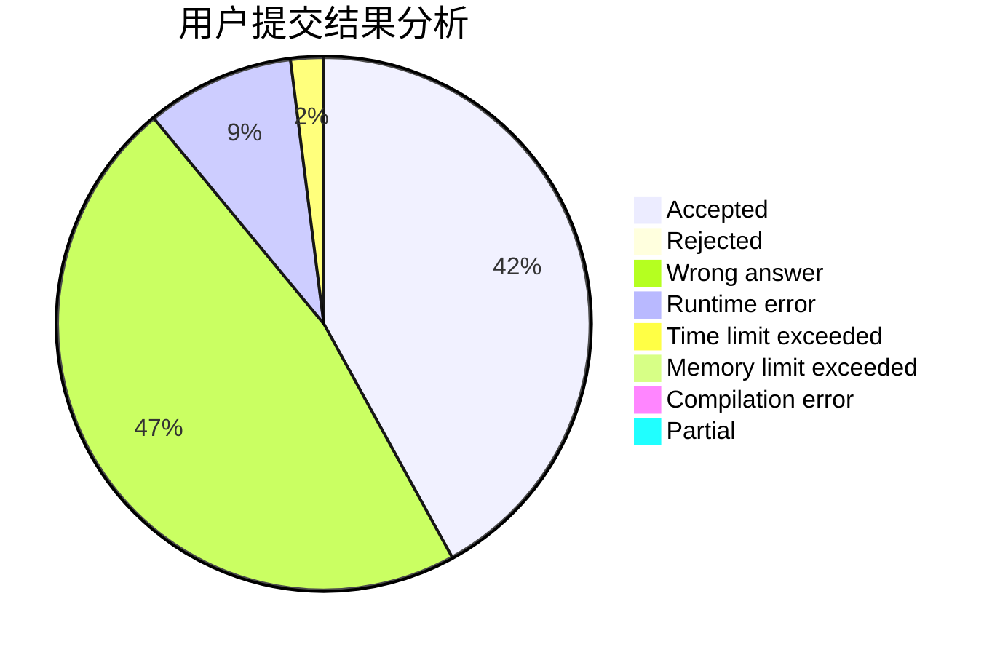
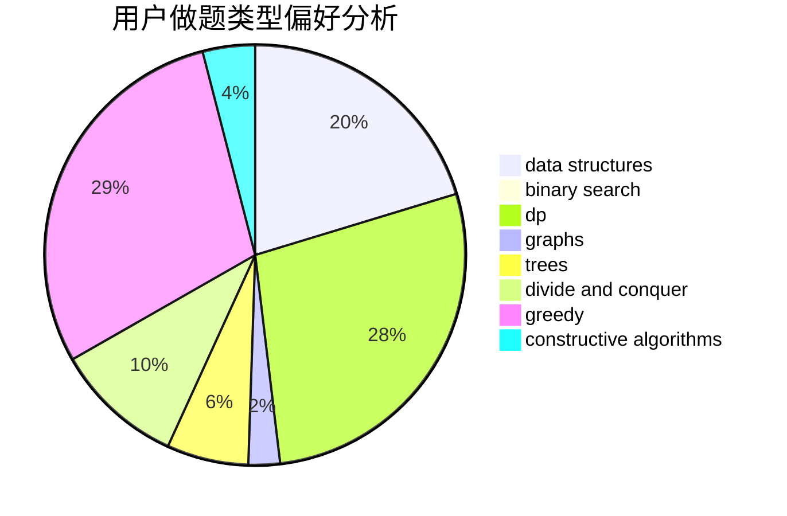
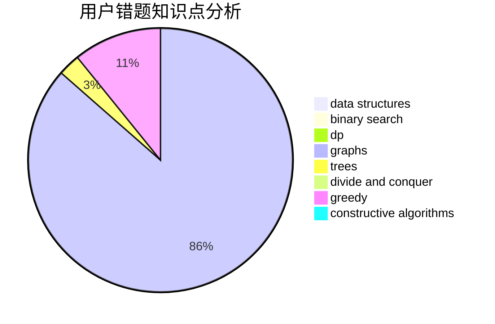

# Roundgod

<!-- tabs:start -->

#### **用户提交结果分析**

#### **用户做题类型偏好分析**

#### **用户错题知识点分析**

<!-- tabs:end -->
# 推荐题目
[1325E](https://codeforces.com/contest/1325/problem/E)		brute force,
                        dfs and similar,
                        graphs,
                        number theory,
                        shortest paths		  
[600D](https://codeforces.com/contest/600/problem/D)		geometry		  
[28B](https://codeforces.com/contest/28/problem/B)		dfs and similar,
                        dsu,
                        graphs		  
[1088B](https://codeforces.com/contest/1088/problem/B)		implementation,
                        sortings		  
[861A](https://codeforces.com/contest/861/problem/A)		dsu,graphs,sortings,trees		  
[1059E](https://codeforces.com/contest/1059/problem/E)		binary search,
                        data structures,
                        dp,
                        greedy,
                        trees		  
[715A](https://codeforces.com/contest/715/problem/A)		constructive algorithms,
                        math		  
[1104E](https://codeforces.com/contest/1104/problem/E)		dsu,graphs,sortings,trees		  
[459B](https://codeforces.com/contest/459/problem/B)		combinatorics,
                        implementation,
                        sortings		  
[781D](https://codeforces.com/contest/781/problem/D)		dsu,graphs,sortings,trees		  
