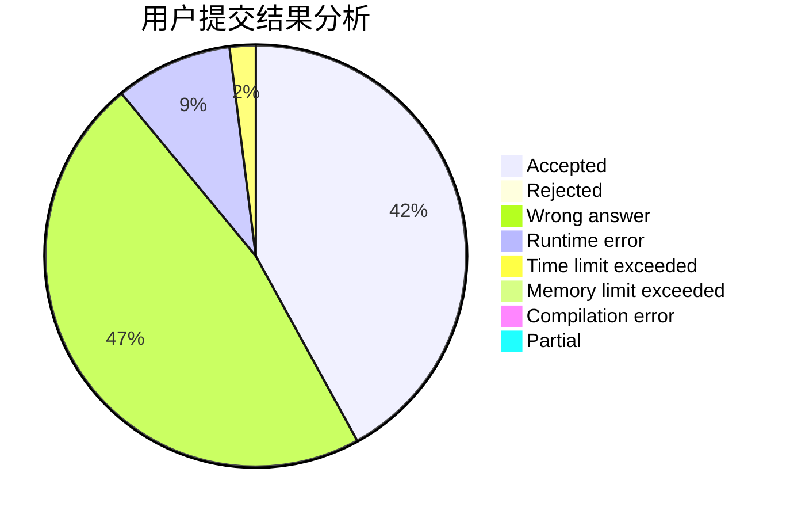
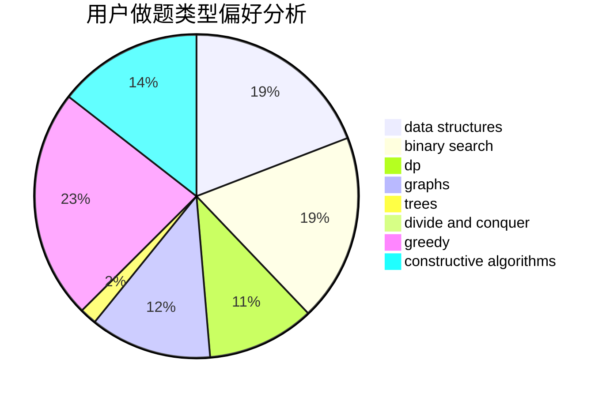
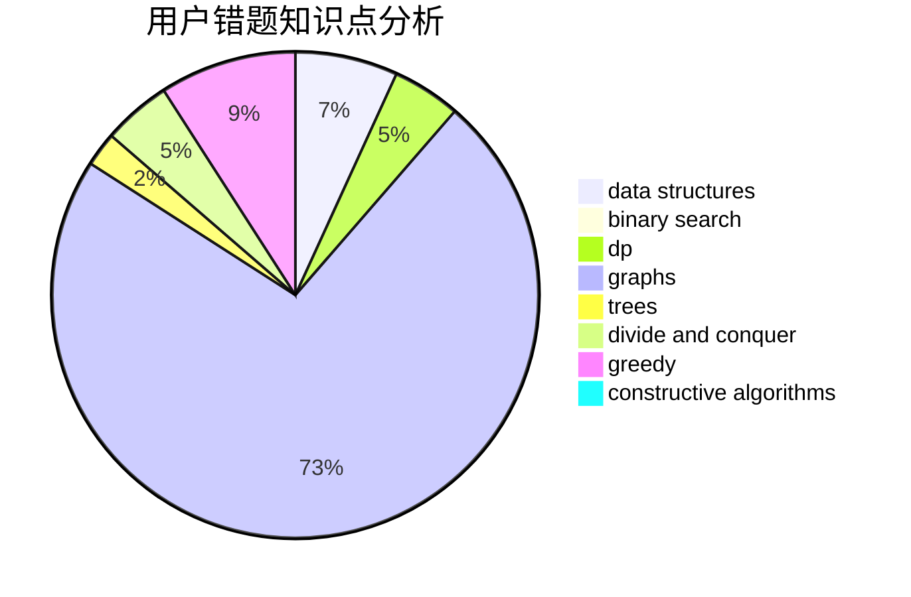

# Roundgod

<!-- tabs:start -->

#### **用户提交结果分析**

#### **用户做题类型偏好分析**

#### **用户错题知识点分析**

<!-- tabs:end -->
# 推荐题目
[1316A](https://codeforces.com/contest/1316/problem/A)		implementation		  
[580B](https://codeforces.com/contest/580/problem/B)		binary search,
                        sortings,
                        two pointers		  
[274C](https://codeforces.com/contest/274/problem/C)		brute force,
                        geometry		  
[1087E](https://codeforces.com/contest/1087/problem/E)		dsu,graphs,sortings,trees		  
[842B](https://codeforces.com/contest/842/problem/B)		geometry		  
[1059B](https://codeforces.com/contest/1059/problem/B)		implementation		  
[698C](https://codeforces.com/contest/698/problem/C)		bitmasks,
                        dp,
                        math,
                        probabilities		  
[1104B](https://codeforces.com/contest/1104/problem/B)		data structures,
                        implementation,
                        math		  
[436F](https://codeforces.com/contest/436/problem/F)		brute force,
                        data structures,
                        dp		  
[762F](https://codeforces.com/contest/762/problem/F)		combinatorics,
                        graphs,
                        trees		  
