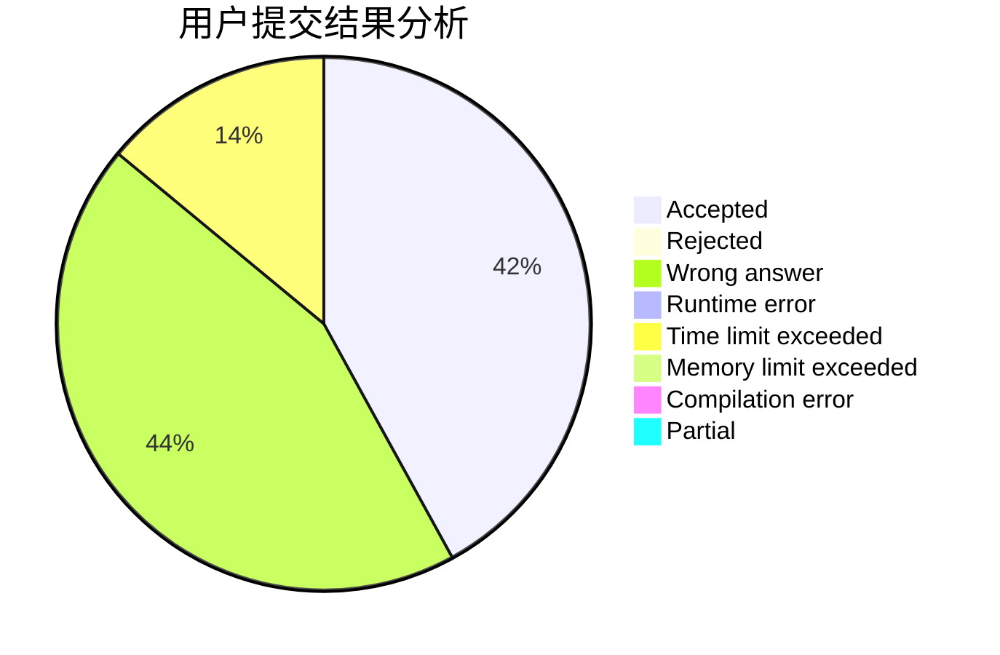
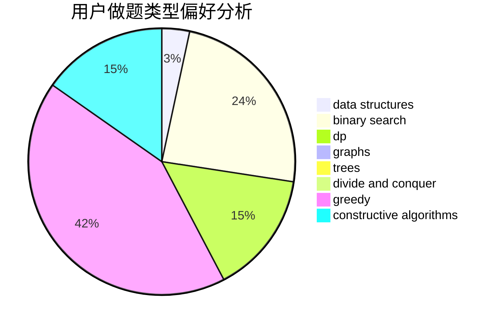

# Rrrrya

<!-- tabs:start -->

#### **用户提交结果分析**

#### **用户做题类型偏好分析**

#### **用户错题知识点分析**

<!-- tabs:end -->
# 推荐题目
[895D](https://codeforces.com/contest/895/problem/D)		combinatorics,
                        math,
                        strings		  
[678A](https://codeforces.com/contest/678/problem/A)		implementation,
                        math		  
[559E](https://codeforces.com/contest/559/problem/E)		dp,
                        sortings		  
[770B](https://codeforces.com/contest/770/problem/B)		*special problem,
                        implementation,
                        math		  
[178F2](https://codeforces.com/contest/178F/problem/2)		dp,
                        sortings,
                        strings		  
[282B](https://codeforces.com/contest/282/problem/B)		greedy,
                        math		  
[606C](https://codeforces.com/contest/606/problem/C)		dsu,graphs,sortings,trees		  
[356B](https://codeforces.com/contest/356/problem/B)		implementation,
                        math		  
[1151D](https://codeforces.com/contest/1151/problem/D)		greedy,
                        math,
                        sortings		  
[164C](https://codeforces.com/contest/164/problem/C)		flows,
                        graphs		  
