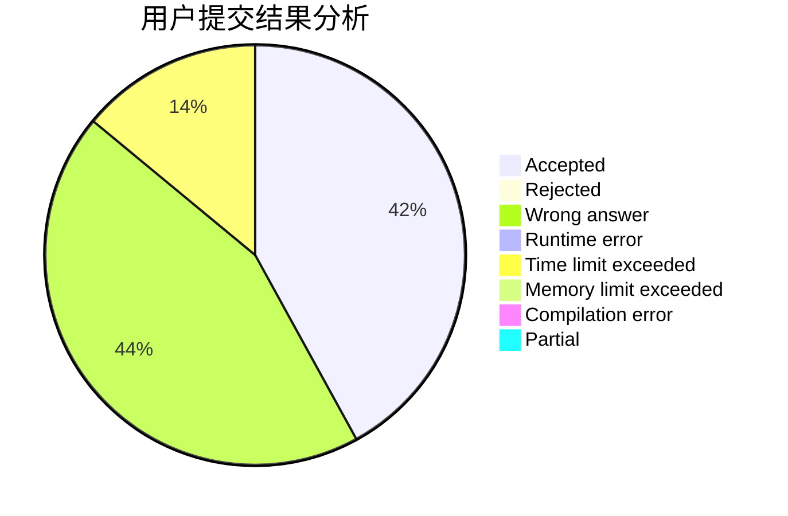
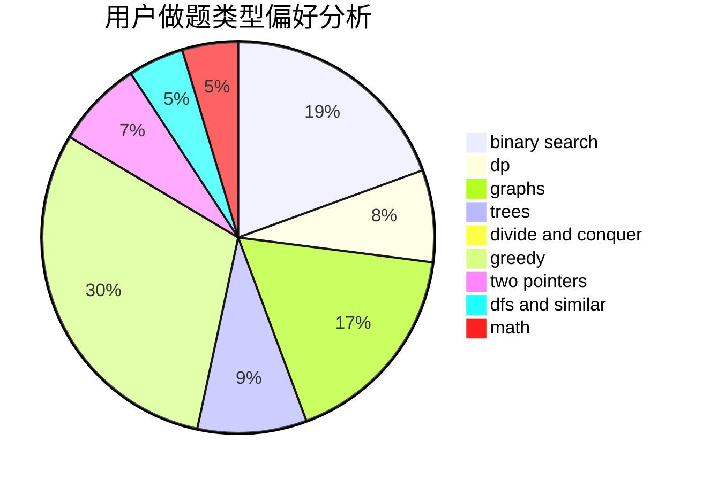

# Rrrrya

<!-- tabs:start -->

#### **用户提交结果分析**

#### **用户做题类型偏好分析**

<!-- tabs:end -->
# 推荐题目
[913B](https://codeforces.com/contest/913/problem/B)
[701E](https://codeforces.com/contest/701/problem/E)
[582C](https://codeforces.com/contest/582/problem/C)
[790A](https://codeforces.com/contest/790/problem/A)
[204E](https://codeforces.com/contest/204/problem/E)
[298D](https://codeforces.com/contest/298/problem/D)
[625B](https://codeforces.com/contest/625/problem/B)
[381A](https://codeforces.com/contest/381/problem/A)
[1153D](https://codeforces.com/contest/1153/problem/D)
[18A](https://codeforces.com/contest/18/problem/A)
