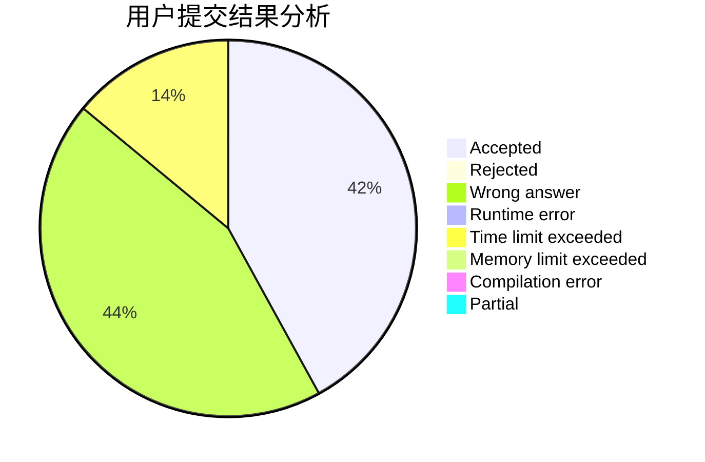
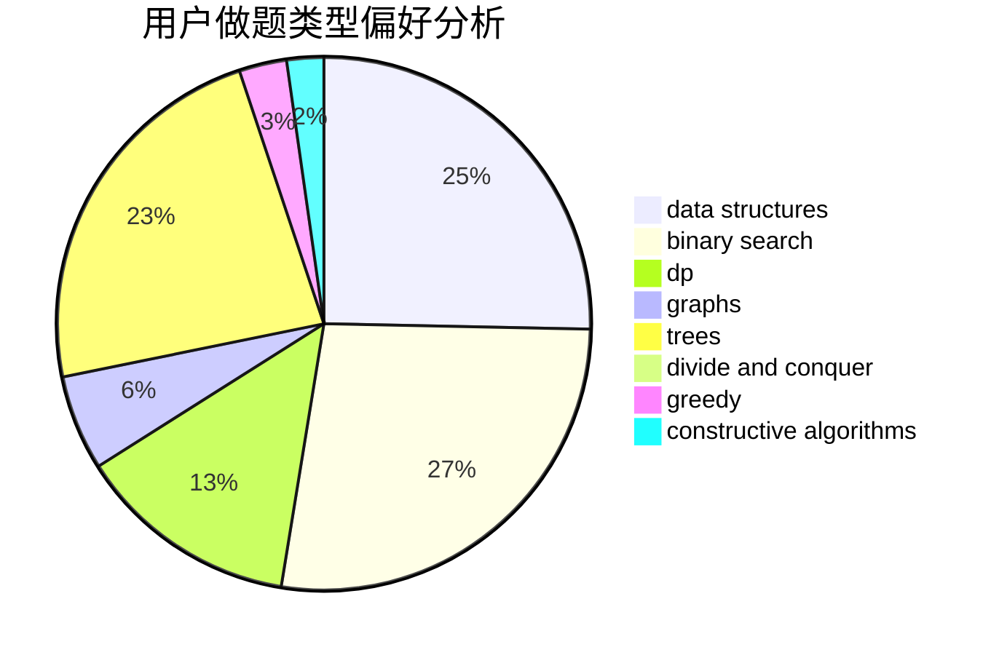

# Rrrrya

<!-- tabs:start -->

#### **用户提交结果分析**

#### **用户做题类型偏好分析**

#### **用户错题知识点分析**

<!-- tabs:end -->
# 推荐题目
[913B](https://codeforces.com/contest/913/problem/B)		implementation,
                        trees		  
[701E](https://codeforces.com/contest/701/problem/E)		dsu,graphs,sortings,trees		  
[582C](https://codeforces.com/contest/582/problem/C)		number theory		  
[790A](https://codeforces.com/contest/790/problem/A)		dsu,graphs,sortings,trees		  
[204E](https://codeforces.com/contest/204/problem/E)		data structures,
                        implementation,
                        string suffix structures,
                        two pointers		  
[298D](https://codeforces.com/contest/298/problem/D)		dsu,graphs,sortings,trees		  
[625B](https://codeforces.com/contest/625/problem/B)		constructive algorithms,
                        greedy,
                        strings		  
[381A](https://codeforces.com/contest/381/problem/A)		greedy,
                        implementation,
                        two pointers		  
[1153D](https://codeforces.com/contest/1153/problem/D)		binary search,
                        dfs and similar,
                        dp,
                        greedy,
                        trees		  
[18A](https://codeforces.com/contest/18/problem/A)		brute force,
                        geometry		  
