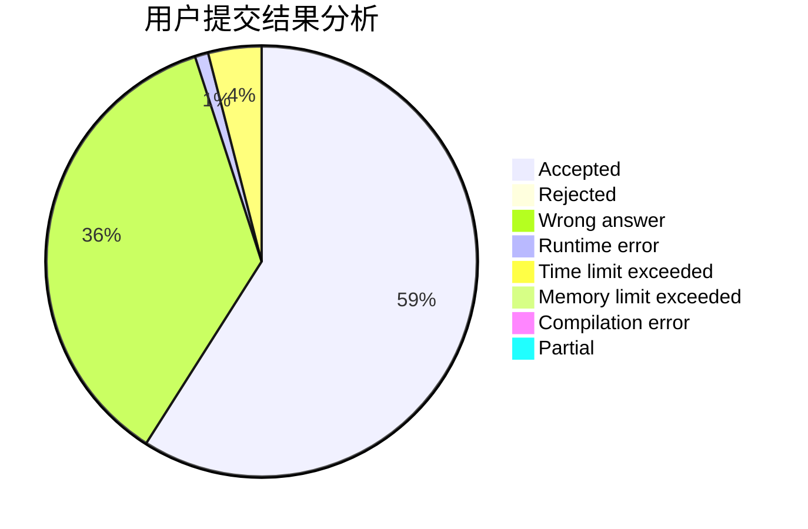
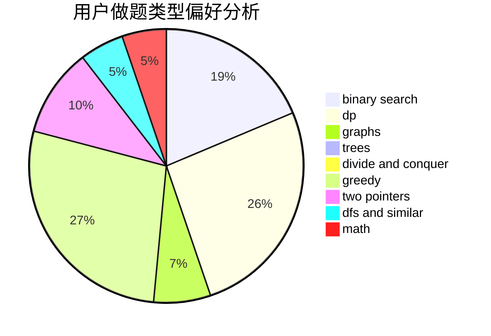

# Ruki

<!-- tabs:start -->

#### **用户提交结果分析**

#### **用户做题类型偏好分析**

<!-- tabs:end -->
# 推荐题目
[893E](https://codeforces.com/contest/893/problem/E)
[23B](https://codeforces.com/contest/23/problem/B)
[1043E](https://codeforces.com/contest/1043/problem/E)
[1300E](https://codeforces.com/contest/1300/problem/E)
[13701](https://codeforces.com/contest/1370/problem/1)
[14C](https://codeforces.com/contest/14/problem/C)
[346E](https://codeforces.com/contest/346/problem/E)
[1004B](https://codeforces.com/contest/1004/problem/B)
[259D](https://codeforces.com/contest/259/problem/D)
[918E](https://codeforces.com/contest/918/problem/E)
