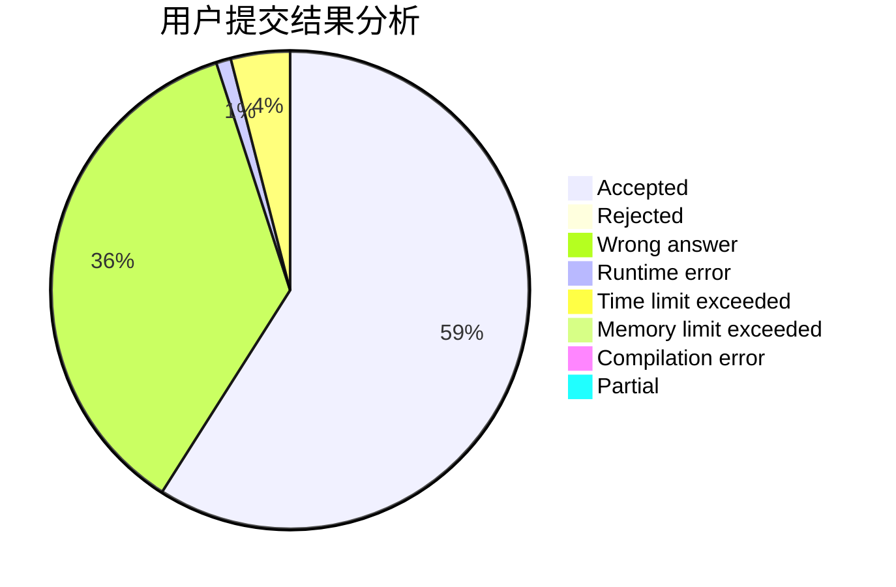
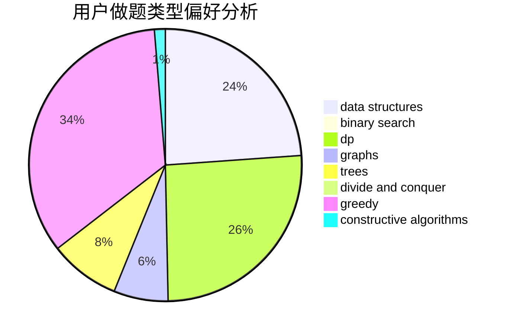

# Ruki

<!-- tabs:start -->

#### **用户提交结果分析**

#### **用户做题类型偏好分析**

#### **用户错题知识点分析**

<!-- tabs:end -->
# 推荐题目
[872C](https://codeforces.com/contest/872/problem/C)		dsu,graphs,sortings,trees		  
[21D](https://codeforces.com/contest/21/problem/D)		bitmasks,
                        graph matchings,
                        graphs		  
[1043B](https://codeforces.com/contest/1043/problem/B)		implementation		  
[1294C](https://codeforces.com/contest/1294/problem/C)		greedy,
                        math,
                        number theory		  
[1362F](https://codeforces.com/contest/1362/problem/F)		dsu,graphs,sortings,trees		  
[1491F](https://codeforces.com/contest/1491/problem/F)		binary search,
                        constructive algorithms,
                        interactive		  
[317C](https://codeforces.com/contest/317/problem/C)		constructive algorithms,
                        dfs and similar,
                        graphs,
                        trees		  
[1003E](https://codeforces.com/contest/1003/problem/E)		constructive algorithms,
                        graphs		  
[236C](https://codeforces.com/contest/236/problem/C)		dsu,graphs,sortings,trees		  
[902C](https://codeforces.com/contest/902/problem/C)		dsu,graphs,sortings,trees		  
