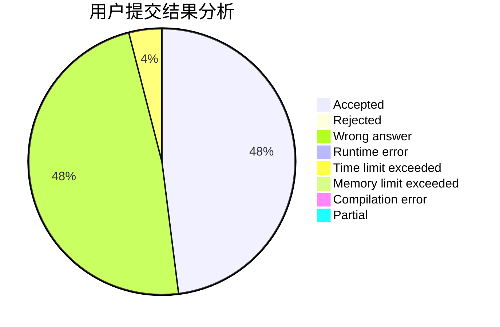
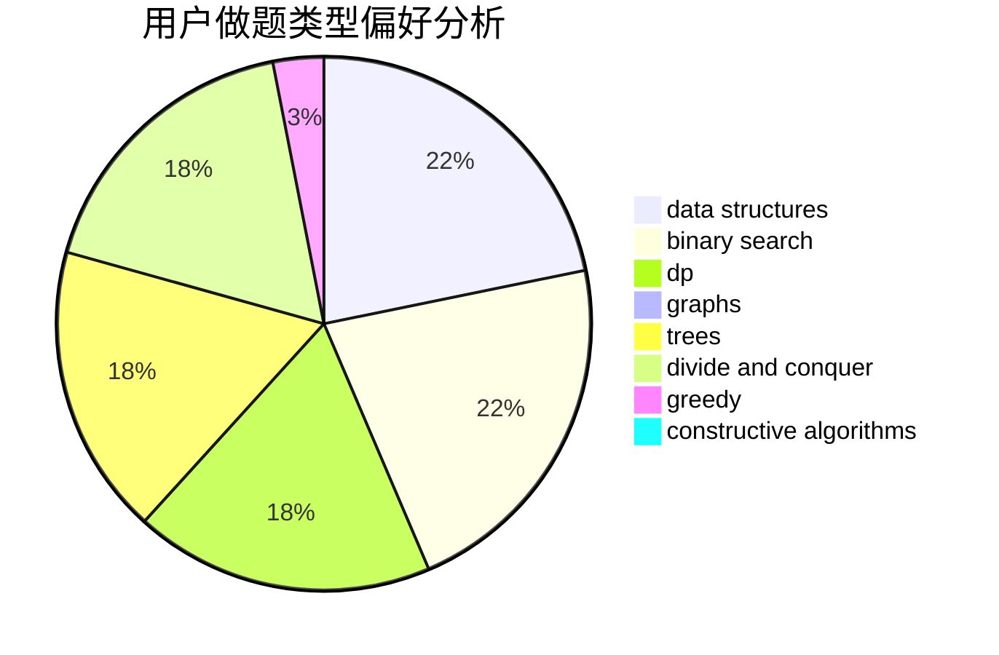
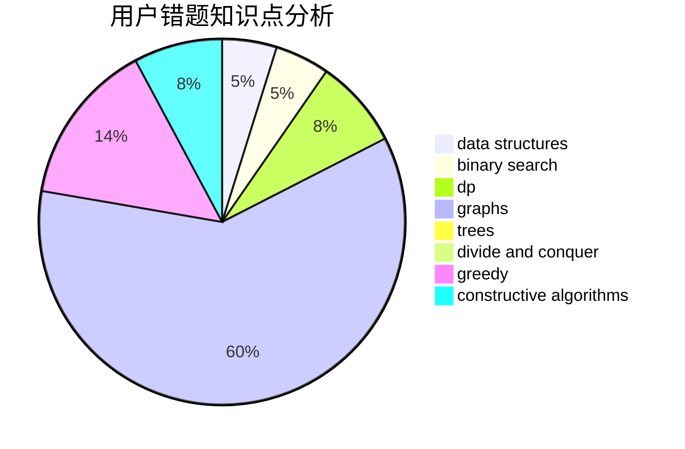

# Rundc09

<!-- tabs:start -->

#### **用户提交结果分析**

#### **用户做题类型偏好分析**

#### **用户错题知识点分析**

<!-- tabs:end -->
# 推荐题目
[582C](https://codeforces.com/contest/582/problem/C)		number theory		  
[1269D](https://codeforces.com/contest/1269/problem/D)		dsu,graphs,sortings,trees		  
[794C](https://codeforces.com/contest/794/problem/C)		games,
                        greedy,
                        sortings		  
[1194C](https://codeforces.com/contest/1194/problem/C)		implementation,
                        strings		  
[935E](https://codeforces.com/contest/935/problem/E)		dfs and similar,
                        dp,
                        trees		  
[1349A](https://codeforces.com/contest/1349/problem/A)		data structures,
                        math,
                        number theory		  
[1389C](https://codeforces.com/contest/1389/problem/C)		brute force,
                        dp,
                        greedy,
                        two pointers		  
[1490C](https://codeforces.com/contest/1490/problem/C)		binary search,
                        brute force,
                        brute force,
                        math		  
[1497B](https://codeforces.com/contest/1497/problem/B)		constructive algorithms,
                        greedy,
                        math		  
[1491C](https://codeforces.com/contest/1491/problem/C)		brute force,
                        data structures,
                        dp,
                        greedy,
                        implementation		  
