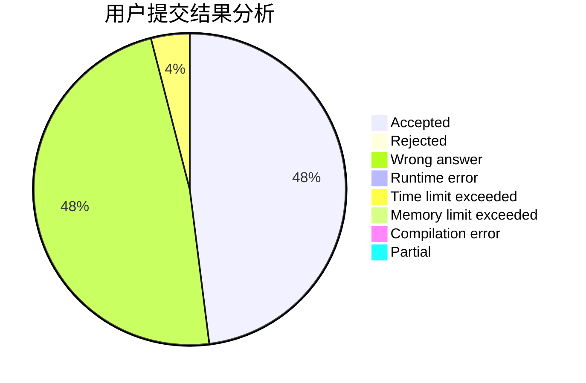
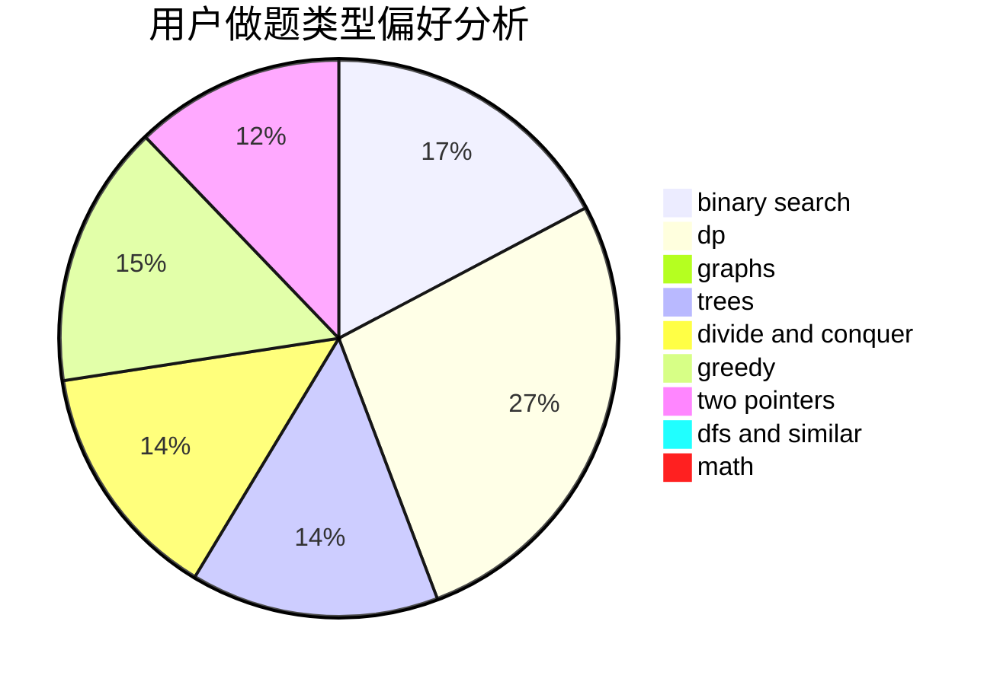

# Rundc09

<!-- tabs:start -->

#### **用户提交结果分析**

#### **用户做题类型偏好分析**

<!-- tabs:end -->
# 推荐题目
[582C](https://codeforces.com/contest/582/problem/C)
[1269D](https://codeforces.com/contest/1269/problem/D)
[794C](https://codeforces.com/contest/794/problem/C)
[1194C](https://codeforces.com/contest/1194/problem/C)
[935E](https://codeforces.com/contest/935/problem/E)
[1349A](https://codeforces.com/contest/1349/problem/A)
[1389C](https://codeforces.com/contest/1389/problem/C)
[1490C](https://codeforces.com/contest/1490/problem/C)
[1497B](https://codeforces.com/contest/1497/problem/B)
[1491C](https://codeforces.com/contest/1491/problem/C)
