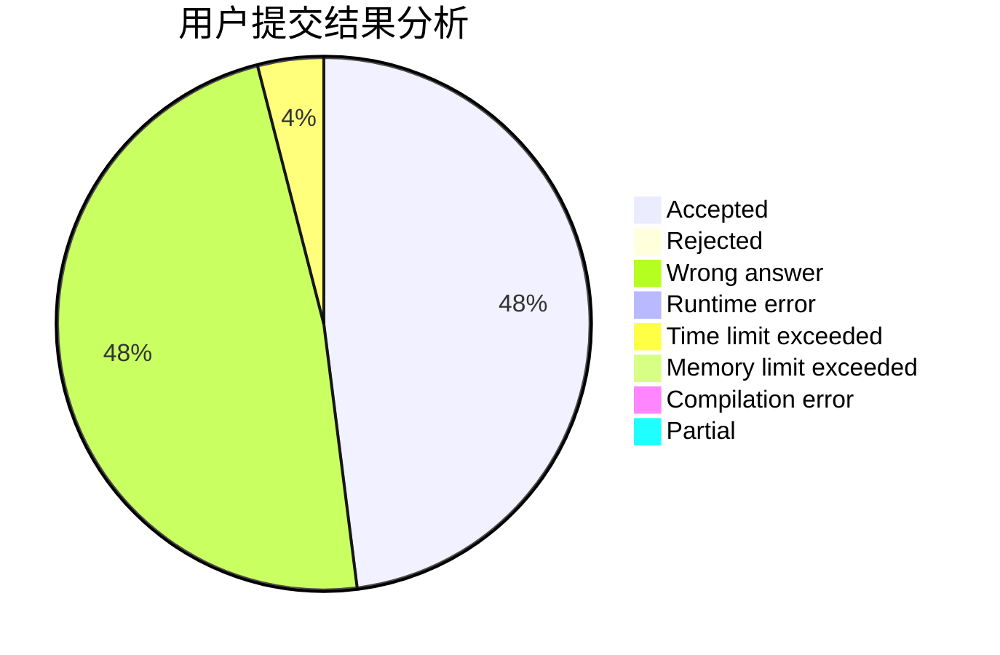
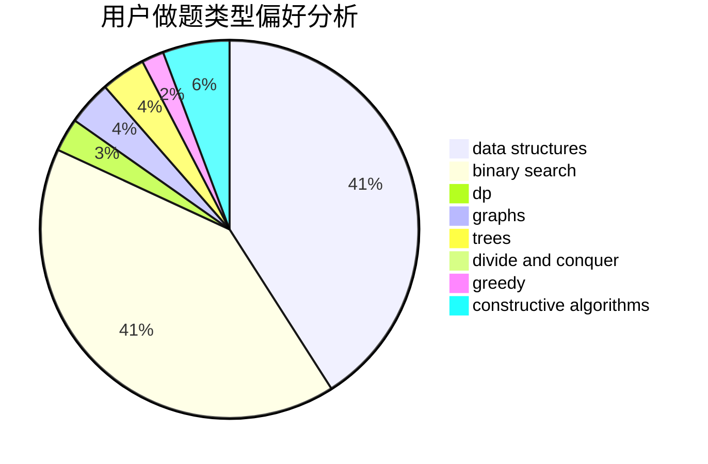
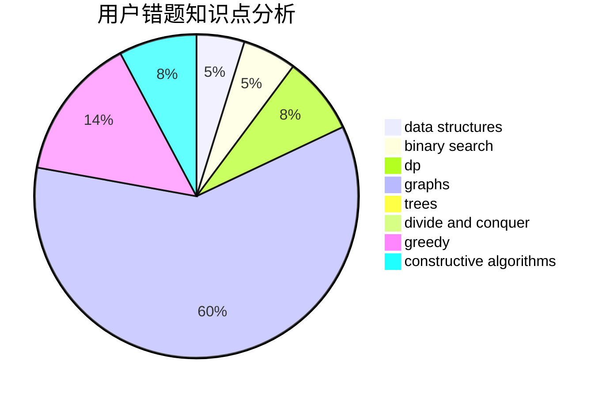

# Rundc09

<!-- tabs:start -->

#### **用户提交结果分析**

#### **用户做题类型偏好分析**

#### **用户错题知识点分析**

<!-- tabs:end -->
# 推荐题目
[559E](https://codeforces.com/contest/559/problem/E)		dp,
                        sortings		  
[1263F](https://codeforces.com/contest/1263/problem/F)		data structures,
                        dfs and similar,
                        dp,
                        flows,
                        graphs,
                        trees		  
[776D](https://codeforces.com/contest/776/problem/D)		2-sat,
                        dfs and similar,
                        dsu,
                        graphs		  
[1189A](https://codeforces.com/contest/1189/problem/A)		strings		  
[915F](https://codeforces.com/contest/915/problem/F)		data structures,
                        dsu,
                        graphs,
                        trees		  
[1342C](https://codeforces.com/contest/1342/problem/C)		math,
                        number theory		  
[137D](https://codeforces.com/contest/137/problem/D)		dp,
                        strings		  
[1482E](https://codeforces.com/contest/1482/problem/E)		data structures,
                        divide and conquer,
                        dp		  
[1489D](https://codeforces.com/contest/1489/problem/D)		dsu,graphs,sortings,trees		  
[1483E](https://codeforces.com/contest/1483/problem/E)		dsu,graphs,sortings,trees		  
