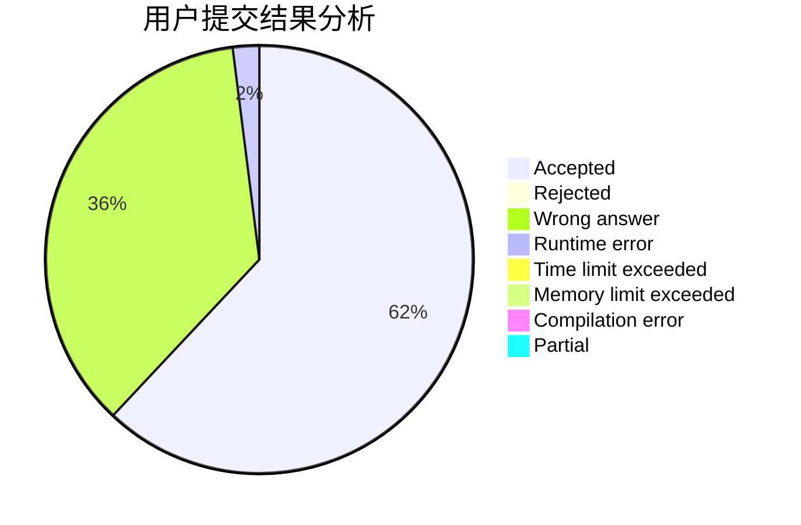
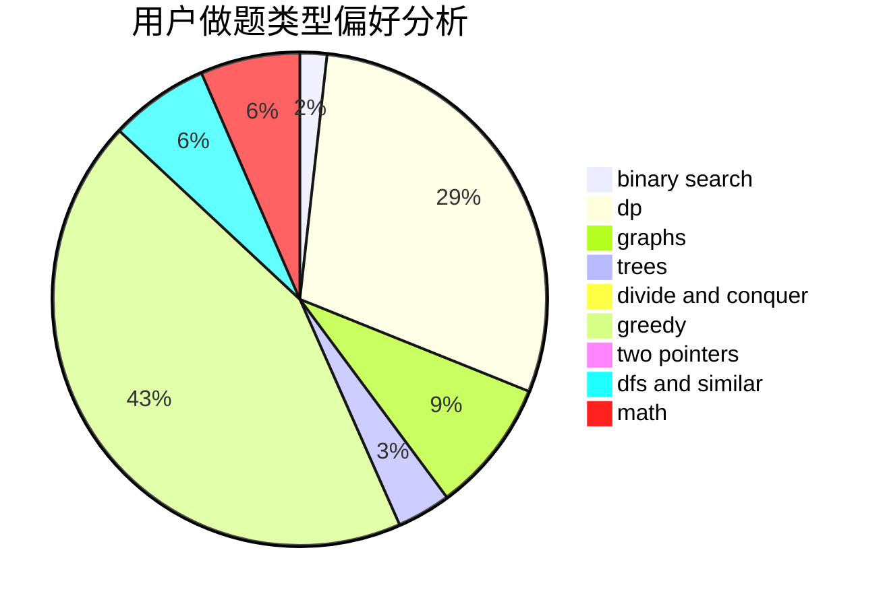

# Runli_the_worst

<!-- tabs:start -->

#### **用户提交结果分析**

#### **用户做题类型偏好分析**

<!-- tabs:end -->
# 推荐题目
[1417B](https://codeforces.com/contest/1417/problem/B)
[291A](https://codeforces.com/contest/291/problem/A)
[1286A](https://codeforces.com/contest/1286/problem/A)
[567D](https://codeforces.com/contest/567/problem/D)
[954B](https://codeforces.com/contest/954/problem/B)
[651D](https://codeforces.com/contest/651/problem/D)
[1105D](https://codeforces.com/contest/1105/problem/D)
[13782](https://codeforces.com/contest/1378/problem/2)
[119D](https://codeforces.com/contest/119/problem/D)
[279D](https://codeforces.com/contest/279/problem/D)
