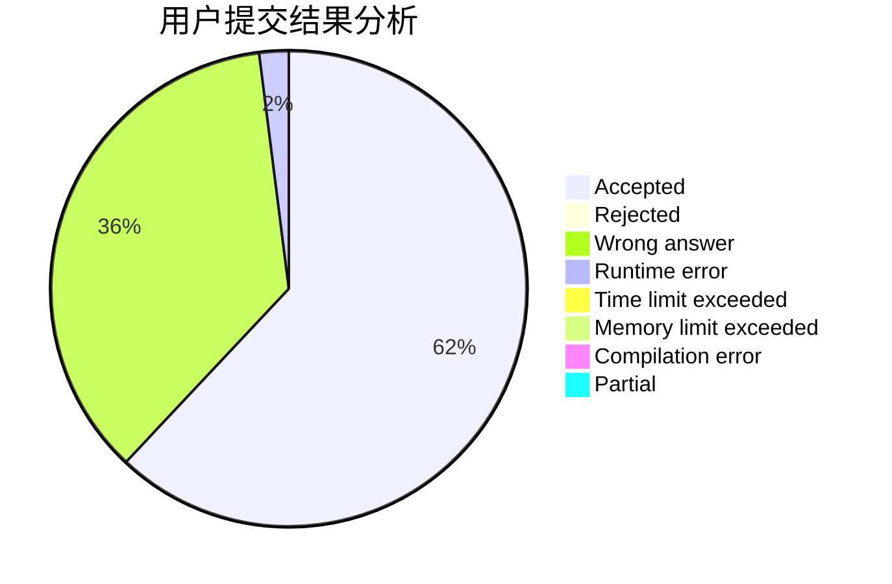
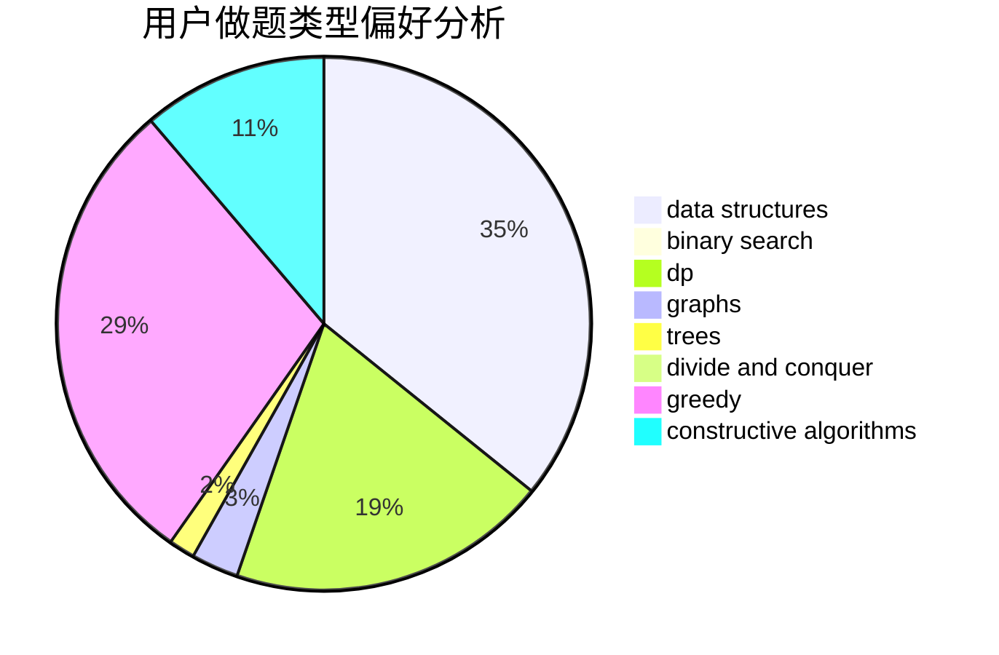
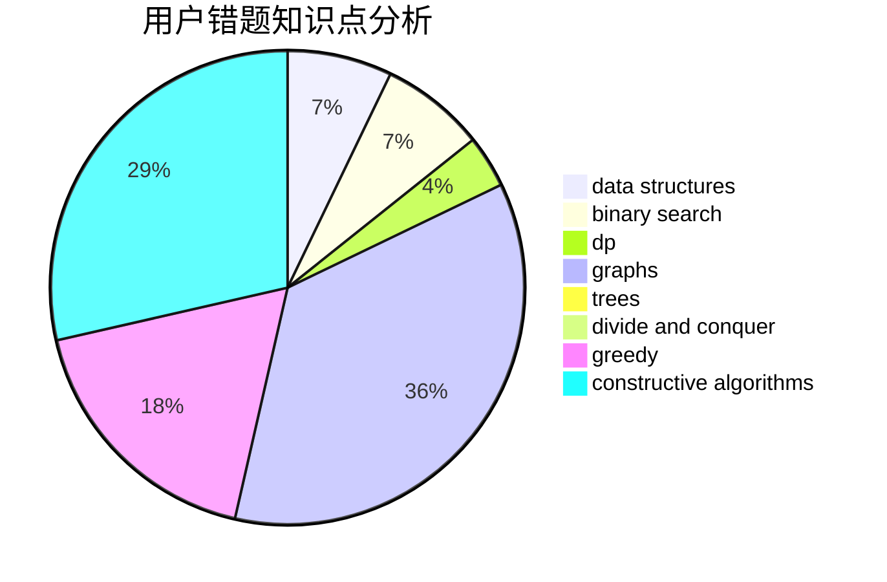

# Runli_the_worst

<!-- tabs:start -->

#### **用户提交结果分析**

#### **用户做题类型偏好分析**

#### **用户错题知识点分析**

<!-- tabs:end -->
# 推荐题目
[1417B](https://codeforces.com/contest/1417/problem/B)		greedy,
                        math,
                        sortings		  
[291A](https://codeforces.com/contest/291/problem/A)		*special problem,
                        implementation,
                        sortings		  
[1286A](https://codeforces.com/contest/1286/problem/A)		dp,
                        greedy,
                        sortings		  
[567D](https://codeforces.com/contest/567/problem/D)		binary search,
                        data structures,
                        greedy,
                        sortings		  
[954B](https://codeforces.com/contest/954/problem/B)		implementation,
                        strings		  
[651D](https://codeforces.com/contest/651/problem/D)		dsu,graphs,sortings,trees		  
[1105D](https://codeforces.com/contest/1105/problem/D)		dfs and similar,
                        graphs,
                        implementation,
                        shortest paths		  
[13782](https://codeforces.com/contest/1378/problem/2)		dsu,graphs,sortings,trees		  
[119D](https://codeforces.com/contest/119/problem/D)		hashing,
                        strings		  
[279D](https://codeforces.com/contest/279/problem/D)		bitmasks,
                        dp		  
