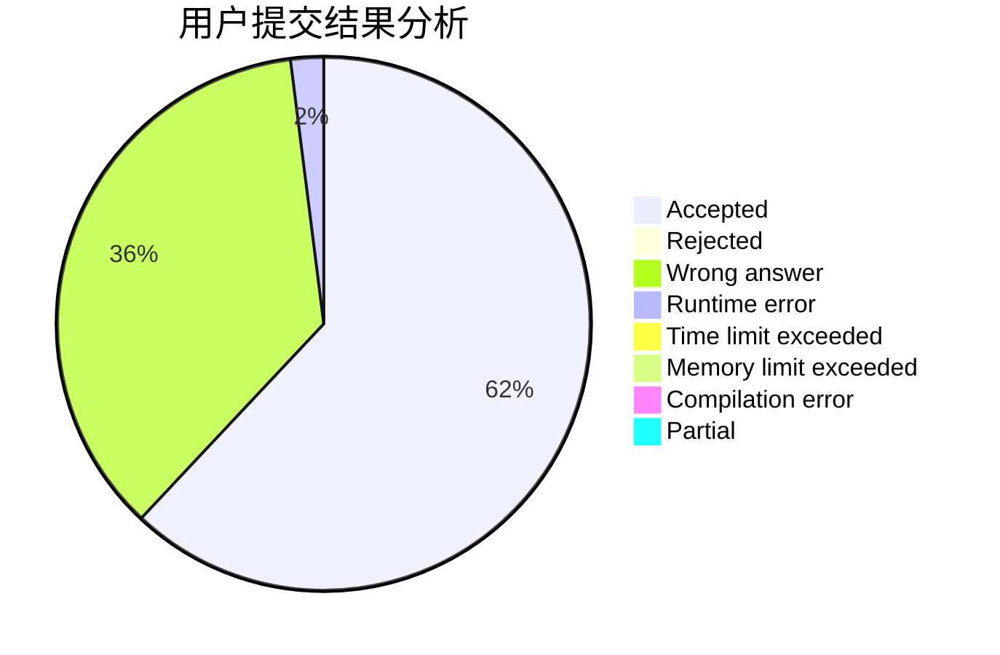
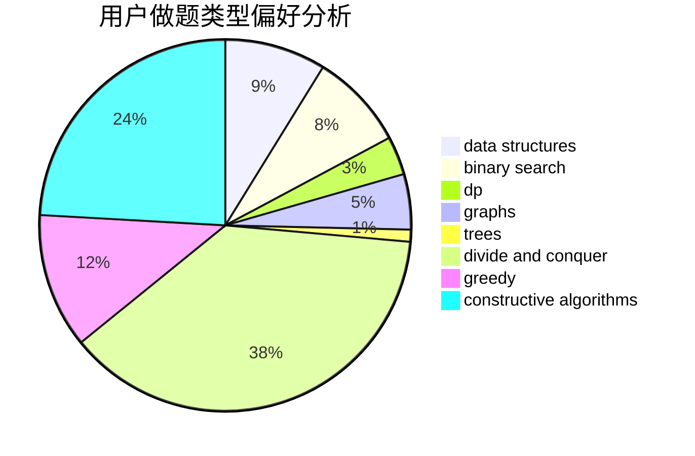
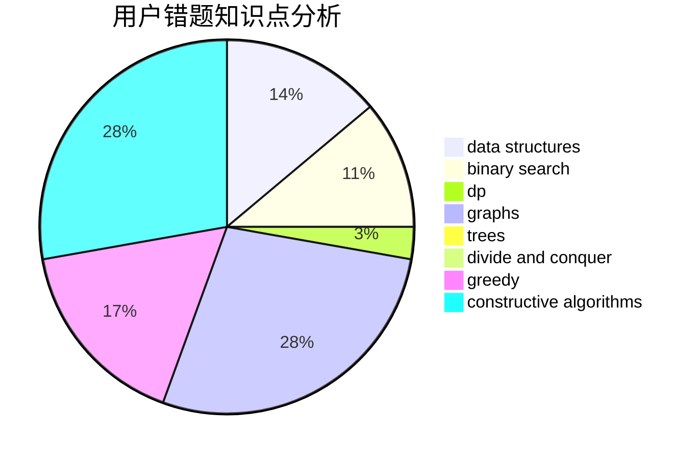

# Runli_the_worst

<!-- tabs:start -->

#### **用户提交结果分析**

#### **用户做题类型偏好分析**

#### **用户错题知识点分析**

<!-- tabs:end -->
# 推荐题目
[1406B](https://codeforces.com/contest/1406/problem/B)		brute force,
                        dp,
                        greedy,
                        implementation,
                        sortings		  
[276D](https://codeforces.com/contest/276/problem/D)		bitmasks,
                        dp,
                        greedy,
                        implementation,
                        math		  
[1280A](https://codeforces.com/contest/1280/problem/A)		implementation,
                        math		  
[543B](https://codeforces.com/contest/543/problem/B)		constructive algorithms,
                        graphs,
                        shortest paths		  
[932B](https://codeforces.com/contest/932/problem/B)		binary search,
                        data structures,
                        dfs and similar		  
[623D](https://codeforces.com/contest/623/problem/D)		greedy,
                        math,
                        probabilities		  
[1105A](https://codeforces.com/contest/1105/problem/A)		brute force,
                        implementation		  
[136D](https://codeforces.com/contest/136/problem/D)		dsu,graphs,sortings,trees		  
[1195E](https://codeforces.com/contest/1195/problem/E)		data structures,
                        two pointers		  
[260E](https://codeforces.com/contest/260/problem/E)		binary search,
                        brute force,
                        data structures		  
