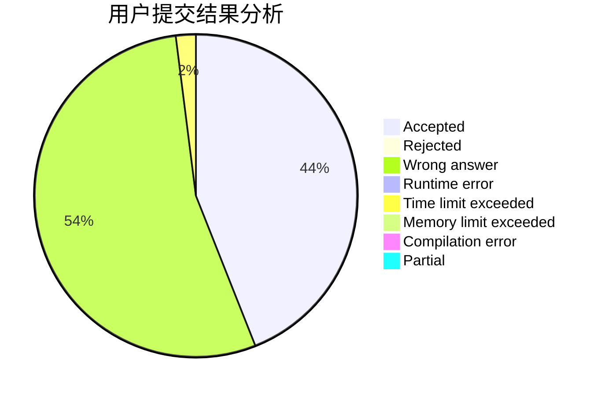
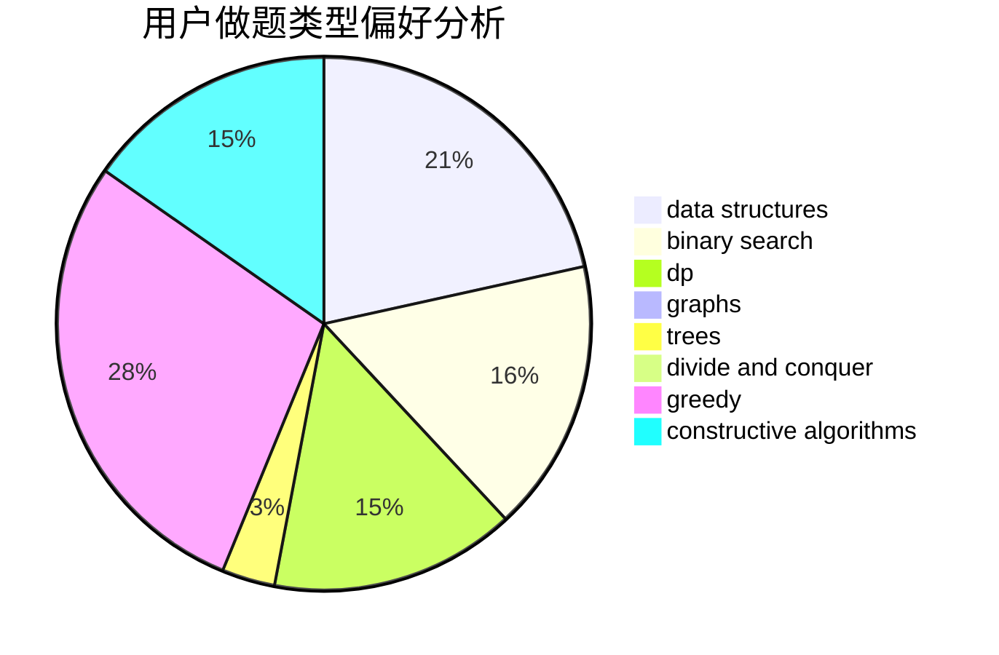
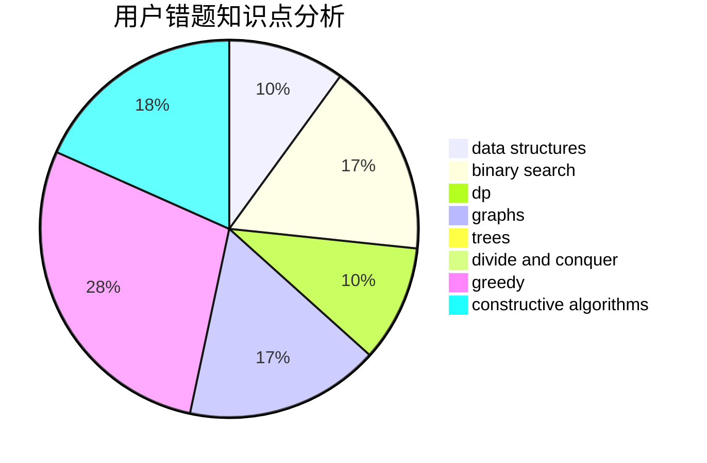

# AMALIGADAY

<!-- tabs:start -->

#### **用户提交结果分析**

#### **用户做题类型偏好分析**

#### **用户错题知识点分析**

<!-- tabs:end -->
# 推荐题目
[1157F](https://codeforces.com/contest/1157/problem/F)		constructive algorithms,
                        dp,
                        greedy,
                        two pointers		  
[1493E](https://codeforces.com/contest/1493/problem/E)		bitmasks,
                        constructive algorithms,
                        greedy,
                        math,
                        strings,
                        two pointers		  
[1089G](https://codeforces.com/contest/1089/problem/G)		math		  
[1236B](https://codeforces.com/contest/1236/problem/B)		combinatorics,
                        math		  
[1494F](https://codeforces.com/contest/1494/problem/F)		brute force,
                        constructive algorithms,
                        dfs and similar,
                        graphs,
                        implementation		  
[1108E2](https://codeforces.com/contest/1108E/problem/2)		data structures,
                        implementation		  
[1038A](https://codeforces.com/contest/1038/problem/A)		implementation,
                        strings		  
[1493F](https://codeforces.com/contest/1493/problem/F)		bitmasks,
                        interactive,
                        number theory		  
[1159C](https://codeforces.com/contest/1159/problem/C)		dsu,graphs,sortings,trees		  
[1007E](https://codeforces.com/contest/1007/problem/E)		dp		  
