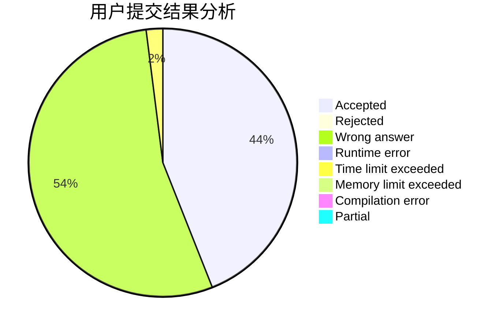
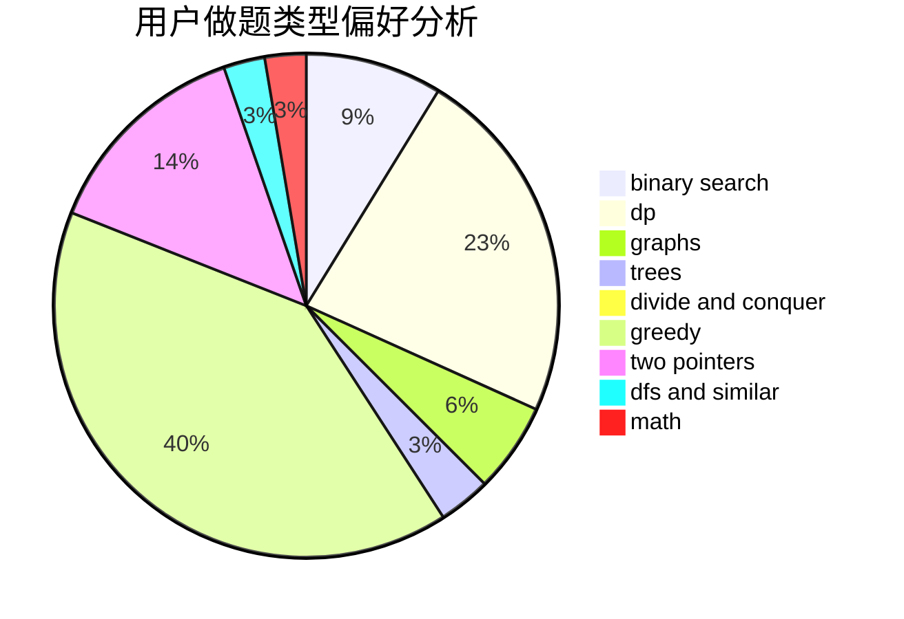

# AMALIGADAY

<!-- tabs:start -->

#### **用户提交结果分析**

#### **用户做题类型偏好分析**

<!-- tabs:end -->
# 推荐题目
[115B](https://codeforces.com/contest/115/problem/B)
[1501E](https://codeforces.com/contest/1501/problem/E)
[1089L](https://codeforces.com/contest/1089/problem/L)
[1240E](https://codeforces.com/contest/1240/problem/E)
[1503F](https://codeforces.com/contest/1503/problem/F)
[1109B](https://codeforces.com/contest/1109/problem/B)
[1038D](https://codeforces.com/contest/1038/problem/D)
[1501F](https://codeforces.com/contest/1501/problem/F)
[1162B](https://codeforces.com/contest/1162/problem/B)
[1008C](https://codeforces.com/contest/1008/problem/C)
